xxIRT: Item Response Theory and Computer-Based Testing in R
================
March 21, 2019

### Table of Contents

-   [Installation](#installation)
-   [Introduction](#introduction)
-   [Package Modules](#package-modules)
    -   [IRT Models](#irt-models)
    -   [Parameter Estimation](#parameter-estimation)
    -   [Automated Test Assembly](#automated-test-assembly)
    -   [Computerized Adaptive Testing](#computerized-adaptive-testing)
    -   [Multistage Testing](#multistage-testing)
-   [Ending](#ending)

### Installation

To install a stable version from [CRAN](https://cran.r-project.org/package=xxIRT), call `install.packages("xxIRT")` in R console. To install the most recent version from [GitHub](https://github.com/xluo11/xxIRT), call `devtools::install_github("xluo11/xxIRT")` in R console (if the *devtools* package has not been installed yet, install it first). To remove the package, call `remove.packages("xxIRT")` in R console.

### Introduction

**xxIRT** is an R package designed to provide a suite of practical psychometric analysis and research tools that keep abreast of latest advancement in psychometrics, especially pertaining to computer-based testing and innovative use of technology. The package is organized into five modules:

1.  IRT Models
2.  Parameter Estimation
3.  Automated Test Assembly
4.  Computerized Adaptive Testing
5.  Multistage Testing

#### Package Modules

##### IRT Models

###### 3PL Model

The famous 3-parameter-logistic (3PL) model was introduced by Birnbaum[1]. The 3PL model uses three item parameters (*a*, *b*, and *c*) and one ability parameter (*θ*) to describe the interaction between an item and a person. The three item parameters are often referred to as the discrimination, difficulty and pseudo-guessing. By default, the scaling constant *D* is 1.702. When c=0, the 3PL model is reduced to the 2PL model. When a=1 and c=0, the 3PL model is reduced to the 1PL model. When a=1, c=0, and D=1, the model is mathematically equivalent to the Rasch model[2].

The following functions are available for the 3PL model:

-   `model_3pl_prob(t, a, b, c, D)`: Compute the probability of correct response for the given parameters, and return results in a people-by-item matrix. `D=1.702` by default.
-   `model_3pl_info(t, a, b, c, D)`: Compute the information for the given parameters, and return results in a people-by-item matrix.
-   `model_3pl_lh(u, t, a, b, c, D, log)`: Compute the likelihood of the given responses. Use `log=TRUE` to compute log-likelihood.
-   `model_3pl_rescale(t, a, b, c, param, mean, sd)`: Linearly transform parameters to a new scale, and return rescaled parameters in a list.
-   `model_3pl_gendata(n_p, n_i, ...)`: Generate responses and parameters. Pass in `t`, `a`, `b`, and `c` to fix parameters. Otherwise, sample these parameters from the normal, log-normal, normal and beta distributions respectively. Use `t_dist`, `a_dist`, `b_dist`, and `c_dist` to customize the sampling distributions. Use `missing` to add missing responses to the generated data.
-   `model_3pl_plot(a, b, c, D, type, total, ...)`: Plot the item characteristic curves (ICCs; `type='prob'`) or the item information functions (IIFs; `type='info'`). When `total=TRUE`, results are summed over items to the test characteristic curve (TCC) or the test information function (TIF).
-   `model_3pl_plot_loglh(u, a, b, c, D, ...)`: Plot the log-likelihood for each response vector. Use `show_mle=TRUE` to print a rough maximum likelihood estimate (MLE) for each response vector.
-   `model_3pl_fitplot(u, t, a, b, c, index, intervals)`: Plot the observed and expected scores for checking item fit. Use `index` to select items, and use `intervals` to set the x-axis of the plot.

###### Examples

``` r
# prepare data
a <- c( .8,  1, 1.2)
b <- c(-.5,  0, 0.5)
c <- c( .1, .2,  .3)
t <- c( -1,  0,   1)
u <- matrix(0, nrow=3, ncol=3)
u[lower.tri(u, diag=T)] <- 1

# compute the probability for the 3PL model
# expect: (.40, .32, .33), (.70, .60, .49), (.90, .88, .81)
model_3pl_prob(t, a, b, c, 1.702) %>% round(., 2)
```

    ##      [,1] [,2] [,3]
    ## [1,]  0.4 0.32 0.33
    ## [2,]  0.7 0.60 0.49
    ## [3,]  0.9 0.88 0.81

``` r
# compute the information for the 3PL model
# expect: (.31, .14, .02), (.35, .48, .31), (.17, .29, .51)
model_3pl_info(t, a, b, c, 1.702) %>% round(., 2)
```

    ##      [,1] [,2] [,3]
    ## [1,] 0.31 0.14 0.02
    ## [2,] 0.35 0.48 0.31
    ## [3,] 0.17 0.29 0.51

``` r
# compute the likelihood for the 3PL model
# expect: (.40, .68, .67), (.70, .60, .51), (.90, .88, .81)
model_3pl_lh(u, t, a, b, c, 1.702) %>% round(., 2)
```

    ##      [,1] [,2] [,3]
    ## [1,]  0.4 0.68 0.67
    ## [2,]  0.7 0.60 0.51
    ## [3,]  0.9 0.88 0.81

``` r
# generate 1PL data with 10% missing
x <- model_3pl_gendata(10, 5, a=1, c=0, missing=.1)
with(x, data.frame(a=a, b=b, c=c)) %>% round(., 2)
```

    ##   a     b c
    ## 1 1  0.73 0
    ## 2 1  0.19 0
    ## 3 1  0.09 0
    ## 4 1 -0.21 0
    ## 5 1 -0.14 0

``` r
# generate 3PL data and sample b from N(1.0, .5)
x <- model_3pl_gendata(10, 5, b_dist=c(1.0, .5))
with(x, data.frame(a=a, b=b, c=c)) %>% round(., 2)
```

    ##      a    b    c
    ## 1 0.73 1.48 0.04
    ## 2 0.74 1.02 0.15
    ## 3 0.84 0.90 0.08
    ## 4 0.97 1.32 0.11
    ## 5 1.46 1.61 0.02

``` r
# rescale b parameters to N(0, 1)
x <- with(x, model_3pl_rescale(t, a, b, c, param="b", mean=0, sd=1))
with(x, data.frame(a=a, b=b, c=c)) %>% round(., 2)
```

    ##      a     b    c
    ## 1 0.22  0.70 0.04
    ## 2 0.22 -0.82 0.15
    ## 3 0.25 -1.22 0.08
    ## 4 0.29  0.18 0.11
    ## 5 0.44  1.15 0.02

###### Graphs

``` r
# generate data
x <- model_3pl_gendata(500, 4)
# Item characteristic curves
with(x, model_3pl_plot(a, b, c, type="prob"))
```

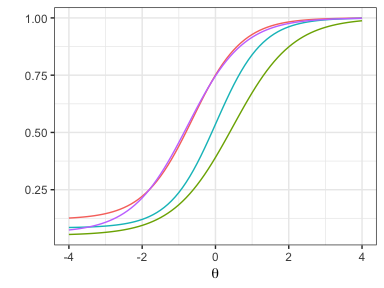

``` r
# Test information function
with(x, model_3pl_plot(a, b, c, type="info", total=TRUE))
```

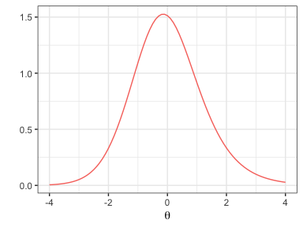

``` r
# Item fit plot
with(x, model_3pl_fitplot(u, t, a, b, c, index=1:2, intervals=seq(-3, 3, .5)))
```


###### Generalized Partial Credit Model

The generalized partial credit model (GPCM) was introduced by Muraki[3][4]. GPCM extends IRT to model polytomously scored items where responses have more than two score categories. GPCM uses one ability parameter, one item discrimination parameter, and *k* (number of score categories) item category parameters to describe the interaction between an item and a people. There are two parameterization of this model: (1) use *b*<sub>*i**k*</sub> to represent the difficulty of category *k* in item *i*, or (2) use *b*<sub>*i*</sub> to represent the overall difficulty of item *i* and *d*<sub>*i**k*</sub> the difficulty of category *k* in item *i*. The second model parameterization is adopted in this package. In this parameterization, each item has a vector of *d*-parameters whose sum is equal to 0, and *d*<sub>1</sub> is set to 0.

The following functions are available for GPCM:

-   `model_gpcm_prob(t, a, b, d, D, insert_d0)`: Compute the probability for all score categories using the given parameters, and return results in a 3D array (people x item x category). Use `insert_d0` to insert an initial category to *d*, if it is omitted in the input. `D=1.702` by default.
-   `model_gpcm_info(t, a, b, d, D, insert_d0)`: Compute the information for all score categories using the given parameters, and return results in a 3D array (people x item x category). Summing results over categories produces a matrix of item information.
-   `model_gpcm_lh(u, t, a, b, d, D, insert_d0, log)`: Compute the likelihood of give responses, and return results in a 2D array (people x item). Use `log=TRUE` to compute the log-likelihood.
-   `model_gpcm_gendata(n_p, n_i, n_c, ...)`: Generate responses and parameters using the GPCM. Pass in `t`, `a`, `b`, and `d` to fix parameters. Otherwise, sample these parameters from the normal, log-normal, normal, and normal distributions respectively. Use `t_dist`, `a_dist`, and `b_dist` to customize the sampling distributions. Use `missing` to add missing responses to the data. Use `sort_d=TRUE` to sort category parameters in ascending order for each item.
-   `model_gpcm_rescale(t, a, b, d, param, mean, sd)`: Transform parameters to a new scale, and return rescaled parameters in a list.
-   `model_gpcm_plot(a, b, d, D, insert_d0, type, by_item, total, xaxis)`: Plot the item category characteristic curves (ICCCs; `type='prob'`) or item category information functions (ICIFs; `type='info'`). Use `by_item=TRUE` to aggregate category-level statistics into item-level statistics. Use `total=TRUE` to sum statistics over items. Use `xaxis` to set the x-axis of the plot.
-   `model_gpcm_plot_loglh(u, a, b, d, D=1.702, insert_d0, xaxis, show_mle)`: Plot the log-likelihood for each response vector. Use `show_mle` to print a rough maximum likelihood estimate for each response vector.

###### Examples

``` r
# prepare data
a <- c( .8,  1, 1.2)
b <- c(-.5,  0, 0.5)
d <- c( -1,-.8, -.2)
d <- cbind(d1=0, d2=d, d3=-d)
t <- c(-1,   0,   1)

# compute the probability for GPCM
# for score=0, expect: (.72, .93, .97), (.18, .44, .73), (.02, .03, .09)
# for score=1, expect: (.09, .04, .03), (.09, .11, .17), (.03, .04, .17)
# for score=2, expect: (.18, .03, .00), (.72, .44, .09), (.95, .93, .73)
model_gpcm_prob(t, a, b, d, 1.702) %>% round(., 2)
```

    ## , , d1
    ## 
    ##      [,1] [,2] [,3]
    ## [1,] 0.72 0.93 0.97
    ## [2,] 0.18 0.44 0.73
    ## [3,] 0.02 0.03 0.09
    ## 
    ## , , d2
    ## 
    ##      [,1] [,2] [,3]
    ## [1,] 0.09 0.04 0.03
    ## [2,] 0.09 0.11 0.17
    ## [3,] 0.03 0.04 0.17
    ## 
    ## , , d3
    ## 
    ##      [,1] [,2] [,3]
    ## [1,] 0.18 0.03 0.00
    ## [2,] 0.72 0.44 0.09
    ## [3,] 0.95 0.93 0.73

``` r
# generate data: 10 peopel, 5 item, 3 categories
x  <- model_gpcm_gendata(10, 5, 3)
# compute the probability
p  <- with(x, model_gpcm_prob(t, a, b, d))
# compute the informtaoin
i  <- with(x, model_gpcm_info(t, a, b, d))
# compute the likelihood
lh <- with(x, model_gpcm_lh(u, t, a, b, d))
```

###### Graphs

``` r
# Figure 1 in Muraki, 1992 (APM)
b <- matrix(c(-2,0,2,-.5,0,2,-.5,0,2), nrow=3, byrow=TRUE)
model_gpcm_plot(a=c(1,1,.7), b=rowMeans(b), d=rowMeans(b)-b, D=1.0, insert_d0=0)
```


``` r
# Figure 2 in Muraki, 1992 (APM)
b <- matrix(c(.5,0,NA,0,0,0), nrow=2, byrow=TRUE)
model_gpcm_plot(a=.7, b=rowMeans(b, na.rm=T), d=rowMeans(b, na.rm=T)-b, D=1.0, insert_d0=0)
```

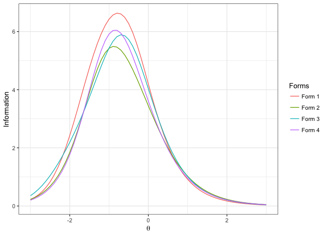

``` r
# Figure 3 in Muraki, 1992 (APM)
b <- matrix(c(1.759,-1.643,3.970,-2.764), nrow=2, byrow=TRUE)
model_gpcm_plot(a=c(.778,.946), b=rowMeans(b), d=rowMeans(b)-b, D=1.0, insert_d0=0)
```

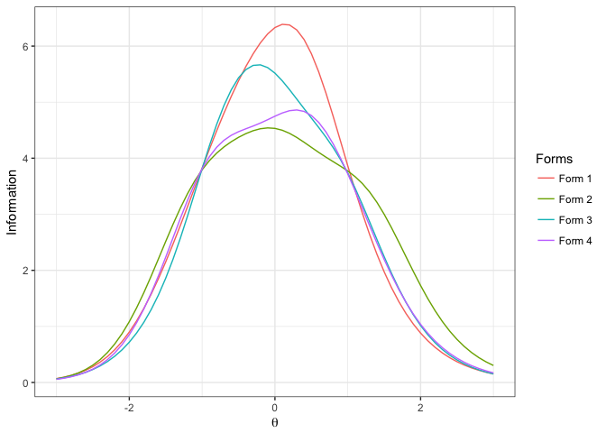

``` r
# Figure 1 in Muraki, 1993 (APM)
b <- matrix(c(0,-2,4,0,-2,2,0,-2,0,0,-2,-2,0,-2,-4), nrow=5, byrow=TRUE)
model_gpcm_plot(a=1, b=rowMeans(b), d=rowMeans(b)-b, D=1.0)
```


``` r
# Figure 2 in Muraki, 1993 (APM)
b <- matrix(c(0,-2,4,0,-2,2,0,-2,0,0,-2,-2,0,-2,-4), nrow=5, byrow=TRUE)
model_gpcm_plot(a=1, b=rowMeans(b), d=rowMeans(b)-b, D=1.0, type='info', by_item=TRUE)
```

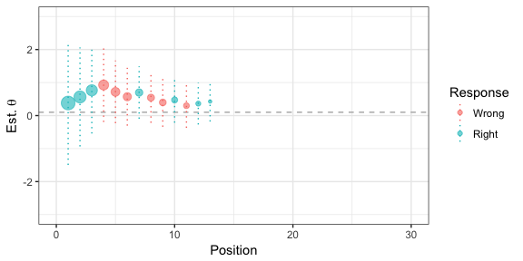

###### Graded Response Model

The graded response model (GRM) was introduced by Samejima[5]. Similar to GPCM, GRM is another polytomous IRT model. However, the difference is that GRM is a "difference" model whereas the GPCM is a "divided-by-total" model under the Thissen and Steinberg's taxonomy of IRT model[6]. The model uses one ability parameter, one item discrimination parameter, and *k-1* ordered item difficulty parameters (*k* is the number of score categories) to describe the interaction between an item and an individual. The probability of a score category involves a two-step computation. First, the *raw* probabilities are computed, where *P*<sup>\*</sup>(*x* &gt; =*m*) is computed using the 2PL model. Two special cases are: *P*<sup>\*</sup>(*x* &gt; =0) = 1 and *P*<sup>\*</sup>(*x* &gt; =*k*) = 0. Next, *P*(*x* = *m*) is computed as *P*<sup>\*</sup>(*x* &gt; =*m*)−*P*<sup>\*</sup>(*x* &gt; =*m* + 1).

The following functions are available for the GRM:

-   `model_grm_prob(t, a, b, D, raw)`: Compute the probability for all score categories using the given parameters, and return results in a 3D array (people by item by category). Use `raw=TRUE` to return *P*<sup>\*</sup>. `D=1.702` by default.
-   `model_grm_info(t, a, b, D)`: Compute the information for all score categories using the given parameters, and return results in a 3D array (people by item by category). Summing results over categories produces a matrix of item information.
-   `model_grm_lh(u, t, a, b, D, log)`: Compute the likelihood of give responses, and return results in a 2D array (people by item). Use `log=TRUE` to compute the log-likelihood.
-   `model_grm_gendata(n_p, n_i, n_c, ...)`: Generate responses and parameters using the GRM. Pass in `t`, `a`, and `b` to fix parameters. Otherwise, sample these parameters from the normal, log-normal, and normal distributions respectively. Use `t_dist`, `a_dist`, and `b_dist` to customize the sampling distributions. Use `missing` to add missing responses to the data.
-   `model_grm_rescale(t, a, b, param, mean, sd)`: Transform parameters to a new scale, and return rescaled parameters in a list.
-   `model_grm_plot(a, b, D, type, by_item, total, xaxis)`: Plot the item category characteristic curves (ICCCs; `type='prob'`) or item category information functions (ICIFs; `type='info'`). Use `by_item=TRUE` to aggregate category-level statistics into item-level statistics. Use `total=TRUE` to sum statistics over items. Use `xaxis` to set the x-axis of the plot.
-   `model_grm_plot_loglh(u, a, b, D=1.702, xaxis, show_mle)`: Plot the log-likelihood for each response vector. Use `show_mle` to print a rough maximum likelihood estimate for each response vector.

###### Examples

``` r
# prepare data
a <- c( .8,  1, 1.2)
b <- c(-.5,  0, 0.5)
b <- cbind(b1=b, b2=b+.5)
t <- c(-1,   0,   1)

# compute the probability for GRM
# for score=0, expect: (.66, .85, .96), (.34, .50, .74), (.11, .15, .26)
# for score=1, expect: (.13, .08, .03), (.16, .20, .15), (.09, .15, .24)
# for score=2, expect: (.20, .07, .02), (.50, .30, .11), (.80, .70, .50)
model_grm_prob(t, a, b, 1.702) %>% round(., 2)
```

    ## , , 1
    ## 
    ##      [,1] [,2] [,3]
    ## [1,] 0.66 0.85 0.96
    ## [2,] 0.34 0.50 0.74
    ## [3,] 0.11 0.15 0.26
    ## 
    ## , , 2
    ## 
    ##      [,1] [,2] [,3]
    ## [1,] 0.13 0.08 0.03
    ## [2,] 0.16 0.20 0.15
    ## [3,] 0.09 0.15 0.24
    ## 
    ## , , 3
    ## 
    ##      [,1] [,2] [,3]
    ## [1,]  0.2 0.07 0.02
    ## [2,]  0.5 0.30 0.11
    ## [3,]  0.8 0.70 0.50

``` r
# generate data: 10 peopel, 5 item, 3 categories
x  <- model_grm_gendata(10, 5, 3)
# compute the probability
p  <- with(x, model_grm_prob(t, a, b))
# compute the informtaoin
i  <- with(x, model_grm_info(t, a, b))
# compute the likelihood
lh <- with(x, model_grm_lh(u, t, a, b))
```

###### Graphs

``` r
# ICCs in GRM
with(model_grm_gendata(10, 4, 3), model_grm_plot(a, b, type='prob'))
```


``` r
# IFFs in GRM
with(model_grm_gendata(10, 4, 3), model_grm_plot(a, b, type='info', by_item=T))
```

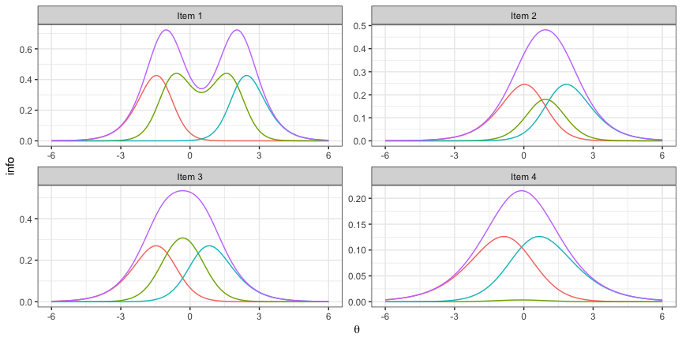

##### Parameter Estimation

Parameters of an IRT model are often unknown and need to be estimated using statistical procedures, and parameter estimation is a central activity in psychometric analysis. A common method is the maximum likelihood estimation (MLE), which attempts to find a set of parameter values that maximizes the likelihood of the observed responses. Two popular methods in IRT are: the joint maximum likelihood estimation (JMLE) and the marginal maximum likelihood estimation (MMLE)[7]. JMLE estimates item parameters and ability parameters in turns, and in each turn it maximizes the likelihood conditional on all parameters. MMLE estimates item parameters using the marginal likelihood which integrates out the ability parameters.

The following functions are available for estimating the 3PL model:

-   `model_3pl_estimate_jmle(u, ...)`: Estimate the parameters of the 3PL model using JMLE. Set `priors` to apply the maximum a posteriori (MAP) estimator instead of the regular MLE. Pass in `t`, `a`, `b`, `c` to fix parameters. Use `iter` and `nr_iter` to control the maximum cycle and the maximum Newton-Raphson iteration. Use `conv` and `nr_conv` to control the convergence criterion in terms of -2 log-likelihood in the overall estimation and the convergence criterion in Newton-Raphson. Use `scale` to set the scale for *θ* parameters. Use `bounds_t`, `bounds_a`, `bounds_b`, and `bounds_c` to set bounds for parameters. Use `debug=TRUE` to turn on the debugging mode. Pass a list of true parameters to `true_params` to compare the true and estimated parameters when the estimation is complete, if true parameters are known.
-   `model_3pl_estimate_mmle(u, ...)`: Estimate the parameters of the 3PL model using MMLE. Most of the JMLE control parameters are also applicable to MMLE. In additoin, use `scoring` to select the `eap` or `map` scoring method.
-   `model_3pl_eap_scoring(u, a, b, c, D, prior, bound)`: Score response vectors for the 3PL model using the expected a posterior (EAP) method, and return a list of *θ* estimates (`t`) and measurement error (`sd`).
-   `model_3pl_map_scoring(u, a, b, c, D, prior, bound, nr_iter, nr_conv)`: Score response vectors for the 3PL model using the MAP method, and return a list of *θ* estimates (`t`).

The following functions are available for estimating the GPCM:

-   `model_gpcm_jmle(u, ...)`: Estimate the parameters of GPCM using JMLE. Similar control parameters are available for fine-tuning the estimation as in the 3PL model.
-   `model_gpcm_estimate_mmle(u, ...)`: Estimate the parameters of GPCM using MMLE. Similar control parameters are available for fine-tuning the estimation as in the 3PL model.
-   `model_gpcm_eap_scoring(u, a, b, d, D, prior, bound)`: Score response vectors for GPCM using the EAP method, and return a list of *θ* estimates (`t`) and measurement error (`sd`).
-   `model_gpcm_map_scoring(u, a, b, d, D, prior, bound, nr_iter, nr_conv)`: Score response vectors for GPCM using the MAP method, and return a list of *θ* estimates (`t`).

The following functions are available for estimating the GPCM:

-   `model_grm_estimate_jmle(u, ...)`: Estimate the parameters of GRM using JMLE. Similar control parameters are available for fine-tuning the estimation as in the 3PL model.
-   `model_grm_estimate_mmle(u, ...)`: Estimate the parameters of GRM using MMLE. Similar control parameters are available for fine-tuning the estimation as in the 3PL model.
-   `model_grm_eap_scoring(u, a, b, d, D, prior, bound)`: Score response vectors for GRM using the EAP method, and return a list of *θ* estimates (`t`) and measurement error (`sd`).
-   `model_grm_map_scoring(u, a, b, d, D, prior, bound, nr_iter, nr_conv)`: Score response vectors for GRM using the MAP method, and return a list of *θ* estimates (`t`).

###### Examples

Estimation of the 3PL model

``` r
# generate data: 2000 people, 60 items
x <- model_3pl_gendata(2000, 60)
# JMLE: free calibration
y <- with(x, model_3pl_estimate_jmle(u, true_params=x))
```


    ## t: corr = 0.967, rmse = 0.258
    ## a: corr = 0.942, rmse = 0.069
    ## b: corr = 0.993, rmse = 0.089
    ## c: corr = 0.647, rmse = 0.03

``` r
# JMLE: no priors
y <- with(x, model_3pl_estimate_jmle(u, priors=NULL, true_params=x))
```

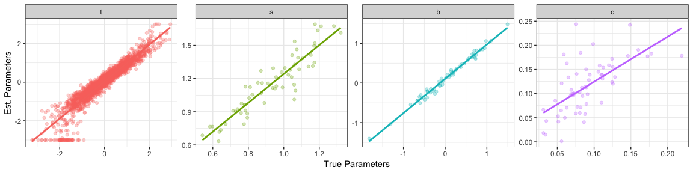

    ## t: corr = 0.945, rmse = 0.332
    ## a: corr = 0.919, rmse = 0.251
    ## b: corr = 0.992, rmse = 0.141
    ## c: corr = 0.644, rmse = 0.048

``` r
# JMLE: fix c=0
y <- with(x, model_3pl_estimate_jmle(u, c=0, true_params=x))
```

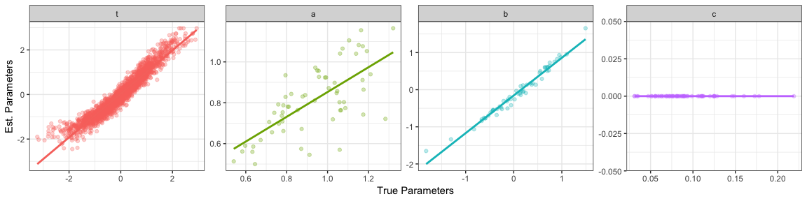

    ## t: corr = 0.962, rmse = 0.275
    ## a: corr = 0.692, rmse = 0.186
    ## b: corr = 0.986, rmse = 0.187

``` r
# MMLE: free calibration
y <- with(x, model_3pl_estimate_mmle(u, iter=20, true_params=x))
```

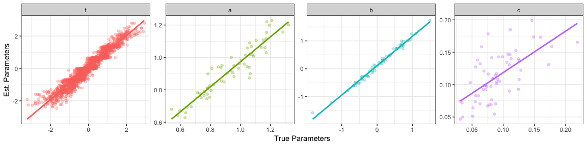

    ## t: corr = 0.965, rmse = 0.273
    ## a: corr = 0.94, rmse = 0.069
    ## b: corr = 0.993, rmse = 0.141
    ## c: corr = 0.644, rmse = 0.038

``` r
# EAP scoring
y <- with(x, model_3pl_eap_scoring(u, a, b, c))
c(corr=cor(x$t, y$t), rmse=rmse(x$t, y$t)) %>% round(., 2)
```

    ## corr rmse 
    ## 0.96 0.26

``` r
# MAP scoring
y <- with(x, model_3pl_map_scoring(u, a, b, c))
c(corr=cor(x$t, y$t), rmse=rmse(x$t, y$t)) %>% round(., 2)
```

    ## corr rmse 
    ## 0.97 0.25

The effect of sample size and test length on the estimation of the 3PL model 

The effect of missing data on the estimation of the 3PL model (2000 people, 60 items) 

Estimation of GPCM

``` r
# generate data: 1000 people, 30 items, 3 score categories
x <- model_gpcm_gendata(1000, 30, 3)
# JMLE: free calibration
y <- with(x, model_gpcm_estimate_jmle(u, true_params=x))
```

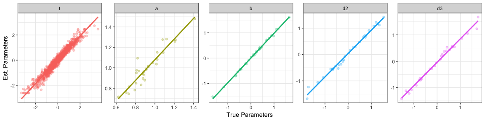

    ## t: corr = 0.976, rmse = 0.226
    ## a: corr = 0.937, rmse = 0.1
    ## b: corr = 0.999, rmse = 0.042
    ## d_2: corr = 0.994, rmse = 0.136
    ## d_3: corr = 0.994, rmse = 0.136

``` r
# MMLE: free calibration
y <- with(x, model_gpcm_estimate_mmle(u, true_params=x))
```

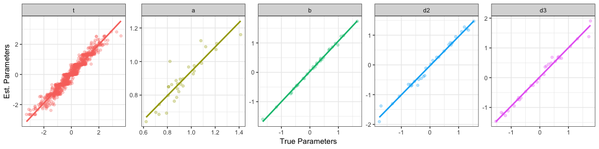

    ## t: corr = 0.971, rmse = 0.251
    ## a: corr = 0.9, rmse = 0.083
    ## b: corr = 0.998, rmse = 0.059
    ## d_2: corr = 0.993, rmse = 0.11
    ## d_3: corr = 0.993, rmse = 0.11

``` r
# EAP scoring
y <- with(x, model_gpcm_eap_scoring(u, a, b, d))
c(corr=cor(x$t, y$t), rmse=rmse(x$t, y$t)) %>% round(., 2)
```

    ## corr rmse 
    ## 0.97 0.25

``` r
# MAP scoring
y <- with(x, model_gpcm_map_scoring(u, a, b, d))
c(corr=cor(x$t, y$t), rmse=rmse(x$t, y$t)) %>% round(., 2)
```

    ## corr rmse 
    ## 0.97 0.24

Estimation of GRM

``` r
# generate data: 1000 people, 30 items, 3 score categories
x <- model_grm_gendata(1000, 30, 3)
# JMLE: free calibration
y <- with(x, model_grm_estimate_jmle(u, true_params=x))
```


    ## t: corr = 0.964, rmse = 0.268
    ## a: corr = 0.973, rmse = 0.053
    ## b_1: corr = 0.998, rmse = 0.059
    ## b_2: corr = 0.997, rmse = 0.056

``` r
# MMLE: free calibration
y <- with(x, model_grm_estimate_mmle(u, true_params=x))
```

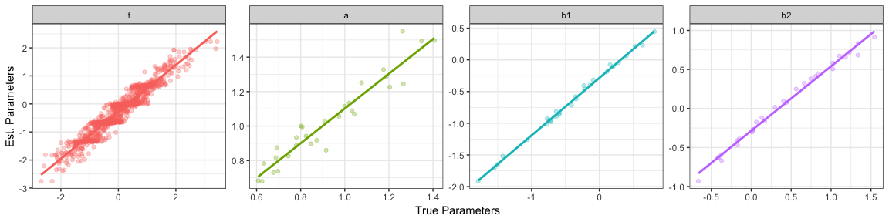

    ## t: corr = 0.959, rmse = 0.403
    ## a: corr = 0.957, rmse = 0.123
    ## b_1: corr = 0.998, rmse = 0.255
    ## b_2: corr = 0.995, rmse = 0.376

``` r
# EAP scoring
y <- with(x, model_grm_eap_scoring(u, a, b))
c(corr=cor(x$t, y$t), rmse=rmse(x$t, y$t)) %>% round(., 2)
```

    ## corr rmse 
    ## 0.96 0.26

``` r
# MAP scoring
y <- with(x, model_grm_map_scoring(u, a, b))
c(corr=cor(x$t, y$t), rmse=rmse(x$t, y$t)) %>% round(., 2)
```

    ## corr rmse 
    ## 0.96 0.27

##### Automated Test Assembly

Test assembly is an activity that selects items from the pool to construct test forms that satisfy a set of predefined psychometric, content, and administration requirements. The quality of the assembled test forms has an immediate impact on the test validity and fairness. The traditional manual test assembly approach relies on content developers to hand-pick items based on their judgments, and this is apprantly an inefficient approach that is difficult to scale up for any large-scale assembly task. Conversely, automated test assembly (ATA) is an approach that utilizes computer algorithms and mathematical optimization techniques to construct test forms in an automated manner. Not only does it improve the efficiency of test assembly, but also lays the foundation for other advanced testing models such as shadow-test computerized adaptive testing[8] and computerized adaptive multistage testing[9].

A test assembly task is essentially an optimization problem in ATA, and it can be solved either by a heuristic[10][11] or a mixed integer programming (MIP)[12] algorithm. Heuristics avoid traversing all possibilities of item combination, yet attempt to find a "shortcut" to one of working solutions. Thus, they are fast but cannot guarantee the optimality of the solution. More importantly, they are usually specialized for a certain type of tasks. On the other hand, MIP is a general framework that is useful for a variety of tasks. To apply MIP, the task has to be defined in linear formulae, with one objective function and a set of constraints. Then, apply a solver to search completely through the feasibility region defined by constraints for a solution that yields the optimal value of the objective function.

Compared with other general linear programming packages, this package is specifically designed for ATA and thus has more succinct and expressive APIs. Many ATA-specific model configurations are simplified for users. Moreover, it includes two open source MIP solvers: [lp\_solve](http://lpsolve.sourceforge.net/5.5/) (accessed via the package [lpSolveAPI](https://CRAN.R-project.org/package=lpSolveAPI)) and [GNU Linear Programming Kit](https://www.gnu.org/software/glpk/) (accessed via the package [glpkAPI](https://CRAN.R-project.org/package=glpkAPI)).

The following functions are available for ATA:

-   `ata(pool, num_form, len, max_use, ...)`: Initiate an ATA job. All subsequent model definitions are stored in the ATA object until `ata_solve()` is called which creates a MIP object according to the model definitions and solves it. Use `len` and `max_use` to conveniently set test length constraint and the maximum item usage constraint. `...` takes some useful optional arguments. For example, use `group` to define the item set grouping variable, use `common_items` and `overlap_items` to define item overlap.
-   `ata_obj_relative(x, coef, mode, tol, negative, forms, ...)`: Add a relative objective to the model. Use `mode` to indicate the optimization direction: `mode="max"` to maximize the objective function and `mode="min"` to minimize the objective function. `coef` is the coefficients of the objective function, which can be a variable in the item pool, a numeric vector whose length is equal to the pool, or a numeric vector of several *θ* points where TIFs are being optimized. By default, a tolerance parameter is added to the model in hopes of getting balanced results (e.g., a flatter TIF over multiple *θ* points). However, users are allowed to use `tol=FALSE` to remove the tolerance parameter or to give `tol` a numeric value to fix it. It is necessary to add `negative=TRUE` to the function call, when the value of the objective function is expected to be negative. Use `forms` to indicate onto which forms objectives are set (`NULL` to indicate that it is for all forms).
-   `ata_obj_absolute(x, coef, target, equal_tol, tol_up, tol_down, forms, ...)`: Add an absolute objective to the model. Use `target` to set the target values. By default, the objective function allows the upward and downward discrepancies from the target to vary and minimize the overall range of these two discrepanceis. Users are allowed to use `equal_tol=TRUE` to force these two tolerance parameters to be equal, and use `tol_up` and `tol_down` to impose extra constraints on the range of these two tolerance parameters.
-   `ata_constraint(x, coef, min, max, level, forms, ...)`: Add a constraint to the model. `coef` can be either a variable in the item pool, a numeric vector which has the same size as the pool, or a single numeric value which is broadcasted to all items. When `coef` refers to a categorical variable in the pool, use `level` to indicate for which level the constraint is set. When `coef` refers to a quantitative variable in the pool, leave `level=NULL`.
-   `ata_item_use(x, min, max, items)`: Set the minimum and maximum usage constraints on items. `items` should be a vector of item indices in the pool.
-   `ata_item_enemy(x, items)`: Set the enemy relationship constraints on items.
-   `ata_item_fixedvalue(x, items, min, max, forms)`: Force items to be selected or not selected in the given forms.
-   `ata_solve(x, solver, as.list, details, time_limit, message, ...)`: Solve the ATA model. Use `solver` to choose between the *lp\_solve* or the *glpk* solver. Use `as.list=TRUE` to return results in list, or in data frame otherwise. Use `time_limit` to set the time limits of the solving process in seconds. Pass additional control parameters in `...` (See the documentation of *lpSolveAPI* and *glpkAPI* for more details). Use `details=TRUE` to print summary messages, and `message=TRUE` to print messages from the solver. Once solved, additional data are appended to the orignal ATA object: `status` (status of the solution), `optimum` (value of the objective function), `obj_var` (values of two essential objective variables), `result` (a binary matrix of assembly results), and `item` (assembled test forms).
-   `plot.ata(x, ...)`: Plot the TIFs of assembled test forms.

###### Examples

``` r
## Generate a pool of 100 items
n_items <- 100
pool <- with(model_3pl_gendata(1, n_items), data.frame(id=1:n_items, a=a, b=b, c=c))
pool$content <- sample(1:3, n_items, replace=TRUE)
pool$time <- round(rlnorm(n_items, log(60), .2))
pool$group <- sort(sample(1:round(n_items/3), n_items, replace=TRUE))

## four 10-item forms to maximize b parameters
x <- ata(pool, 4, len=10, max_use=1)
x <- ata_obj_relative(x, 'b', 'max', negative=F)
x <- ata_solve(x, 'lpsolve')
```

    ## optimal solution found, optimum: 6.75 (6.75, 0)

``` r
## four 10-item forms to minimize b parameters
x <- ata(pool, 4, len=10, max_use=1)
x <- ata_obj_relative(x, 'b', 'min', negative=T)
x <- ata_solve(x, 'glpk')
```

    ## relative mip gap tolerance reached, optimum: -5.8 (-5.84, 0.04)

``` r
## four 10-item forms to maximize TIF at [-1, 0, 1]
x <- ata(pool, 4, len=10, max_use=1)
x <- ata_obj_relative(x, seq(-1, 1, .5), 'max')
x <- ata_solve(x, 'lpsolve', details=F)
plot(x)
```


``` r
## four 10-item forms to have a TIF of 3 at [-1, 0, 1] with equal tolerance
x <- ata(pool, 4, len=10, max_use=1)
x <- ata_obj_absolute(x, seq(-1, 1, .5), 3, equal_tol=T)
x <- ata_solve(x, 'lpsolve')
```

    ## the model is sub-optimal, optimum: 0.567 (0.283, 0.283)

``` r
plot(x)
```

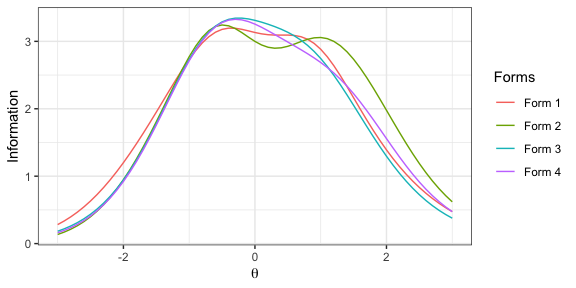

``` r
# two severly constrained 10-item form
# constraints: item set, 4 common items, 3 items in domain 1 & 3, 58-62 seconds per item
x <- ata(pool, 2, len=10, max_use=1, group='group', common_items=4)
x <- ata_obj_relative(x, c(-1, 1), 'max')
x <- ata_constraint(x, 'content', 3, 3, level=1)
x <- ata_constraint(x, 'content', 3, 3, level=3)
x <- ata_constraint(x, 'time', 58*10, 62*10)
x <- ata_solve(x, 'lpsolve', as.list=F)
```

    ## optimal solution found, optimum: 2.68 (2.73, 0.05)

``` r
# check item set and item overlap
group_by(x$items, item_set=group) %>% summarise(n_items=length(unique(id)), n_forms=length(unique(form)))
```

    ## # A tibble: 9 x 3
    ##   item_set n_items n_forms
    ##      <int>   <int>   <int>
    ## 1        1       1       1
    ## 2        2       1       1
    ## 3        5       2       1
    ## 4        6       3       1
    ## 5        8       1       2
    ## 6       12       1       1
    ## 7       24       1       2
    ## 8       30       2       2
    ## 9       33       4       1

``` r
# check constraints on content and time
group_by(x$items, form) %>% summarise(content_1=sum(content==1), content_3=sum(content==3), time=mean(time))
```

    ## # A tibble: 2 x 4
    ##    form content_1 content_3  time
    ##   <int>     <int>     <int> <dbl>
    ## 1     1         3         3  61.8
    ## 2     2         3         3  61

##### Computerized Adaptive Testing

Computerized adaptive testing (CAT) is a testing model that utilizes the computing powers of modern computers to customize the test form on-the-fly to match a test taker's demonstrated abilities. The on-the-fly test adaptation improves testing efficiency and prevents answer-copying behaviors to a great extent. This module provides a framework for conducting CAT simulation studies. Three essential components of a CAT system are: the item selection rule, the ability estimation rule, and the test stopping rule. The framework allows for the mix-and-match of different rules and using customized rules in the CAT simulation. When writing a new rule, the function signature must be `function(len, theta, stats, admin, pool, opts)` where `len` is the current test length, `theta` is the current *θ* estimate, `stats` is a matrix of four columns (*u*, *t*, *se*, *info*), `admin` is a data frame of administered items, `pool` is a data frame of remaining items in the pool, `opts` is a list of option/control parameters (see built-in rules for examples).

The following functions are available in this module:

-   `cat_sim(true, pool, ...)`: Start a CAT simulation. Pass options into `...`, where `min` (the minimum test length) and `max` (the maximum test length) are required. Use `theta` to set the initial value of *θ* estimate.
-   `cat_estimate_mle`: The maximum likelihood estimation rule. Use `map_len` (10 by default) to apply MAP to the first K items and use `map_prior` (`c(0, 1)` by default) to set the prior for MAP. MAP is used to prevent extreme result of MLE.
-   `cat_estimate_eap`: The EAP estimation rule. Use `eap_mean` and `eap_sd` options to control the prior.
-   `cat_estimate_hybrid`: A hybrid estimation rule of MLE (for mixed responses) and EAP (for all 1s or 0s response)
-   `cat_select_maxinfo`: The maximum information selection rule[13]. Use `group` (variable name) to group items belonging to the set. Use `info_random` to add the random-esque item exposure control.
-   `cat_select_ccat`: The constrained CAT selection rule[14]. This rule selects items under the content-balancing constraint. Use `ccat_var` to indicate the content variable in the pool and use `ccat_perc` to set the desired content distribution (a vector in which the element name is the content code and the value is the percentage). Use `ccat_random` to add randomness to initial item selections. Use `info_random` to add the randomesque item exposure control.
-   `cat_select_shadow`: The shadow-test selection rule[15]. Use `shadow_id` to group item sets. Use `constraints` to set constraints. Constraints should be in a data frame with four columns: var (variable name), level (variable level, `NA` for quantitative variable), min (lower bound), and max (upper bound).
-   `cat_stop_default`: A three-way stopping rule. When `stop_se` is set in options, the standard error stopping rule is invoked. When `stop_mi` is set in options, the minimum information stopping rule is invoked. When `stop_cut` is set in options, the confidence interval stopping rule is invoked. The width of the confidence interval is controlled by the `ci_width` option.
-   `cat_stop_projection`: The projection-based stopping rule[16]. Use `projection_method` to choose the projection method (`info` or `diff`). Use `stop_cut` to set the cut score. Use `constraints` to set the constraints. Constraints should be in a data frame with four columns: var (variable name), level (variable level, `NA` for quantitative variable), min (lower bound), max (upper bound).
-   `plot.cat(x, ...)`: Plot the results of a CAT simulation.

###### Examples

Generate a 100-item pool

``` r
num_items <- 100
pool <- with(model_3pl_gendata(1, num_items), data.frame(a=a, b=b, c=c))
pool$group <- sort(sample(1:30, num_items, replace=TRUE))
pool$content <- sample(1:3, num_items, replace=TRUE)
pool$time <- round(rlnorm(num_items, mean=4.1, sd=.2))
```

MLE, EAP, and hybrid estimation rule

``` r
cat_sim(.5, pool, min=10, max=20, estimate_rule=cat_estimate_mle) %>% plot()
```

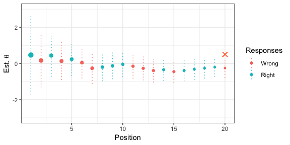

``` r
cat_sim(.5, pool, min=10, max=20, estimate_rule=cat_estimate_eap) %>% plot()
```


``` r
cat_sim(.5, pool, min=10, max=20, estimate_rule=cat_estimate_hybrid) %>% plot()
```

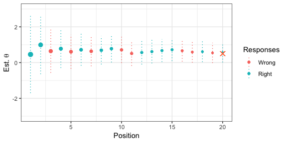

SE, MI, and CI stopping rule

``` r
cat_sim(.5, pool, min=10, max=20, stop_se=.3) %>% plot()
```


``` r
cat_sim(.5, pool, min=10, max=20, stop_mi=.6) %>% plot()
```

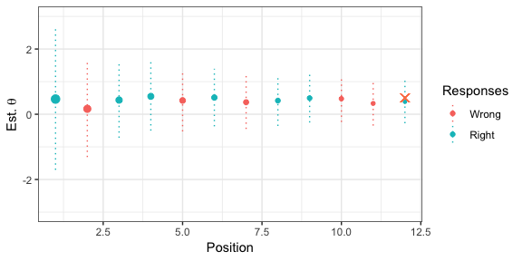

``` r
cat_sim(.5, pool, min=10, max=20, stop_cut=0) %>% plot() 
```

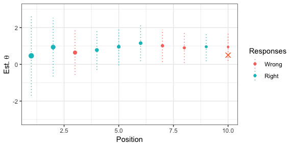

``` r
cat_sim(.5, pool, min=10, max=20, stop_cut=0, ci_width=2.58) %>% plot()
```

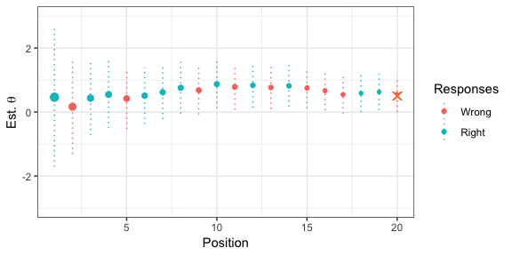

Maximum information selection with item sets

``` r
cat_sim(.5, pool, min=10, max=10, group="group")$admin %>% round(., 2)
```

    ##    u     t   se info    a     b    c group content time
    ## 38 1  0.38 1.21 0.68 1.33 -0.23 0.15    13       2   54
    ## 51 0 -0.11 0.75 1.78 1.15  0.01 0.06    18       3   85
    ## 18 1 -0.05 0.56 3.24 1.38  0.00 0.17     6       1   55
    ## 19 0 -0.05 0.56 3.24 0.89  0.04 0.07     6       2   43
    ## 58 1  0.27 0.43 5.47 0.88  0.49 0.07    21       3   70
    ## 59 1  0.27 0.43 5.47 0.76  0.09 0.15    21       3   66
    ## 60 1  0.27 0.43 5.47 1.18 -0.01 0.08    21       2   38
    ## 61 0  0.27 0.43 5.47 0.90 -0.02 0.19    21       1   48
    ## 62 1  0.27 0.43 5.47 0.90 -0.32 0.09    21       1   73
    ## 35 1  0.41 0.43 5.52 0.93  0.18 0.17    12       2   53

Maximum information with item exposure control

``` r
cat_sim(.5, pool, min=10, max=10, info_random=5)$admin %>% round(., 2)
```

    ##    u     t   se info    a     b    c group content time
    ## 51 0 -0.51 1.30 0.59 1.15  0.01 0.06    18       3   85
    ## 33 1 -0.21 0.75 1.78 1.42 -0.64 0.09    11       2   60
    ## 18 0 -0.43 0.64 2.45 1.38  0.00 0.17     6       1   55
    ## 10 1 -0.30 0.53 3.51 1.44 -0.81 0.08     3       2   77
    ## 38 1 -0.15 0.48 4.34 1.33 -0.23 0.15    13       2   54
    ## 98 1 -0.03 0.45 4.86 1.11 -0.15 0.12    30       2   48
    ## 32 1  0.06 0.44 5.26 1.08 -0.26 0.16    11       1   58
    ## 60 1  0.17 0.42 5.76 1.18 -0.01 0.08    21       2   38
    ## 37 1  0.31 0.40 6.17 1.23  0.25 0.05    12       1   51
    ## 68 1  0.46 0.41 6.04 1.04  0.23 0.10    23       3   65

Constrained-CAT selection rule with and without initial randomness

``` r
cat_sim(.5, pool, min=10, max=20, select_rule=cat_select_ccat, ccat_var="content", ccat_perc=c("1"=.2, "2"=.3, "3"=.5))$admin$content %>% freq()
```

    ##   value freq perc cum_freq cum_perc
    ## 1     1    4  0.2        4      0.2
    ## 2     2    6  0.3       10      0.5
    ## 3     3   10  0.5       20      1.0

Shadow-test selection rule

``` r
cons <- data.frame(var='content', level=1:3, min=c(3,3,4), max=c(3,3,4))
cons <- rbind(cons, data.frame(var='time', level=NA, min=55*10, max=65*10))
cat_sim(.5, pool, min=10, max=10, select_rule=cat_select_shadow, constraints=cons)$admin %>% round(., 2)
```

    ##    u    t   se info    a     b    c group content time shadow_id
    ## 18 1 0.47 1.11 0.82 1.38  0.00 0.17     6       1   55        18
    ## 21 1 0.94 0.81 1.51 1.35  0.68 0.05     7       2   47        21
    ## 8  0 0.64 0.62 2.62 1.17  0.87 0.08     3       3   77         8
    ## 37 0 0.32 0.54 3.43 1.23  0.25 0.05    12       1   51        37
    ## 60 0 0.04 0.52 3.76 1.18 -0.01 0.08    21       2   38        60
    ## 38 1 0.16 0.45 4.88 1.33 -0.23 0.15    13       2   54        38
    ## 51 1 0.28 0.42 5.77 1.15  0.01 0.06    18       3   85        51
    ## 87 1 0.36 0.40 6.37 1.06  0.02 0.09    28       3   50        87
    ## 68 1 0.44 0.38 6.88 1.04  0.23 0.10    23       3   65        68
    ## 85 0 0.40 0.37 7.43 0.91  0.46 0.10    27       1   59        85

Projection-based stopping rule

``` r
cons <- data.frame(var='content', level=1:3, min=5, max=15)
cons <- rbind(cons, data.frame(var='time', level=NA, min=60*20, max=60*40))
cat_sim(.5, pool, min=20, max=40, select_rule=cat_select_shadow, stop_rule=cat_stop_projection, projection_method="diff", stop_cut=0, constraints=cons) %>% plot()
```


##### Multistage Testing

Multistage testing (MST) is a computer-based adaptive testing model that gives practitioners more controls over the test, compared to CAT. MST navigates test takers through multiple stages and each stage contains a set of pre-constructed *modules*. The test is adapted between stages in order to administer modules most suited to the test taker's ability. A group of modules connected via the routing rule constitutes a MST *panel*, and the combination of modules (one module per stage) that leads a test taker to the end of the test is called a *route*. The design, or configuration, of a MST is normally abbreviated as "1-2", "1-3-3", etc., where the length represents the number of stages and each number represents the number of modules in that stage. With reduced adaptivity, MST usually has a slightly low efficiency than CAT. However, it allows test developers to add complex constraints and review assembled tests before publishing and administration, which enhances test quality and security.

The following functions are available in this module:

-   `mst(pool, design, num_panel, method, len, max_use, group, ...)`: Create a MST assembly job. Use `design` to specify the design/configuration of the MST (e.g., "1-3", "1-2-2", "1-2-3"). Use `num_panel` to simultaneously assembly multiple panels. `method` can be either *topdown*[17] or *bottomup*[18]. Use `len` and `max_use` to conveniently set the test length and maximum item usage. Use `group` to group item sets.
-   `mst_route(x, route, op)`: Add or remove a route from the MST
-   `mst_obj(x, theta, indices, target, ...)`: Add objective functions to the assembly job. Use `theta` to specify at which *θ* points the information is optimized. When `target` is `NULL`, the information is maximized at *θ* points; otherwise, the information approaches the given targets. `indices` sets on which modules or routes the objective functions are added.
-   `mst_constraint(x, coef, min, max, level, indices)`: Add constraints to the assembly job. `coef` should be a variable name of pool-long numeric vector. Set `level=NULL` for a quantitative variable and a specific level for a categorical variable.
-   `mst_stage_length(x, stages, min, max)`: Add the length constraints on modules in the given stages.
-   `mst_rdp(x, theta, indices, tol)`: Set the routing decision points between two adjacent modules.
-   `mst_module_info(x, theta, min, max, indices)`: Set the min and max information requirements at the given *θ* points for some modules.
-   `mst_assemble(x, ...)`: Assemble MST panels.
-   `mst_get_items(x, panel_ix, stage_ix, module_ix, route_ix)`: Extract assembled modules.
-   `plot.mst(x, ...)`: Plot TIFs of assembled routes (when `byroute=TRUE`) or modules (when `byroute=FALSE`).
-   `mst_sim(x, true, rdp, ...)`: Simulate a MST administration. When `rdp=NULL`, test takers are routed to the module with the maximum information; otherwise test takers are routed according to the given routing decision points. Use `t_prior` to pass in the prior distribution for estimation.

###### Examples

Generate a pool of 300 items

``` r
num_item <- 300
pool <- with(model_3pl_gendata(1, num_item), data.frame(a=a, b=b, c=c))
pool$id <- 1:num_item
pool$content <- sample(1:3, num_item, replace=TRUE)
pool$time <- round(rlnorm(num_item, 4, .3))
pool$group <- sort(sample(1:round(num_item/3), num_item, replace=TRUE))
```

Ex. 1: Assemble 2 panels of 1-2-2 MST using the top-down approach 20 items in total and 10 items in content area 1 in each route maximize info. at -1 and 1 for easy and hard routes

``` r
x <- mst(pool, "1-2-2", 2, 'topdown', len=20, max_use=1)
x <- mst_obj(x, theta=-1, indices=1:2)
x <- mst_obj(x, theta=1, indices=3:4)
x <- mst_constraint(x, "content", 10, 10, level=1)
x <- mst_assemble(x, timeout=10)
```

    ## the model is sub-optimal, optimum: 12.1 (12.12, 0.02)

``` r
plot(x, byroute=TRUE)
```


Ex. 2: Assemble 2 panels of 1-2-3 MST using the bottom-up approach Remove two routes with large theta change: 1-2-6, 1-3-4 10 items in total and 4 items in content area 2 in each module Maximize info. at -1, 0 and 1 for easy, medium, and hard modules

``` r
x <- mst(pool, "1-2-3", 2, 'bottomup', len=10, max_use=1)
x <- mst_route(x, c(1, 2, 6), "-")
x <- mst_route(x, c(1, 3, 4), "-")
x <- mst_obj(x, theta= 0, indices=c(1, 5))
x <- mst_obj(x, theta=-1, indices=c(2, 4))
x <- mst_obj(x, theta= 1, indices=c(3, 6))
x <- mst_constraint(x, "content", 4, 4, level=2)
x <- mst_assemble(x, timeout=10) 
```

    ## the model is sub-optimal, optimum: 5.85 (6.18, 0.33)

``` r
plot(x, byroute=FALSE)
```


Ex.3: Same specs with Ex.2 (without content constraints), but group-based

``` r
x <- mst(pool, "1-2-3", 2, 'bottomup', len=12, max_use=1, group="group")
x <- mst_route(x, c(1, 2, 6), "-")
x <- mst_route(x, c(1, 3, 4), "-")
x <- mst_obj(x, theta= 0, indices=c(1, 5))
x <- mst_obj(x, theta=-1, indices=c(2, 4))
x <- mst_obj(x, theta= 1, indices=c(3, 6))
x <- mst_assemble(x, timeout=10)
```

    ## the model is sub-optimal, optimum: 4.77 (5.1, 0.33)

``` r
plot(x, byroute=FALSE)
```

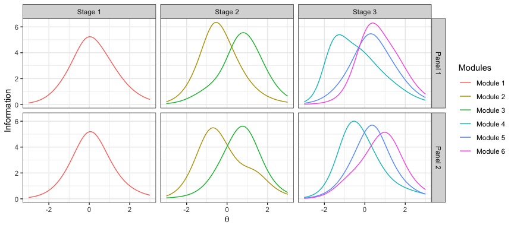

``` r
for(p in 1:x$num_panel)
   for(m in 1:x$num_module){
     items <- mst_get_items(x, panel=p, module=m)
     cat('panel=', p, ', module=', m, ': ', length(unique(items$id)), ' items from ', 
         length(unique(items$group)), ' groups\n', sep='')
   }
```

    ## panel=1, module=1: 12 items from 4 groups
    ## panel=1, module=2: 12 items from 4 groups
    ## panel=1, module=3: 12 items from 4 groups
    ## panel=1, module=4: 12 items from 5 groups
    ## panel=1, module=5: 12 items from 4 groups
    ## panel=1, module=6: 12 items from 4 groups
    ## panel=2, module=1: 12 items from 5 groups
    ## panel=2, module=2: 12 items from 5 groups
    ## panel=2, module=3: 12 items from 4 groups
    ## panel=2, module=4: 12 items from 6 groups
    ## panel=2, module=5: 12 items from 6 groups
    ## panel=2, module=6: 12 items from 4 groups

Ex.4: Assemble 2 panels of 1-2-3 using the top-down design 20 total items and 10 items in content area 3, 6+ items in stage 1 & 2

``` r
x <- mst(pool, "1-2-3", 2, "topdown", len=20, max_use=1)
x <- mst_route(x, c(1, 2, 6), "-")
x <- mst_route(x, c(1, 3, 4), "-")
x <- mst_obj(x, theta=-1, indices=1)
x <- mst_obj(x, theta=0, indices=2:3)
x <- mst_obj(x, theta=1, indices=4)
x <- mst_constraint(x, "content", 8, 12, level=3)
x <- mst_stage_length(x, 1:2, min=6)
x <- mst_assemble(x, timeout=15)
```

    ## the model is sub-optimal, optimum: 11.56 (11.73, 0.17)

``` r
plot(x, byroute=FALSE)
```

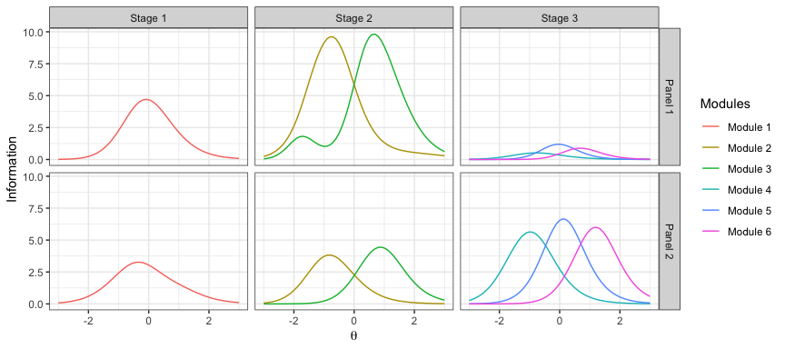

``` r
for(p in 1:x$num_panel)
  for(s in 1:x$num_stage){
    items <- mst_get_items(x, panel=p, stage=s)
    cat('panel=', p, ', stage=', s, ': ', length(unique(items$id)), ' items\n', sep='')
    }
```

    ## panel=1, stage=1: 6 items
    ## panel=1, stage=2: 26 items
    ## panel=1, stage=3: 3 items
    ## panel=2, stage=1: 6 items
    ## panel=2, stage=2: 12 items
    ## panel=2, stage=3: 24 items

Ex. 5: Administer the MST using fixed RDP for routing

``` r
x_sim <- mst_sim(x, .5, list(stage1=0, stage2=c(-.4, .4)))
plot(x_sim, ylim=c(-4, 4))
```

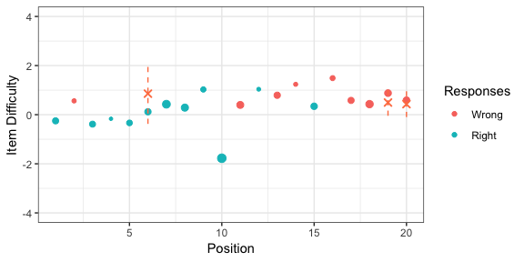

Ex. 6: Administer the MST using the maximum information for routing

``` r
x_sim <- mst_sim(x, .5)
plot(x_sim, ylim=c(-4, 4))
```

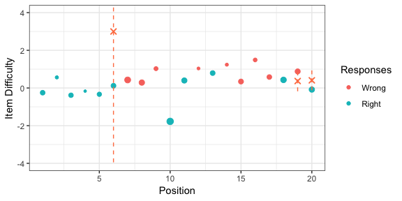

### Ending

Please send comments, questions and feature requests to the [author](mailto:xluo1986@gmail.com). To report bugs, go to the [issues](https://github.com/xluo11/xxIRT/issues) page.

### References

[1] Birnbaum, A. (1968). Some latent trait models. In F.M. Lord & M.R. Novick, (Eds.), Statistical theories of mental test scores. Reading, MA: Addison-Wesley.

[2] Rasch, G. (1966). An item analysis which takes individual differences into account. British journal of mathematical and statistical psychology, 19(1), 49-57.

[3] Muraki, E. (1992). A Generalized Partial Credit Model: Application of an EM Algorithm. Applied Psychological Measurement, 16(2), 159-176.

[4] Muraki, E. (1993). Information Functions of the Generalized Partial Credit Model. Applied Psychological Measurement, 17(4), 351-363.

[5] Samejima, F. (1969). Estimation of latent ability using a response pattern of graded scores. Psychometrika Monograph Supplement, 34(4, Pt. 2), 100.

[6] Thissen, D., & Steinberg, L. (1986). A taxonomy of item response models. Psychometrika, 51(4), 567-577.

[7] Bock, R. D., & Aitkin, M. (1981). Marginal maximum likelihood estimation of item parameters: Application of an EM algorithm. Psychometrika, 46(4), 443-459.

[8] van der Linden, W. J. (2009). Constrained adaptive testing with shadow tests. In Elements of adaptive testing (pp. 31-55). Springer, New York, NY.

[9] Luecht, R. M., & Nungester, R. J. (1998). Some practical examples of computer‐adaptive sequential testing. Journal of Educational Measurement, 35(3), 229-249.

[10] Stocking, M. L., & Swanson, L. (1998). Optimal design of item banks for computerized adaptive tests. Applied Psychological Measurement, 22, 271-279.

[11] Luecht, R. M. (1998). Computer-assisted test assembly using optimization heuristics. Applied Psychological Measurement, 22, 224-236.

[12] Van der Linden, W. J. (2006). Linear models for optimal test design. Springer Science & Business Media.

[13] Weiss, D. J., & Kingsbury, G. (1984). Application of computerized adaptive testing to educational problems. Journal of Educational Measurement, 21, 361-375.

[14] Kingsbury, C. G., & Zara, A. R. (1991). A comparison of procedures for content-sensitive item selection in computerized adaptive tests. Applied Measurement in Education, 4, 241-261.

[15] van der Linden, W. J. (2000). Constrained adaptive testing with shadow tests. In Computerized adaptive testing: Theory and practice (pp. 27-52). Springer Netherlands.

[16] Luo, X., Kim, D., & Dickison, P. (2018). Projection-based stopping rules for computerized adaptive testing in licensure testing. Applied Psychological Measurement, 42, 275-290

[17] Luo, X., & Kim, D. (2018). A Top‐Down Approach to Designing the Computerized Adaptive Multistage Test. Journal of Educational Measurement, 55(2), 243-263.

[18] Luecht, R. M., & Nungester, R. J. (1998). Some practical examples of computer‐adaptive sequential testing. Journal of Educational Measurement, 35(3), 229-249.
