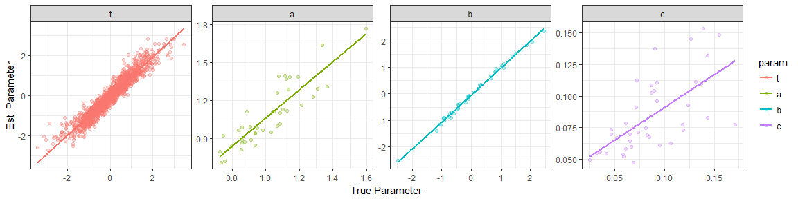
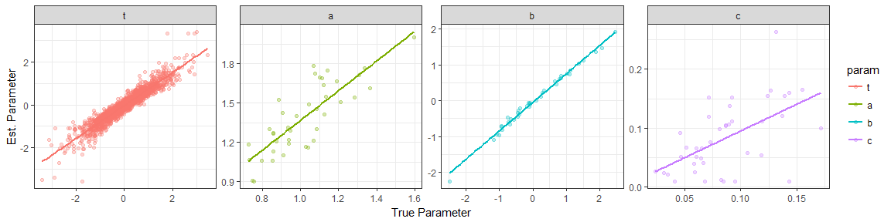
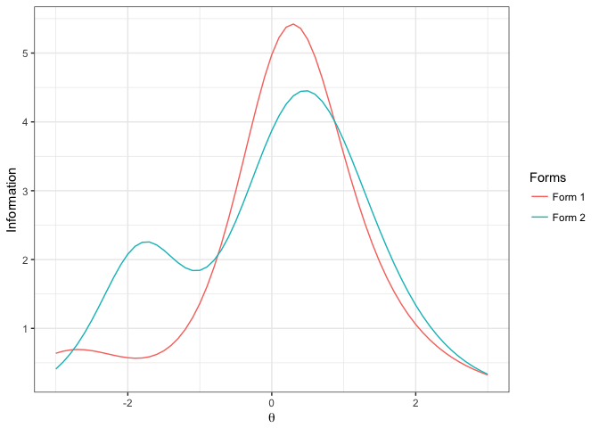
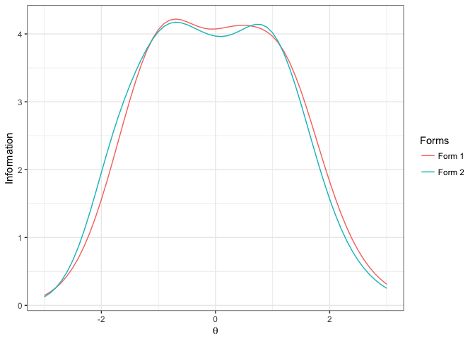

xxIRT: Item Response Theory and Computer-Based Testing in R
================

###### Author: [Xiao Luo](mailto:xluo1986@gmail.com) || Last Edit: 2017-01-22 || Version: 0.0.1

###### **Citation**: Luo, X. (2016). xxIRT: Item Response Theory and Computer-based Testing in R \[Computer Software\]. Retrieved from <https://github.com/xluo11/xxIRT>

### Table of Contents

**1. [Installation](#installation)**
**2. [Introduction](#introduction)**
**3. [Module 0: IRT Models](#module-0-irt-models)**
**4. [Module 1: IRT Utils](#module-1-irt-utils)**
**5. [Module 2: Estimation](#module-2-estimation)**
**6. [Module 3: Automate Test Assembly](#module-3-automated-test-assembly)**
**7. [Module 4: Computerized Adaptive Testing](#module-4-computerized-adaptive-testing)**
**8. [Module 5: Multistage Testing](#module-5-multistage-testing)**
**9. [Graphical User Interfaces](#graphical-user-interfaces)**

### Installation

To install a stable version from [CRAN](https://cran.r-project.org/package=xxIRT), type `install.packages("xxIRT")` in R console. To install the most recent version from [GitHub](https://github.com/xluo11/xxIRT), type `devtools::install_github("xluo11/xxIRT")` in R console (if *devtools* package has not been installed yet, install it first). The package is updated frequently on GitHub to add new features and revisions. When it is deemed a significant upgrade from the previous version, I will submit it to CRAN. To remove the installed package, call `remove.packages("xxIRT")` in R console.

### Introduction

*xxIRT* is a R package that intends to bring latest advancements in psychometric research, especially in the areas of item response theory and computer-based testing, into easily accessible implementations to facilitate practical research and practice. It is my hope that this package becomes a medium that bridges the gap between psychometric theories and practice and benefits the parties on the both sides by creating a common language in between. That is, the implementations of theories allows the idea to be tested and refined by practitioners, and in the meanwhile, the new ideas/demands generated in practice drive researchers to explore better solutions and methodologies.

The current version of this package consists of six modules: (0) measurment models, (1) item response theory (IRT), (2) parameter estimation, (3) automated test assembly (ATA), (4) computerized adaptive testing (CAT), and (5) computerized multistage testing (MST). The application programming interface, or API, is for intermediate R users who are comfortable with the R programming language. Additionally, several graphical user interfaces, or GUIs, are developed for novice users who are not necessarily familiar with R. GUIs are more user-friendly and include most, but not all, of the key functionalities available in the API.

### Module 0: IRT Models

##### 3PL Model

The 3-parameter-logistic (3PL) model was introduced by Birnaum [1], in which an item is characterized with the a (discrimination), b (difficulty), and c (pseudo-guessing) parameters and a test taker with the **θ** parameter. The probability of a correct response is given by:
$$p = c + \\frac{1-c} {1 + e^{-1.7a(\\theta - b)}}$$
 The information function is given by:
$$I=(1.7a)^2 (\\frac{p-c}{1-c})^2 \\frac{q}{p}$$
 Use `model_3pl(people, items, responses)` or `model_3pl(theta, a, b, c)` to create an object of 3PL model. The *people* argument needs to be a data frame with a column named *theta*, the *items* argument a data frame with columns named *a*, *b*, and *c*, and the *responses* argument a matrix or data frame with dimensions equal to the number of people and items. Alternatively, *theta*, *a*, *b*, and *c* arguments take numeric vectors direclty. In addition to data, the object also contains the functions to compute probability (`P(x)`), information (`I(x)`), and likelihood (`L(x, log)`) and a function to generate data (`gendata(n.people, n.items, people, items, ...)`). The `gendata` function may take in the number of people and/or items or fixed people and/or item parameters. The */*t**h**e**t**a** parmaeter is drawn from a normal distribution (mean=*theta.mean*, sd=*theta.sd*), a parmaeter from a lognormal distribution (log-mean=*a.mean*, log-sd=*a.sd*), b parameter from a normal distribution (mean=*b.mean*, sd=*b.sd*), and c parameter from a beta distribution (alpha=*c.alpha*, beta=*c.beta*).

##### Code Sample

``` r
# create a 3pl model using given parameters
theta <- c(-1, 0, 1)
a <- c(.588, 1)
b <- c(-1, 1)
c <- c(0, .2)
u <- matrix(c(1, 0, 1, 0, 1, 0), nrow=3)
people <- data.frame(theta=theta)
items <- data.frame(a=a, b=b, c=c)
# create 3pl model using different arguments
model_3pl(people=people, items=items, responses=u) 
model_3pl(people=people, items=items) 
model_3pl(theta=theta, a=a, b=b, c=c) 
model_3pl(people=people, a=a, b=b, c=c) 
model_3pl(theta=theta, items=items) 

# compute P(robability), I(nformation), L(ikelihood)
x <- model_3pl(people=people, items=items, responses=u)
x$P(x)
x$I(x)
x$L(x)
# compute P, I, L like using static methods
model_3pl()$P(x)
model_3pl()$I(x)
model_3pl()$L(x)
```

``` r
# create a 3pl model using generated data
x <- model_3pl()$gendata(5, 3)
x$P(x)
```

    ##             item.1    item.2    item.3
    ## people.1 0.6287781 0.1635074 0.5719511
    ## people.2 0.9948916 0.9079288 0.9957775
    ## people.3 0.7872351 0.2089806 0.7489196
    ## people.4 0.8930723 0.3049837 0.8777382
    ## people.5 0.9255020 0.3756219 0.9173478

``` r
x$I(x)
```

    ##              item.1     item.2     item.3
    ## people.1 0.51588688 0.02402012 0.52644116
    ## people.2 0.01275843 0.25144839 0.01309778
    ## people.3 0.39730141 0.09753580 0.50091330
    ## people.4 0.23396945 0.28680894 0.31407539
    ## people.5 0.17034657 0.41171573 0.22705435

``` r
x$L(x)
```

    ##             item.1    item.2    item.3
    ## people.1 0.3712219 0.8364926 0.4280489
    ## people.2 0.9948916 0.9079288 0.9957775
    ## people.3 0.2127649 0.7910194 0.7489196
    ## people.4 0.8930723 0.6950163 0.8777382
    ## people.5 0.9255020 0.3756219 0.9173478

##### PCM

### Module 1: IRT Utils

Item response theory (IRT) parameterizes the characteristics of test takers and testing items, and uses these parameters to build statistical models that describes the mechanisms underlying observed responses. It is widely used in practice to develop and analyze modern assessment instruments. IRT refers to a family of models using the metholodgy of this kind. This module provides a common interface for IRT computations and graphing, and it is the foundation for other advanced IRT applications in this package.

For instance, use `irt_model(model, people, items, responses)` to initiate an IRT model object to hold the data and functions to compute essential statitics (i.e., probability, information, and likelihood). It is possible to pass in `NULL` data; however, some computations may fail if necessary parameters/data are missing. Use `irt_stats(obj, stats, summary, fun)` to compute statistics and summarize it over *people* or *items* optionally. Use `irt_select(obj, people.index, items.index)` to subset data and `irt_sample(obj, n.people, n.items)` to sample data. Use `irt_rescale_3pl(obj, parameter, mean, sd)` to re-scale 3PL parameters.

##### Code Sample

``` r
# create a 3pl model using given parameters
people <- data.frame(theta=c(-1, 0, 1))
items <- data.frame(a=c(.588, 1), b=c(-1, 1), c=c(0, .2))
responses <- matrix(c(1, 0, 1, 0, 1, 0), nrow=3)
x <- irt_model("3pl", people, items, responses)
# create a 3pl model using generated data
x <- irt_model("3pl")$gendata(10, 5)

# compute Prob(ability), Info(rmation), Lik(elihood)
irt_stats(x, "prob")
```

    ##              item.1    item.2    item.3    item.4    item.5
    ## people.1  0.6429782 0.1941566 0.2554577 0.1154315 0.1840395
    ## people.2  0.9557277 0.6687975 0.7964279 0.3176767 0.5944310
    ## people.3  0.4537915 0.1134879 0.1604777 0.1035207 0.1582727
    ## people.4  0.9825589 0.8233128 0.9149533 0.5211018 0.8142628
    ## people.5  0.8256941 0.3527823 0.4543884 0.1509636 0.2679375
    ## people.6  0.8848196 0.4521410 0.5738800 0.1847716 0.3464151
    ## people.7  0.9958190 0.9426709 0.9803176 0.8191487 0.9613088
    ## people.8  0.9535879 0.6592061 0.7879066 0.3090956 0.5814250
    ## people.9  0.9857954 0.8482763 0.9306558 0.5703159 0.8487793
    ## people.10 0.9604517 0.6910882 0.8157191 0.3390230 0.6251868

``` r
irt_stats(x, "prob", summary="people", fun=sum)
```

    ##  people.1  people.2  people.3  people.4  people.5  people.6  people.7 
    ## 1.3920635 3.3330606 0.9895505 4.0561896 2.0517658 2.4420274 4.6992650 
    ##  people.8  people.9 people.10 
    ## 3.2912211 4.1838226 3.4314687

``` r
irt_stats(x, "info")
```

    ##                item.1     item.2     item.3      item.4      item.5
    ## people.1  0.491186108 0.23150714 0.28856978 0.010283791 0.035944332
    ## people.2  0.100074265 0.39626594 0.42072466 0.337451471 0.676944662
    ## people.3  0.463227048 0.12065775 0.10946142 0.002066332 0.005845529
    ## people.4  0.040753696 0.26386703 0.20778131 0.528323474 0.500596578
    ## people.5  0.329715952 0.38181128 0.54019950 0.056055631 0.207023258
    ## people.6  0.237175774 0.42755024 0.58105642 0.112907500 0.379557837
    ## people.7  0.009927152 0.09877116 0.05217972 0.366462664 0.131283855
    ## people.8  0.104629002 0.40146095 0.43260386 0.324655743 0.673694032
    ## people.9  0.033321861 0.23386725 0.17288043 0.538910316 0.432253871
    ## people.10 0.089926528 0.38282784 0.39213376 0.367806929 0.678694360

``` r
irt_stats(x, "info", summary="items", fun=sum)
```

    ##   item.1   item.2   item.3   item.4   item.5 
    ## 1.899937 2.938587 3.197591 2.644924 3.721838

``` r
irt_stats(x, "lik")
```

    ##              item.1    item.2    item.3    item.4    item.5
    ## people.1  0.3570218 0.8058434 0.7445423 0.8845685 0.8159605
    ## people.2  0.9557277 0.6687975 0.7964279 0.6823233 0.5944310
    ## people.3  0.4537915 0.8865121 0.8395223 0.8964793 0.8417273
    ## people.4  0.9825589 0.1766872 0.9149533 0.4788982 0.8142628
    ## people.5  0.8256941 0.3527823 0.4543884 0.8490364 0.7320625
    ## people.6  0.8848196 0.5478590 0.5738800 0.8152284 0.6535849
    ## people.7  0.9958190 0.9426709 0.9803176 0.8191487 0.9613088
    ## people.8  0.9535879 0.6592061 0.7879066 0.6909044 0.4185750
    ## people.9  0.9857954 0.8482763 0.9306558 0.4296841 0.8487793
    ## people.10 0.9604517 0.6910882 0.8157191 0.3390230 0.6251868

``` r
irt_stats(x, "lik", summary="people", fun=prod)
```

    ##   people.1   people.2   people.3   people.4   people.5   people.6 
    ## 0.15460921 0.20647472 0.25485018 0.06193987 0.08226738 0.14822651 
    ##   people.7   people.8   people.9  people.10 
    ## 0.72465777 0.14323460 0.28382934 0.11475947

``` r
# select and sample data
irt_select(x, c(1, 3, 5), c(2, 4))
```

    ## a 3pl model: 3 people, 2 items, with responses.
    ## snapshot of people:
    ##       theta
    ## 1 -1.464385
    ## 2 -2.009038
    ## 3 -0.816224
    ## snapshot of items:
    ##           a          b          c
    ## 2 0.7964260 -0.3162396 0.02388623
    ## 4 0.9470823  0.8709904 0.09483641
    ## snapshot of responses:
    ##          item.2 item.4
    ## people.1      0      0
    ## people.3      0      0
    ## people.5      1      0

``` r
irt_sample(x, 5, 3)
```

    ## a 3pl model: 5 people, 3 items, with responses.
    ## snapshot of people:
    ##        theta
    ## 1  0.1437940
    ## 2 -0.8162240
    ## 3 -2.0090379
    ## 4  0.7986781
    ## 5  0.9338915
    ## snapshot of items:
    ##           a          b          c
    ## 4 0.9470823  0.8709904 0.09483641
    ## 3 0.9690238 -0.5881494 0.07966401
    ## 2 0.7964260 -0.3162396 0.02388623
    ## snapshot of responses:
    ##          item.4 item.3 item.2
    ## people.8      0      1      1
    ## people.5      0      1      1
    ## people.3      0      0      0
    ## people.4      0      1      0
    ## people.9      0      1      1

``` r
# rescale
x <- irt_rescale_3pl(x, "theta", 0, 1)
c(mean=mean(x$people$theta), sd=sd(x$people$theta))
```

    ##         mean           sd 
    ## 1.113476e-17 1.000000e+00

``` r
x <- irt_rescale_3pl(x, "b", 0, 1)
c(mean=mean(x$items$b), sd=sd(x$items$b))
```

    ##          mean            sd 
    ## -1.113476e-17  1.000000e+00

Visualization is important in data analysis. Use `plot(obj, stats, total, ...)` to draw the specified *stats* at item/person level (`total=FALSE`) or test level ( `total=TRUE`). For example, use `stats='prob'` to draw item/test characteristic curves, use `stats='info'` to draw item/test information functions, and use `stats='loglik'` to visualize reponses likelihood.

``` r
x <- irt_model("3pl")$gendata(10, 5)
plot(x, stats='prob', total=FALSE)
```


``` r
plot(x, stats='info', total=TRUE)
```



``` r
plot(x, stats='loglik', total=TRUE)
```



Use `rmse(x, y)` to compute the root mean square error between two vectors or matrices. Use `freq(x, values)` to count the frequency and percentage for the given vlaues.

##### Code Sample

``` r
rmse(rnorm(100), rnorm(100))
```

    ## [1] 1.466552

``` r
freq(round(sample(1:4, 100, replace=TRUE)), 1:4)
```

    ##   value freq perc cum.freq cum.perc
    ## 1     1   26   26       26       26
    ## 2     2   24   24       50       50
    ## 3     3   26   26       76       76
    ## 4     4   24   24      100      100

``` r
freq(round(sample(1:4, 100, replace=TRUE)), 1:3)
```

    ##   value freq perc cum.freq cum.perc
    ## 1     1   23   23       23       23
    ## 2     2   23   23       46       46
    ## 3     3   30   30       76       76

### Module 2: Estimation

Parameter estimation is a quintessential component of IRT analyses and applications. Many applications are built upon computations involving people and/or item parameters. However, these unobserved parameters are naturaly known in practice and have to be estimated through observed data. This module provides an interface for estimating people and item parameters by a variety of estimation methods for the 3PL model. For instance, when item parameters are available, people parameters can be estimated by the maximum likelihood (MLE), maximum a posteriori (MAP) estimator, or the expected a priori (EAP) estimator. Alternatively, item parameters can be calibrated by the joint maximum likelihood estimator (JMLE) when people parameters are known and by the marginal maximum likelihood (MMLE) or the bayesian estimator (BME) when people parameters are not known. More technical detail regarding these estimation methods is provided in Baker and Kim (2004)[2].

To estimate people and item parameters simultaneously, use `estimate_3pl(responses)`. The function first calibrates item parameters using MMLE and then estimates people parameters using MLE.

##### Code Samples

``` r
# data generation
data <- irt_model("3pl")$gendata(500, 50)
# Estimate people parameters: MLE
x.mle <- estimate_people(data$responses, data$items, "3pl", "mle")
# Estimate people parameters: MAP
x.map <- estimate_people(data$responses, data$items, "3pl", "map")
# Estimate people parameters: EAP
x.eap <- estimate_people(data$responses, data$items, "3pl", "eap")
# Comparison with true parameters
x <- data.frame(true=data$people$theta, mle=x.mle$people$theta, map=x.map$people$theta, eap=x.eap$people$theta)
round(t(apply(x, 2, function(v) c(R=cor(v, x$true), RMSE=rmse(v, x$true)))), 2)
melt(x, id.vars="true") %>%
  ggplot(aes(x=true, y=value, color=variable)) + geom_point(pch=1) +
  facet_wrap(~variable, nrow=2) + xlab("True") + ylab("Est.") +
  theme_bw() + theme(legend.key=element_blank())

# data generation
data <- irt_model("3pl")$gendata(1200, 50)
# Estimate item parameters: JMLE
x.jmle <- estimate_items(data$responses, "3pl", "jmle", people=data$people)
# Estimate item parameters: MMLE
x.mmle <- estimate_items(data$responses, "3pl", "mmle")
# Estimate item parameters: BME
x.bme <- estimate_items(data$responses, "3pl", "bme")
# Comparison with true parameters
sapply(list(jmle=x.jmle, mmle=x.mmle, bme=x.bme), function(x) diag(cor(x$items, data$items)))
sapply(list(jmle=x.jmle, mmle=x.mmle, bme=x.bme), function(x) rmse(x$items, data$items))
x <- rbind(data.frame(method="jmle", melt(x.jmle$items), true=melt(data$items)$value),
           data.frame(method="mmle", melt(x.mmle$items), true=melt(data$items)$value),
           data.frame(method="bme", melt(x.bme$items), true=melt(data$items)$value))
ggplot(data=x, aes(x=true, y=value, color=method)) + geom_point(pch=1) +
  facet_grid(variable ~ method, scales="free") + xlab("True") + ylab("Est.") +
  theme_bw() + theme(legend.key=element_blank())
```

### Module 3: Automated Test Assembly

Automated test assembly (ATA) is not only a technique that could greatly faciliate assembly of parallel test forms in practice, but also a indispensable component in advanced applications that involves sophisticated test assembly problems. Apprantly, it is astronomically daunting, tedious and error-prone job to manually assemble multiple parallel forms under complex constraints. ATA transforms this type of problem into a set of linear equations and utilizes advanced optimization methodology to find the best solution to the problem, if a solution is feasible. Beyond that, ATA is a necessary building block of applications such as shadow test CAT algorithm[3], MST assembly[4], and projection-based stopping rule[5].

Technically, ATA is to solve an optimization problem per se. This module provides an interface to solve the problem using mixed integer programming (MIP) technique. It is built upon the open-source mixed integer linear programming solver *[lp\_solve](http://lpsolve.sourceforge.net)* and its R interface package *[lpSolveAPI](https://CRAN.R-project.org/package=lpSolveAPI)*. Compared to the heuristic ATA methods [6][7], MIP is able to address more complex problem and obtain better results. However, its computation is far more sophisticated and intense than heuristic methods.

This module tends to make programming easier, and the users should have a decent amount of knowledge with respect to ATA and MIP in order to use it properly. To start off, use `ata(pool, nform, len, maxselect, debug)` to create a *ata* object which is a wrapper of a LP model object. Use `ata_obj_relative(ata, coef, mode, negative, flatten, compensate, forms, collapse)` and `ata_obj_absolute(ata, coef, target, compensate, forms, collapse)` functions to add relative and absolute objective functions to the LP respectively. The relative objective functions is to maximize or minimize the objective function (the `mode` argument), whereas the absolute objective functions is to minimize the discrepancy between the objective functions and targetted values (the `target` argument). The `coef` argument can be a pool-size numeric vector, a variable name, or a vector of theta values (when length is not equal to the number of items in the pool). When the expected value of the optimized objective function is negative, set the `negative=TRUE`. The `forms` argument specifies which forms the objectives or constraints will be set. When `collapse=TRUE`, it means the forms will be collapsed into one combined form. Otherwise, the same objective or contraint is set for each form. This is very useful in assembling a MST using the top-down approach.

Use `ata_constraint(ata, coef, min, max, level, forms, collapse)` to add constraints. The `coef` argument can be a variable name, a constant, or a pool-size numeric vector. When `min=NA` or `max=NA`, the lower or the upper bound of the constraint is not set. When `min==max`, the constraint is set to equal to the value.

Use `ata_item_enemy(ata, items)` to add enemy items which should not be selected into the same form at the same time. Use `ata_item_fixedvalue(ata, items, min, max, forms, collapse)` to force the selection or not selection of items. Use `ata_item_maxselect(ata, maxselect, items)` to set the maximum number of selection for items.

Finally, use `ata_solve(ata, ...)` to attempt to solve the LP problem specified by the user. A useful optional argument is `timeout` which sets the maximum time allowed to solve the problem. If solved successfully, the *ata* object adds a binary matrix named *`results`* where 1 indicates an item (in rows) is selected into a form (in columns). Use `ata_get_items(ata, as.list)` to retrieve selected items into a list or data frame more conveniently. Use `plot(ata)` to draw the TIF of each assembled form.

##### Code Samples

Below are five examples to illustrate how to use this module. First, a 100-item pool with content area (categorical) and response time (quantitative) variables is generated and used throughout all examples. The first example assembles four parallel forms with 10 items to maximize *b* parameters. The second example assembles four parallel forms with 10 items to minimize *b* parameters in which the expected objective function has a negative value. The third example assembles four parallel forms with 10 items to maximize information at *θ* = −1 and *θ* = 1 while subject to (3, 3, 4) items from content area (1, 2, 3) and average response is between 55 and 65 seconds. The fourth example assembles 2 10-item parallel forms that has mean and sd of *b* parameters equal to 0 and 1 while subject to (3, 3, 4) items from content area (1, 2, 3). The fifth example assembles 2 10-item parallel forms that has a flat TIF over the interval *θ* = \[ − 1, 1\].

``` r
# generate a 100-item pool
items <- irt_model("3pl")$gendata(1, 100)$items
items$content <- sample(1:3, nrow(items), replace=TRUE)
items$time <- round(rlnorm(nrow(items), log(60), .2), 0)
# ex. 1: 4 forms, 10 items, maximize b parmaters
x <- ata(items, 4, len=10, maxselect=1)
x <- ata_obj_relative(x, "b", "max")
x <- ata_solve(x)
plot(x)
```


``` r
ata_get_items(x) %>% group_by(form) %>%
  summarize(a=mean(a), b=mean(b), c=mean(c))
```

    ## # A tibble: 4 × 4
    ##    form         a        b          c
    ##   <int>     <dbl>    <dbl>      <dbl>
    ## 1     1 0.9391223 1.038569 0.10071905
    ## 2     2 0.8920659 1.034778 0.12730724
    ## 3     3 1.0210491 1.035137 0.08944497
    ## 4     4 1.0187401 1.036483 0.12317564

``` r
# ex. 2: 4 forms, 10 items, minimize b parmaeters
x <- ata(items, 4, len=10, maxselect=1)
x <- ata_obj_relative(x, "b", "min", negative=TRUE)
x <- ata_solve(x)
plot(x)
```


``` r
ata_get_items(x) %>% group_by(form) %>%
  summarize(a=mean(a), b=mean(b), c=mean(c))
```

    ## # A tibble: 4 × 4
    ##    form         a          b         c
    ##   <int>     <dbl>      <dbl>     <dbl>
    ## 1     1 1.1373417 -0.9243515 0.1033393
    ## 2     2 1.0127499 -0.9041928 0.1214619
    ## 3     3 1.0670107 -0.9085962 0.1060852
    ## 4     4 0.9989113 -0.9060205 0.1011612

``` r
# ex. 3: 4 forms, 10 items, maximize information at -1 and 1
# content distribution: 3, 3, 4; response time: avg. 55--65s
x <- ata(items, 4, len=10, maxselect=1) %>%
     ata_obj_relative(c(-1, 1), "max") %>%
     ata_constraint("content", min=3, max=3, level=1) %>%
     ata_constraint("content", min=3, max=3, level=2) %>%
     ata_constraint("content", min=4, max=4, level=3) %>%
     ata_constraint("time", min=55*10, max=65*10) %>%
     ata_solve()
plot(x)
```


``` r
ata_get_items(x) %>% group_by(form) %>%
  summarize(a=mean(a), b=mean(b), c=mean(c),
  cont1=sum(content==1), cont2=sum(content==2), cont3=sum(content==3))
```

    ## # A tibble: 4 × 7
    ##    form        a           b          c cont1 cont2 cont3
    ##   <int>    <dbl>       <dbl>      <dbl> <int> <int> <int>
    ## 1     1 1.154586  0.16252593 0.10078701     3     3     4
    ## 2     2 1.145044  0.05425901 0.09033857     3     3     4
    ## 3     3 1.220982 -0.11109597 0.10181334     3     3     4
    ## 4     4 1.177860 -0.23324201 0.08410996     3     3     4

``` r
# ex. 4: 2 forms, 10 items, mean(b) = 0, sd(b) = 1.0, content = (3, 3, 4)
x <- ata(items, 2, len=10, maxselect=1) %>%
     ata_obj_absolute(x$pool$b, 0 * 10) %>%
     ata_obj_absolute((x$pool$b - 0)^2, 1 * 10) %>%
     ata_constraint("content", min=3, max=3, level=1) %>%
     ata_constraint("content", min=3, max=3, level=2) %>%
     ata_constraint("content", min=4, max=4, level=3) %>%
     ata_solve(timeout=30)
plot(x)
```



``` r
ata_get_items(x) %>% group_by(form) %>%
  summarize(b_mean=mean(b), b_sd=sd(b),
  cont1=sum(content==1), cont2=sum(content==2), cont3=sum(content==3))
```

    ## # A tibble: 2 × 6
    ##    form       b_mean     b_sd cont1 cont2 cont3
    ##   <int>        <dbl>    <dbl> <int> <int> <int>
    ## 1     1 -0.002466859 1.054485     3     3     4
    ## 2     2 -0.023941835 1.040859     3     3     4

``` r
# ex. 5: 2 forms, 10 items, flat TIF over [-1, 1]
x <- ata(items, 2, len=10, maxselect=1) %>%
     ata_obj_relative(seq(-1, 1, .5), "max", flatten=0.1) %>%
     ata_solve(timeout=30)
plot(x)
```



### Module IV: Computerized Adaptive Testing (CAT)

CAT is an innovative application of IRT on top of modern computing technology. CAT takes advantage of immense computing power in modern computers to customize the test for the test taker in the real time. The adaptivity in CAT reduces the administration of non-informative items so that the test length can be shorted without scarifying the measurement quality.

A working CAT algorithm consists of three imperative components: the selection rule, the estimation rule, and the termination rule. The selection rule delineates how to select the next item given the status quo of the test taker. The estimation rule is a method of ability estimation. And the termination rule determines whether it is appropriate to exit the repetitive "seletion-estimation" cycles and terminate the test. A CAT research is usually about inventing a new rule within the general "selection-estimation-termination" workflow. Therefore, this module provides a framework for CAT simulation using user-defined rules. Some common rules are provided in the package and are readily available to use. If the user wants to try a new rule, only that particular rule needs to be written and passed into the `cat.sim` function. This approach allows users t write minimal code to get a CAT simulation up and running.

The default selection rule (`cat.select.default`) selects the most informative item for the next administration. To add some randomness to appease the item overexposure, set a `options$randomesque` value to randomly select an item from the *k* most informative ones. The constrained-CAT selection rule (`cat.select.ccat`) selects item under the content-balancing constraint. It first identifies the content domain with largest discrepancy from the target (`options$ccat.target`) and then select the most informative item from that content domain. Set a `options$cat.random` value to add some randomness to initial content domain sequence. The shadow test selection rule (`cat.select.shadow`) implements the shadow test algorithm. Set `options$shadow.constraints` to a data frame of constraints with four columns: `name` (variable name), `level` (`NA` for a quantitative variable), `min` and `max`.

The default estimation rule (`cat.estimate.default`) applies the EAP method to estimate the test taker's ability when the responses are all correct or all incorrect; otherwise, applies the MLE method.

The default stopping rule (`cat.stop.default`) is a trifold rule. Before the test reaches the minimum length (`options$min`), it never stops the test, and when the test reaches the maximum length (`options$max`) it always stops the test. Between the minimum and maximum length, it stops the test: (1) when the SE threshold (`options$stop.se`) is reached; (2) when none of items in the pool exceeds the MI threshold (`options$stop.mi`); or (3) when a clear pass/fail decision is available against the cut score (`options$stop.cut`). The projection-based stopping rule (`cat.stop.projection`) stops the test when the projected ability range under the constraints (`optioins$projection.constraints`) is clearly above or below the cut score (`options$projection.cut`) using the given projection method (`options$projection.method`).

When `debug=TRUE` is set in `cat.sim`, debugging information will be printed on the console to help troubleshooting and understand the internal process of the simulation.

Once a simulation is complete, it returns a `cat` object including a data frame of unused items (`pool`), a data frame of used items (`items`), responses and theta history (`stats`), administration history (`admin`), test length (`len`), true theta (`true`), and estimated theta (`eat`). The generic method `plot` is overridden to draw the simulation result.

##### Code Samples

``` r
# generate an item pool
pool <- irt.model()$gen.data(1,200)$items
pool$content <- sample(1:3, nrow(pool), replace=TRUE)
pool$time <- round(exp(rnorm(nrow(pool), log(60), .2)))
# cat simulation: 10-30 items, default rules, stop criterion: se = .3
opts <- list(min=10, max=30, stop.se=.3)
x <- cat.sim(0.1, pool, opts)
x$admin
plot(x)
# cat simulation: 10-30 items, default rules, stop criterion: mi = .3
opts <- list(min=10, max=30, stop.mi=.8)
x <- cat.sim(0.1, pool, opts, debug=TRUE)
# cat simulation: 10-30 items, default rules, stop criterion: cut = -.5
opts <- list(min=10, max=30, stop.cut=-0.5)
x <- cat.sim(0.1, pool, opts, debug=TRUE)
# cat simulation: 10-30 items, default rules, stop criterion: se = .3, randomesque=10
opts <- list(min=10, max=30, stop.se=.3, randomesque=5)
x <- cat.sim(0.1, pool, opts)
x
plot(x)
# cat simulation: 10-30 items, c-cat selection rule, first 10 random
opts <- list(min=30, max=60, stop.cut=0, ccat.target=c(.5,.25,.25), ccat.random=10)
x <- cat.sim(0.1, pool, opts, cat.select=cat.select.ccat)
x
freq(x$admin$content, 1:3)
plot(x)
# cat simulation with shadow test
cons <- data.frame(name="content", level=1, min=10, max=10, stringsAsFactors=FALSE)
cons <- rbind(cons, c("content", 2, 10, 10))
cons <- rbind(cons, c("content", 3, 10, 10))
cons <- rbind(cons, c("time", NA, 55*30, 65*30))
opts <- list(min=30, max=30, stop.se=.03, shadow.constraints=cons)
x <- cat.sim(0.1, pool, opts, cat.select=cat.select.shadow, debug=TRUE)
x
freq(x$admin$content, 1:3)
sum(x$items$time)
plot(x)
# cat simulation using the projection-based stopping rule
cons <- data.frame(name="content", level=1, min=10, max=10, stringsAsFactors=FALSE)
cons <- rbind(cons, c("content", 2, 10, 10))
cons <- rbind(cons, c("content", 3, 10, 10))
opts <- list(min=10, max=30, projection.cut=0, projection.constraints=cons,
projection.method="information")
x <- cat.sim(0.1, pool, opts, cat.stop=cat.stop.projection, debug=TRUE)
```

### Module V: Multistage Testing (MST)

MST is another adaptive testing model that has recently drawn a great deal of attention from practitioners. A MST consists of multiple testing phases, and in each stage a test taker will be administered with a pre-assembled *module*. The adaptivity takes place between stages and route the test taker to the module that best matches the test taker's ability in the next stage. When modules are connected with certain routing rules across stages, they constitute a *panel*. A common practice is to have multiple parallel and interchangeable panels in place for administration. One panel will randomly selected for administration in order to control the item exposure. With reduced adaptivity, it is difficult for MST to surmount CAT in terms of measurement quality. However, all modules are assembled in house prior to administration, and thus MST allows the preview and quality control opportunities to inspect both content and psychometric properties before the tests are published. This module provides an interface for designing, assembling and simulating a MST.

To start off, call `mst` to initiate a *mst* object and set up an *MILP* object for assembling *k* panels (the `npanel` argument) using the given item pool (the `pool` argument). The `mst` function requires the `design` and `method` arguments. The design is a numeric vector with each element representing the number of modules in that stage. For example, `c(1,2,3)` represents a 1-2-3 MST design (3 stages, 6 modules) and `c(1, 4)` represents a 1-4 MST design (2 stages, 5 modules). Internally, the modules will be indexed sequentially from the first to the last stage. A module-index map is constructed to illustrate the correspondence between index and stage-module position. A route map is also constructed to show all permissible routes. Use `mst.route` to remove an existing route or add a new route. In practice, routes with radical changes are oftentimes prohibited.

The method can be `topdown` or `bottomup`. With the top-down approach, objectives and constraints are imposed on routes, and with the bottom-up, objectives and constraints are imposed on modules. For the top-down method, test-level objectives and constraints are set directly, whereas for the bottom-up method, objectives and constraints have to be broken down into stages. Use `mst.objective` to set TIF objectives, and use `mst.constraint` to impose constraints. Both functions takes a `indices` argument. It is a vector of module indices for the bottom-up design and route indices for the top-down design method. For the top-down method, an additional constraint is needed to regulate the minimum length in stages; otherwise the ATA is likely to cumulate all items into the final stage to achieve the optimum.

After setting up all objectives and constraints, use `mst.assemble` to assemble items into panels, and results are added the object in the name of `items`. Use `mst.get.items` to extract items for a panel, module or a route. The function `mst.sim` simulate the administration of the assembled MST for the given `true.theta`. The generic method `plot` is overridden to draw TIFs of modules. When the argument `byroute=FALSE`, the plot is in a panel-by-stage grid. When the argument `byroute=TRUE`, the plot draws TIFs of each route in each panel.

##### Code Samples

``` r
# ex. 1: 1-2-2 MST, 2 panels, topdown, 20 items, content = c(10, 5, 5)
# maximize information at -1 for easy routes and 1 for hard routes
pool <- irt.model()$gen.data(1,300)$items
pool$content <- sample(1:3, nrow(pool), replace=TRUE)
pool$time <- round(exp(rnorm(nrow(pool), log(60), .2)))
x <- mst(pool, design=c(1,2,2), npanel=2, method='topdown')
x$route
x <- mst.objective(x, theta=-1, indices=1:2)
x <- mst.objective(x, theta=1, indices=3:4)
x <- mst.constraint(x, 1, 20, 20)
x <- mst.constraint(x, "content", 10, 10, level=1)
x <- mst.constraint(x, "content", 5, 5, level=2)
x <- mst.constraint(x, "content", 5, 5, level=3)
x <- mst.stage.length(x, c(1,2,3), min=5)
x <- mst.assemble(x)
freq(mst.get.items(x, panel=1,route=1)$content, 1:3)$n
freq(mst.get.items(x, panel=2,route=4)$content, 1:3)$n
plot(x)
plot(x, byroute=TRUE)
mst.sim(x, 1)
mst.sim(x, -1)
# ex. 2: 1-2-2 MST, 2 panels, bottomup, 10 items per stage, content = c(4, 3, 3)
# maximize information at -1 for easy modules, 0 for medium modules and 1 for hard modules
x <- mst(pool, design=c(1,2,2), npanel=2, method='bottomup')
x$module
x <- mst.objective(x, theta=0, indices=1)
x <- mst.objective(x, theta=-1, indices=c(2,4))
x <- mst.objective(x, theta=1, indices=c(3,5))
x <- mst.constraint(x, 1, 10, 10)
x <- mst.constraint(x, "content", 4, 4, level=1)
x <- mst.constraint(x, "content", 3, 3, level=2)
x <- mst.constraint(x, "content", 3, 3, level=3)
x <- mst.assemble(x)
freq(mst.get.items(x, panel=1,route=1)$content, 1:3)$n
freq(mst.get.items(x, panel=2,route=4)$content, 1:3)$n
plot(x)
plot(x, byroute=TRUE)
mst.sim(x, 1)
mst.sim(x, -1)
# ex. 3: 1-2-3 MST, 2 panels, topdown, 30 items,
# content = c(10, 10, 10), prohibit routes with radical changes
# maximize information at -1 for easy, 0 for medium and 1 for hard routes
x <- mst(pool, design=c(1,2,3), npanel=2, method='topdown')
x <- mst.route(x, c(1,2,6), "-")
x <- mst.route(x, c(1,3,4), "-")
x$route
x <- mst.objective(x, -1, indices=1)
x <- mst.objective(x,  0, indices=2:3)
x <- mst.objective(x,  1, indices=4)
x <- mst.constraint(x, 1, 30, 30)
x <- mst.constraint(x, "content", 10, 10, level=1)
x <- mst.constraint(x, "content", 10, 10, level=2)
x <- mst.constraint(x, "content", 10, 10, level=3)
x <- mst.stage.length(x, c(1,2,3), min=3)
x <- mst.assemble(x, timeout=5*60)
freq(mst.get.items(x, panel=1,route=1)$content, 1:3)$n
freq(mst.get.items(x, panel=2,route=4)$content, 1:3)$n
plot(x)
plot(x, byroute=TRUE)
mst.sim(x, 1)
mst.sim(x, .2)
mst.sim(x, -.2)
mst.sim(x, -1)
# ex. 4: 1-2-3 MST, 2 panels, bottomup, 10 items per stage,
# content = c(4, 3, 3), prohibit routes with radical changes
# target information at 6 (theta=-1) for easy, 6 (theta=0) for medium
# and 6 (theta=1) for hard modules
x <- mst(pool, design=c(1,2,3), npanel=2, method='bottomup')
x <- mst.route(x, c(1,2,6), "-")
x <- mst.route(x, c(1,3,4), "-")
x$module
x <- mst.objective(x, -1, indices=c(2,4), target=6)
x <- mst.objective(x,  0, indices=c(1,5), target=6)
x <- mst.objective(x,  1, indices=c(3,6), target=6)
x <- mst.constraint(x, 1, 10, 10)
x <- mst.constraint(x, "content", 4, 4, level=1)
x <- mst.constraint(x, "content", 3, 3, level=2)
x <- mst.constraint(x, "content", 3, 3, level=3)
x <- mst.stage.length(x, c(1,2,3), min=3)
x <- mst.assemble(x, timeout=5*60)
freq(mst.get.items(x, panel=1,route=1)$content, 1:3)$n
freq(mst.get.items(x, panel=2,route=4)$content, 1:3)$n
plot(x)
plot(x, byroute=TRUE)
mst.sim(x, 1)
mst.sim(x, .2)
mst.sim(x, -.2)
mst.sim(x, -1)
```

### Module 0: Graphic User Interfaces (GUIs)

Call `gui.irt()` to launch a shiny app for generating data and computing and drawing IRT statistics. Users can choose to generate parameters and data or import from file. When importing people parameters, make sure it is a csv file with the proper column name (e.g., *theta* for 3PL model). When importing item parameters, make sure it is a csv file with proper column names (e.g., *a*, *b*, *c* for 3PL model). To download files, select the data and hit the "Download" button.

Call `gui.estimation()` to launch a shiny app for estimating parameters. After uploading a response file in cvs format, users can choose to import or estimate people and item parameters. When importing people parameter file, make sure it is a cvs file and has a column named *theta*. When estimating people parameters, choose an estimation method. When importing item parameters, make sure it is a csv file and has three columns named *a*, *b*, and *c*. When estimating item parameters, choose an estimation method. Click "Download" button in the *people* and *items* tabs to download people or item parameters.

Call `gui.ata()` to launch a shiny app for ATA. First, upload an item pool file. Make sure it is a cvs file and has three columns named *a*, *b*, and *c*. When add an objective, make sure the *coefficient* is variable name or a theta point. When add a constraint, leave the *level* empty if the variable is a quantitative variable. The app will crash if the user try to add a wrong objective or constraint (e.g., wrong variable name, wrong minimum/maximum value). Click "Download" button in the *Results* tab to download assembly results.

Call `gui.cat()` to launch a shiny app for CAT simulation. First, upload an item pool file. Make sure it is a cvs file and has three columns named *a*, *b*, and *c*. Next, choose to run a single simulation or a batch simulation. For a single simulation, enter the true theta directly. For a batch simulation, upload a people parameter file. Afterwards, select the appropriate selection, estimation and termination rules and click "Run" button to run the simulation. In the *Results* tab, use arrows above the table to navigate among simulations. If it is a batch simulation, two additional graphs will be provided in the *Summary* tab to illustrate the relationship between true and estimated thetas and the relationship between true theta and test length.

Call `gui.mst()` to launch a shiny app for MST simulation. First, upload an item pool file. Make sure it is a cvs file and has three columns named *a*, *b*, and *c*. The route map, the module map, and the ATA object will be shown in the *console* tab. Use *Route Management* to add or remove allowable routes in the MST. Make sure type in the correct route index connected by hyphen (e.g., 1-2-4). When setting objectives, leave the *target* empty if it is to maximize the objective. When setting constraints, leave the *level* empty if it is a quantitative variable. Objectives and constraints will be printed for monitoring in the *console* tab. Don't forget to test length constraint and the stage length constraint (for the top-down method). Click "Assemble" button to assemble MST. Go to *Simulation* tab to run a simulation using the assembled MST.

### Ending

This is an early version of an ongoing project. Please send your comments, questions, feature request and bug reporting to the author [Xiao Luo](mailto:xluo1986@gmail.com).

[1] Birnbaum, A. (1968). Some latent trait models. In F.M. Lord & M.R. Novick, (Eds.), Statistical theories of mental test scores. Reading, MA: Addison-Wesley.

[2] Baker, F. B., & Kim, S. H. (Eds.). (2004). Item response theory: Parameter estimation techniques. CRC Press.

[3] van der Linden, W. J. (2000). Constrained adaptive testing with shadow tests. In Computerized adaptive testing: Theory and practice (pp. 27-52). Springer Netherlands.

[4] Breithaupt, K., & Hare, D. R. (2007). Automated simultaneous assembly of multistage testlets for a high-stakes licensing examination. Educational and Psychological Measurement, 67(1), 5-20.

[5] Luo, ...

[6] Swanson, L., & Stocking, M. L. (1993). A model and heuristic for solving very large item selection problems. Applied Psychological Measurement, 17(2), 151-166.

[7] Luecht, R. M. (1998). Computer-assisted test assembly using optimization heuristics. Applied Psychological Measurement, 22(3), 224-236.
