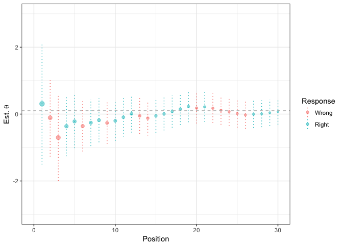
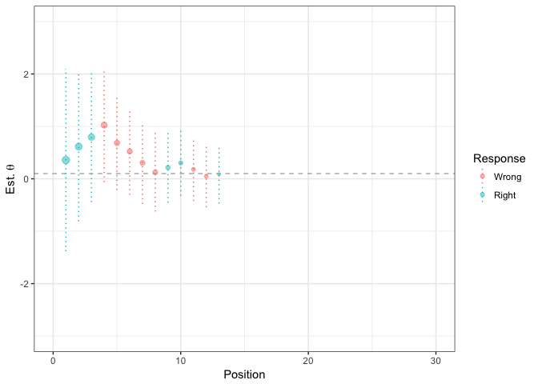
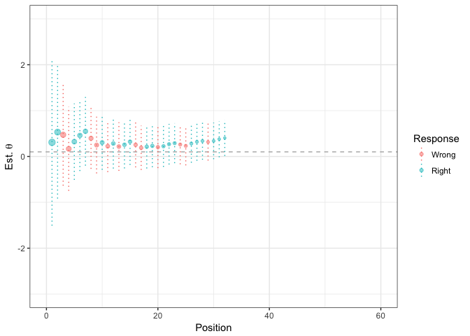
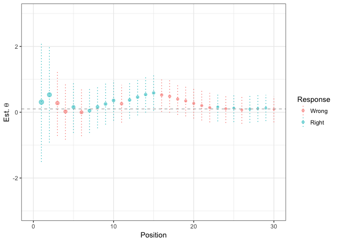
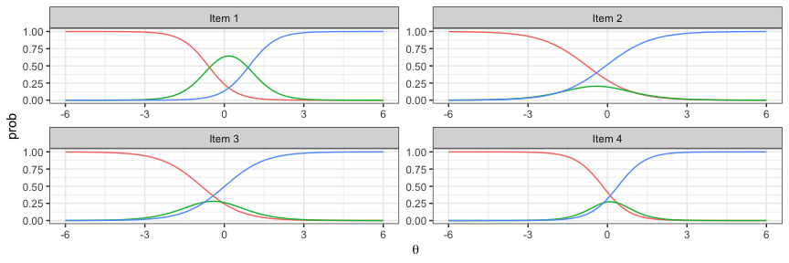
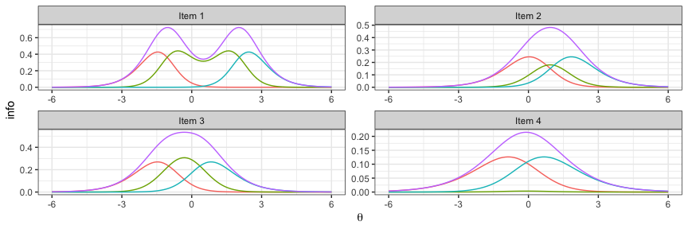
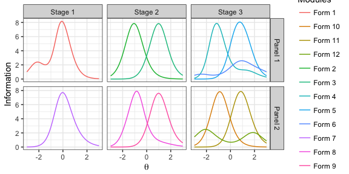
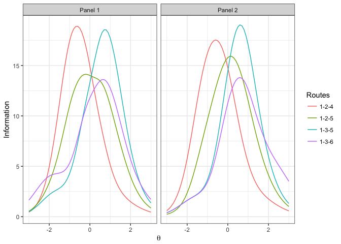
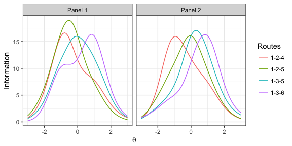

xxIRT: Practical Item Response Theory and Computer-Based Testing in R
================
Xiao Luo
06 May 2017

### Table of Contents

-   [Installation](#installation)
-   [Introduction](#introduction)
-   [Package Modules](#package-modules)
    -   [IRT Models](#irt-models)
    -   [IRT Utils](#irt-utils)
    -   [Parameter Estimation](#parameter-estimation)
    -   [Automated Test Assembly](#automated-test-assembly)
    -   [Computerized Adaptive Testing](#computerized-adaptive-testing)
    -   [Multistage Testing](#multistage-testing)
-   [Graphical User Interfaces](#graphical-user-interfaces)
-   [Ending](#ending)

### Installation

To install a stable version from [CRAN](https://cran.r-project.org/package=xxIRT), call `install.packages("xxIRT")` in R console. To install the most recent version from [GitHub](https://github.com/xluo11/xxIRT), call `devtools::install_github("xluo11/xxIRT")` in R console (if *devtools* package has not been installed yet, install it first). To remove the installed package, call `remove.packages("xxIRT")` in R console.

### Introduction

*xxIRT* is a R package that intends to bring latest advancements in psychometric research in the areas of computer-based testing into easily accessible implementations so as to facilitate psychometric research and operations. This package started as a side project while I tried to organize my code scattered around different locations in a better manner. I wanted my code to be centralized, portable, and cross-platform, and I realized writing a package is probably the best way to achieve that goal. It is my hope that this package becomes a medium bridging the gap between psychometric theories and practice, and it evetually benefits parties on both sides by creating a common language in between.

The package is organized into several modules. The current version include six modules:

1.  IRT models
2.  IRT Utils
3.  Parameter Estimation
4.  Automated Test Assembly
5.  Computerized Adaptive Testing
6.  Multistage Testing

The application programming interface (API) is for the intermediate R users who are familiar with the R programming language. In addition, graphic user interafaces (GUIs) are developed for novice users who don't feel comfortable to write code but want to use this package. I tried to make GUIs to be as rich and powerful as the programming interface. However, I don't want them to be over-complicated to use in the same time.

#### Package Modules

##### IRT Models

The 3-parameter-logistic (3PL) model was introduced by Birnaum [1], in which an item is characterized by the a (discrimination), b (difficulty), and c (pseudo-guessing) parameters and a test taker by the **θ** parameter. Setting the a-parmaeter to 0.5882 (because D=1.7) and c-parameter to 0, this model becomes **mathematically** equivalent to the Rasch model [2].

Use `model_3pl(people, items, responses)` or `model_3pl(theta, a, b, c)` to create an object of the 3PL model. The *people* argument needs to be a data frame with a column named *theta*, the *items* argument a data frame with columns named *a*, *b*, and *c*, and the *responses* argument a matrix or data frame with dimensions equal to the number of people and items. Alternatively, *theta*, *a*, *b*, and *c* arguments can be numeric vectors. In addition to these given data, the object contains the functions to compute probability (`P(x)`), information (`I(x)`), and likelihood (`L(x, log)`) and a function to generate data (`gendata(n.people, n.items, people, items, ...)`).

When using `gendata(...)` to generate data, pass in the number of people (`n.people`) and items (`n.items`) to be generated. To fix parameters, pass in the fixed people (`people`) or item parameters (`items`). By default, the */*t**h**e**t**a** parmaeters are drawn from a normal distribution (mean=`theta.mean`, sd=`theta.sd`), a-parmaeters from a lognormal distribution (log-mean=`a.mean`, log-sd=`a.sd`), b-parameters from a normal distribution (mean=`b.mean`, sd=`b.sd`), and c-parameters from a beta distribution (alpha=`c.alpha`, beta=`c.beta`).

###### Examples

``` r
# create a 3pl model using given parameters
theta <- c(-1, 0, 1)
a <- c(.588, 1)
b <- c(-1, 1)
c <- c(0, .2)
u <- matrix(c(1, 0, 1, 0, 1, 0), nrow=3)
people <- data.frame(theta=theta)
items <- data.frame(a=a, b=b, c=c)

# create 3pl model using different arguments
model_3pl(people=people, items=items, responses=u) 
model_3pl(people=people, items=items) 
model_3pl(theta=theta, a=a, b=b, c=c) 
model_3pl(people=people, a=a, b=b, c=c) 
model_3pl(theta=theta, items=items) 

# compute P(robability), I(nformation), L(ikelihood)
x <- model_3pl(people=people, items=items, responses=u)
x$P(x)
x$I(x)
x$L(x)

# compute P, I, L like using static methods
model_3pl()$P(x)
model_3pl()$I(x)
model_3pl()$L(x)

# create a 3pl model using generated data
x <- model_3pl()$gendata(5, 3)
x$P(x)
x$I(x)
x$L(x)
```

##### IRT Utils

Item response theory (IRT) is a family of measurement models that describes the relationship between observed responses and unobserved item/people parameters, oftentimes using the probability theory. It has been widely used in practice to analyze testing data, build scales, develop items, etc. It is the foundation of some advanced applications like computerized adaptive testing and multistage testing. See Hambleton and Swaminathan's [3] and Lord's [4] books for more detail.

This module provides an interface for common computations and graphing in IRT. For instance, use `irt_model(model, people, items, responses)` to create an IRT model object that holds the data and functions to compute essential statitics (i.e., probability, information, and likelihood). It is possible to pass in `NULL` data; however, some computations may fail if necessary parameters/data are missing. Use `irt_stats(obj, stats, summary, fun)` to compute statistics and summarize it over *people* or *items* optionally. Use `irt_select(obj, people.index, items.index)` to subset data and `irt_sample(obj, n.people, n.items)` to sample data. Use `irt_rescale_3pl(obj, parameter, mean, sd)` to rescale parameters.

###### Examples

``` r
# create a 3pl model using given parameters
people <- data.frame(theta=c(-1, 0, 1))
items <- data.frame(a=c(.588, 1), b=c(-1, 1), c=c(0, .2))
responses <- matrix(c(1, 0, 1, 0, 1, 0), nrow=3)
x <- irt_model("3pl", people, items, responses)

# create a 3pl model using generated data
x <- irt_model("3pl")$gendata(6, 5)

# compute probability
irt_stats(x, "prob")
```

    ##             item.1    item.2    item.3    item.4    item.5
    ## people.1 0.1301240 0.4237061 0.2798107 0.3839696 0.1535344
    ## people.2 0.1805486 0.6228336 0.4353061 0.5006111 0.1844186
    ## people.3 0.4623318 0.9547754 0.8781345 0.8398889 0.5387775
    ## people.4 0.2681661 0.8169320 0.6462375 0.6514644 0.2662453
    ## people.5 0.5351105 0.9724044 0.9191021 0.8814995 0.6490036
    ## people.6 0.3673151 0.9126870 0.7944490 0.7657158 0.3951022

``` r
# compute probability, added over items
irt_stats(x, "prob", summary="people", fun=sum)
```

    ## people.1 people.2 people.3 people.4 people.5 people.6 
    ## 1.371145 1.923718 3.673908 2.649045 3.957120 3.235269

``` r
# compute information
irt_stats(x, "info")
```

    ##              item.1    item.2    item.3    item.4     item.5
    ## people.1 0.07885345 0.7893203 0.4531014 0.2463181 0.01652680
    ## people.2 0.13810990 0.8998119 0.6931518 0.3521681 0.07304879
    ## people.3 0.34204854 0.1859017 0.3632293 0.2666545 0.81369882
    ## people.4 0.22766659 0.6209455 0.7282569 0.3918740 0.28926011
    ## people.5 0.35290639 0.1159765 0.2543333 0.2116914 0.82920494
    ## people.6 0.30135591 0.3397281 0.5441583 0.3399262 0.61105589

``` r
# compute information, added over people
irt_stats(x, "info", summary="items", fun=sum)
```

    ##   item.1   item.2   item.3   item.4   item.5 
    ## 1.440941 2.951684 3.036231 1.808632 2.632795

``` r
# compute likelihood
irt_stats(x, "lik")
```

    ##             item.1    item.2    item.3    item.4    item.5
    ## people.1 0.1301240 0.5762939 0.7201893 0.3839696 0.8464656
    ## people.2 0.8194514 0.6228336 0.4353061 0.4993889 0.8155814
    ## people.3 0.4623318 0.9547754 0.8781345 0.8398889 0.4612225
    ## people.4 0.2681661 0.8169320 0.6462375 0.6514644 0.7337547
    ## people.5 0.5351105 0.9724044 0.9191021 0.8814995 0.3509964
    ## people.6 0.6326849 0.9126870 0.7944490 0.7657158 0.6048978

``` r
# compute likelihood, multipled over items
irt_stats(x, "lik", summary="people", fun=prod)
```

    ##   people.1   people.2   people.3   people.4   people.5   people.6 
    ## 0.01755311 0.09048910 0.15015797 0.06767426 0.14797178 0.21248338

``` r
# retain items [1, 3, 5] and people [2, 4]
irt_select(x, c(1, 3, 5), c(2, 4))
```

    ## a 3pl model: 3 people, 2 items, with responses.
    ## snapshot of people:
    ##        theta
    ## 1 -0.7866266
    ## 2  0.8924285
    ## 3  1.1390603
    ## snapshot of items:
    ##          a           b          c
    ## 2 1.226427 -0.52182930 0.09190521
    ## 4 0.859083 -0.09964656 0.15808985
    ## snapshot of responses:
    ##          item.2 item.4
    ## people.1      0      1
    ## people.3      1      1
    ## people.5      1      1

``` r
# sample 5 people and 3 items
irt_sample(x, 5, 3)
```

    ## a 3pl model: 5 people, 3 items, with responses.
    ## snapshot of people:
    ##        theta
    ## 1  1.1390603
    ## 2  0.5529128
    ## 3  0.1383146
    ## 4  0.8924285
    ## 5 -0.7866266
    ## snapshot of items:
    ##          a           b          c
    ## 4 0.859083 -0.09964656 0.15808985
    ## 2 1.226427 -0.52182930 0.09190521
    ## 5 1.221547  0.95127851 0.13061274
    ## snapshot of responses:
    ##          item.4 item.2 item.5
    ## people.5      1      1      0
    ## people.6      1      1      0
    ## people.4      1      1      0
    ## people.3      1      1      0
    ## people.1      1      0      0

``` r
# rescale parameters
x <- irt_rescale_3pl(x, "theta", 0, 1)
c(mean=mean(x$people$theta), sd=sd(x$people$theta))
```

    ##          mean            sd 
    ## -4.612377e-18  1.000000e+00

``` r
x <- irt_rescale_3pl(x, "b", 0, 1)
c(mean=mean(x$items$b), sd=sd(x$items$b))
```

    ## mean   sd 
    ##    0    1

Visualization is important in data analysis. Call `plot(obj, stats, total, ...)` to draw the specified *stats* at item/person level (`total=FALSE`) or test level ( `total=TRUE`). For example, use `stats='prob'` to draw item/test characteristic curves, use `stats='info'` to draw item/test information functions, and use `stats='loglik'` to visualize reponses likelihood.

###### Examples

``` r
x <- irt_model("3pl")$gendata(10, 5)
plot(x, stats='prob', total=FALSE)
```


``` r
plot(x, stats='info', total=TRUE)
```


``` r
plot(x, stats='loglik', total=TRUE)
```


Use `rmse(x, y)` to compute the root mean square error between two vectors or matrices. Use `freq(x, values)` to count the frequency and percentage for the given vlaues.

###### Examples

``` r
rmse(rnorm(100), rnorm(100))
freq(round(sample(1:4, 100, replace=TRUE)), 1:4)
freq(round(sample(1:4, 100, replace=TRUE)), 1:3)
```

##### Parameter Estimation

Parameter estimation is central to IRT. Parameters are the foundation of many advanced applications, yet they are unobserved and have to be estimated from observed response data. This module provides an interface for estimating people and item parameters by various estimators for the 3pl model.

For instance, when item parameters are known, people parameters can be estimated by the maximum likelihood (MLE), maximum a posteriori (MAP) estimator, or the expected a priori (EAP) estimator. In addtion to the responses and item parameters, the MLE and MAP estimator take these arguments:

-   `init`: the initial **θ** value, 0 by default
-   `iter`: the maximum Newton-Raphson iterations, 30 by default
-   `conv`: the convergence criterion, 0.01 by default
-   `bound`: the absolute value of the parameter bounds, 3.5 by default
-   `debug`: TRUE to turn on debugging mode

The MAP estimators take additional arguments as follows: \* `prior.mean`: the mean of the prior distribution \* `prior.sd`: the sd of the prior distribution

###### Examples

``` r
# data generation
data <- irt_model("3pl")$gendata(500, 50)
# Estimate people parameters: MLE
x.mle <- estimate_people(data$responses, data$items, "3pl", "mle", iter=10)
# Estimate people parameters: MAP
x.map <- estimate_people(data$responses, data$items, "3pl", "map", iter=10)
# Estimate people parameters: EAP
x.eap <- estimate_people(data$responses, data$items, "3pl", "eap")
# Comparison with true parameters
x <- data.frame(true=data$people$theta, mle=x.mle$people$theta, map=x.map$people$theta, eap=x.eap$people$theta)
round(t(apply(x, 2, function(v) c(R=cor(v, x$true), RMSE=rmse(v, x$true)))), 2)
```

    ##         R RMSE
    ## true 1.00 0.00
    ## mle  0.96 0.30
    ## map  0.96 0.29
    ## eap  0.96 0.31

``` r
melt(x, id.vars="true") %>%
  ggplot(aes(x=true, y=value, color=variable)) + geom_point(pch=1) + geom_smooth(lty=2) +
  facet_wrap(~variable) + xlab("True") + ylab("Est.") +
  theme_bw() + guides(color=FALSE)
```


Similarly, when people parameters are known, item parameters can be estimated by the joint maximum likelihood estimator (JMLE). When people parameters are not known, item parameters can be estimated by the marginal maximum likelihood (MMLE) or the bayesian estimator (BME). In addtion to responses, All estimators take these arguments:

-   `init`: a list of initial value of parameters, `list(a=1, b=0, c=0)` by default
-   `bound`: a list of parameter bounds, `list(a=2, b=3.5, c=0.25)` by default
-   `fix`: a list of fixed parameter values, `list()` by default
-   `iter`: the maximum iterations, 30 by default
-   `convergence`: the convergence criterion, 0.01 by default
-   `debug`: TRUE to turn on debugging mode

The BME estimator takes an additional argument:

-   `prior`: a list of prior distribution parmaeters, `list(a.mean=0, a.sd=0.2, b.mean=0, b.sd=1, c.alpha=5, c.beta=43)` by default

###### Examples

``` r
# data generation
data <- irt_model("3pl")$gendata(1200, 50)
# Estimate item parameters: JMLE
x.jmle <- estimate_items(data$responses, "3pl", "jmle", people=data$people, iter=10)
# Estimate item parameters: MMLE
x.mmle <- estimate_items(data$responses, "3pl", "mmle", iter=10)
# Estimate item parameters: BME
x.bme <- estimate_items(data$responses, "3pl", "bme", iter=10)
# RMSE between true and estimated parameters
sapply(list(jmle=x.jmle, mmle=x.mmle, bme=x.bme), function(x) rmse(x$items, data$items))
```

    ##         jmle       mmle        bme
    ## a 0.19657919 0.30577887 0.19342890
    ## b 0.16114826 0.27516163 0.21509566
    ## c 0.05244482 0.07010027 0.05111459

``` r
# Plot a-parmaeters
x <- rbind(data.frame(method="jmle", melt(x.jmle$items), true=melt(data$items)$value),
           data.frame(method="mmle", melt(x.mmle$items), true=melt(data$items)$value),
           data.frame(method="bme", melt(x.bme$items), true=melt(data$items)$value))
filter(x, variable == "a") %>% 
  ggplot(aes(x=true, y=value, color=method)) + geom_point(pch=1) + geom_smooth(lty=2) +
  facet_wrap(~ method) + xlab("True") + ylab("Est.") +
  theme_bw() + guides(color=FALSE)
```


``` r
# Plot b-parameters
filter(x, variable == "b") %>% 
  ggplot(aes(x=true, y=value, color=method)) + geom_point(pch=1) + geom_smooth(lty=2) +
  facet_wrap(~ method) + xlab("True") + ylab("Est.") +
  theme_bw() + guides(color=FALSE)
```


To estimate people and item parameters simultaneously, call `estimate_3pl(responses)`. The function first calibrates item parameters using MMLE and then estimates people parameters using MLE.

See Baker and Kim (2004)[5] for more technical detail about these estimators.

##### Automated Test Assembly

Automated test assembly (ATA) is a technique that uses advanced algorithms to assemble test forms with optimized psychometric properties under a set of constraints. ATA is an indispensable component in advanced applications that involves sophisticated test assembly problems. The ATA problem can be solved by heuristic algorithms [6][7] or the mixed integer linear programming (MILP) algorithms [8]. Heuristic algorithms are fast, but cannot guarantee a global optiimality. Conversely, the MILP is more versatile in terms of the size and complexity of the problme it can address. This module provides an ATA interface buit on two open source solvers: [lp\_solve](http://lpsolve.sourceforge.net/5.5/) and [glpk](https://www.gnu.org/software/glpk/).

Call `ata(pool, nform, len, maxselect, debug)` to create a *ata* object which wraps a LP object. Use `ata_obj_relative(ata, coef, mode, negative, flatten, forms, collapse)` and `ata_obj_absolute(ata, coef, target, forms, collapse)` functions to add relative and absolute objective functions to the LP respectively. The relative objective functions is to maximize or minimize the objective function (the `mode` argument), whereas the absolute objective functions is to minimize the discrepancy between the objective function and target (the `target` argument). The `coef` argument can be a pool-size numeric vector, a variable name, or a numeric vector of theta values (when length is not equal to the number of items in the pool). When the expected value of the optimized objective function is negative, set the `negative=TRUE`. The `forms` argument specifies which forms the objectives are set, and by default `forms=NULL` for all forms. When `collapse=TRUE`, forms are collapsed into one combined form. Otherwise, the same objective is set for each form.

Use `ata_constraint(ata, coef, min, max, level, forms, collapse)` to add constraints. The `coef` argument can be a variable name, a constant, or a pool-size numeric vector. When `min=NA` or `max=NA`, the lower or the upper bound of the constraint is not set. When `min==max`, the constraint is set to equal to the value. When `coef` is a categorical variable, use `level` to specify which level is constrained. The `forms` and `collapses` work in the same way as in setting objectives.

Use `ata_item_enemy(ata, items)` to add enemy items which should not be selected into the same form at the same time. Use `ata_item_fixedvalue(ata, items, min, max, forms, collapse)` to force the selection or not selection of items. Use `ata_item_maxselect(ata, maxselect, items)` to set the maximum number of selection for items.

Finally, use `ata_solve(ata, solver, as.list, timeout, mip_gap, verbose, ...)` to solve the LP problem wrapped in the `ata` object. The `solver` argument specifies waht solver will be used: (`lpsolve`)\[<https://cran.r-project.org/package=lpSolveAPI>\] or (`glpk`)\[<https://cran.r-project.org/package=glpkAPI>\]. When `as.list=TRUE` (default value), the results are in a list; otherwise, in a data frame. The `timeout`, `min_gap`, `verbose` arguments are three important MILP parameters. Additional parameters are taken by `...`. See the documentation of \*lpSolveAPI** and **glpkAPI\*\* for more detail. When the LP is successfully solve, the function adds a four types of data to the original object:

-   `status`: the status of the solution
-   `optimum`: the value of the objective function
-   `result`: a binary matrix of assembly result
-   `items`: a list or data frame of assembled items

Use `plot(ata)` to visualize the TIFs of assembled test forms.

###### Examples

Below are five examples to illustrate how to use this module. First, a 100-item pool with content area (categorical) and response time (quantitative) variables is generated and used throughout all examples. The first example assembles four parallel forms with 10 items to maximize *b* parameters. The second example assembles four parallel forms with 10 items to minimize *b* parameters in which the expected objective function has a negative value. The third example assembles four parallel forms with 10 items to maximize information at *θ* = −1 and *θ* = 1 while subject to (3, 3, 4) items from content area (1, 2, 3) and average response is between 55 and 65 seconds. The fourth example assembles 2 10-item parallel forms that has mean and sd of *b* parameters equal to 0 and 1 while subject to (3, 3, 4) items from content area (1, 2, 3). The fifth example assembles 2 10-item parallel forms that has a flat TIF over the interval *θ* = \[ − 1, 1\].

``` r
### generate a pool with 100 3PL items
### item properties: content and response time
items <- irt_model("3pl")$gendata(1, 100)$items
items$content <- sample(1:3, nrow(items), replace=TRUE)
items$time <- round(rlnorm(nrow(items), log(60), .2), 0)

### ex. 1: assemble 6 parallel forms, each with 10 items
### objecrive: maximize b parmaters
## solved by GLPK and LpSolve respectively
x <- ata(items, 6, len=10, maxselect=1)
x <- ata_obj_relative(x, "b", "max")
glpk <- ata_solve(x, solver="glpk")
glpk$optimum
```

    ## [1] 6.48

``` r
sapply(glpk$items, function(x)
  c(mean=mean(x$b), sd=sd(x$b), min=min(x$b), max=max(x$b)))
```

    ##            [,1]       [,2]       [,3]        [,4]       [,5]       [,6]
    ## mean  0.6471515  0.7082855  0.6648295  0.73137873  0.6672310  0.6761464
    ## sd    0.8724083  0.8140381  0.4643166  0.53025926  0.5986516  0.7366953
    ## min  -0.4195984 -0.1846505 -0.2181234 -0.08477705 -0.2529798 -0.2060515
    ## max   2.4668560  2.5533885  1.2883247  1.95667823  1.8000736  1.7772813

``` r
lpsolve <- ata_solve(x, solver="lpsolve")
lpsolve$optimum
```

    ## [1] 6.923333

``` r
sapply(lpsolve$items, function(x)
  c(mean=mean(x$b), sd=sd(x$b), min=min(x$b), max=max(x$b)))
```

    ##            [,1]       [,2]       [,3]      [,4]      [,5]      [,6]
    ## mean  0.6978658  0.7005639  0.6886125 0.6885835 0.6852373 0.6904374
    ## sd    1.0053857  0.6357920  0.8246577 0.5704860 0.3937711 0.3847441
    ## min  -0.2529798 -0.1671536 -0.2060515 0.1898673 0.2772607 0.1245182
    ## max   2.5533885  1.6841988  2.4668560 1.8000736 1.2883247 1.5074688

``` r
### ex. 2: assembled 4 parallel forms, each with 10 items
### objective: minimize b parmaeters
x <- ata(items, 3, len=10, maxselect=1)
x <- ata_obj_relative(x, "b", "min", negative=TRUE)
glpk <- ata_solve(x, solver="glpk", as.list=FALSE, timeout=5)
group_by(glpk$items, form) %>%
  summarise(mean=mean(b), sd=sd(b), min=min(b), max=max(b))
```

    ## # A tibble: 3 × 5
    ##    form      mean        sd       min        max
    ##   <int>     <dbl>     <dbl>     <dbl>      <dbl>
    ## 1     1 -1.315203 0.3258966 -1.900198 -0.7886153
    ## 2     2 -1.329198 0.4896985 -2.082413 -0.7101408
    ## 3     3 -1.339738 0.4543712 -2.206083 -0.9330765

``` r
lpsolve <- ata_solve(x, solver="lpsolve", as.list=FALSE, timeout=5)
group_by(lpsolve$items, form) %>%
  summarise(mean=mean(b), sd=sd(b), min=min(b), max=max(b))
```

    ## # A tibble: 3 × 5
    ##    form      mean        sd       min        max
    ##   <int>     <dbl>     <dbl>     <dbl>      <dbl>
    ## 1     1 -1.352139 0.4941957 -2.206083 -0.7743853
    ## 2     2 -1.335497 0.4518504 -2.082413 -0.7886153
    ## 3     3 -1.349302 0.2483372 -1.634292 -0.9330765

``` r
### ex. 3: assemble 3 parallel forms, each with 10 items
### objective: maximize information at -1 and 1
### content: [3, 3, 4] items in area 1--3
### response time: avg. 55-65 seconds
x <- ata(items, 3, len=10, maxselect=1)
x <- ata_obj_relative(x, c(-1, 1), "max")
x <- ata_constraint(x, "content", min=3, max=3, level=1)
x <- ata_constraint(x, "content", min=3, max=3, level=2)
x <- ata_constraint(x, "content", min=4, max=4, level=3)
x <- ata_constraint(x, "time", min=55*10, max=65*10)
lpsolve <- ata_solve(x, solver="lpsolve")
lpsolve$optimum
```

    ## [1] 4.2

``` r
plot(lpsolve)
```


``` r
sapply(lpsolve$items, function(x)
  c(freq(x$content, 1:3)$freq, mean(x$time)))
```

    ##      [,1] [,2] [,3]
    ## [1,]  3.0  3.0  3.0
    ## [2,]  3.0  3.0  3.0
    ## [3,]  4.0  4.0  4.0
    ## [4,] 59.8 64.2 62.5

``` r
### ex. 4: assemble 2 parallel forms, each with 10 items
### objective: mean(b) = 0, sd(b) = 1.0
### content: [3, 3, 4] items in area 1--3
x <- ata(items, 2, len=10, maxselect=1) %>%
     ata_obj_absolute(items$b, 0 * 10) %>%
     ata_obj_absolute((items$b - 0)^2, 1 * 10) %>%
     ata_constraint("content", min=3, max=3, level=1) %>%
     ata_constraint("content", min=3, max=3, level=2) %>%
     ata_constraint("content", min=4, max=4, level=3)
lpsolve <- ata_solve(x, "lpsolve", verbose="normal", timeout=5)
```

    ## 
    ## Model name:  '' - run #1    
    ## Objective:   Minimize(R0)
    ##  
    ## SUBMITTED
    ## Model size:      116 constraints,     201 variables,         1392 non-zeros.
    ## Sets:                                   0 GUB,                  0 SOS.
    ##  
    ##                      [           +0 < Z < Inf           ]
    ##  
    ## Using DUAL simplex for phase 1 and PRIMAL simplex for phase 2.
    ## The primal and dual simplex pricing strategy set to 'Devex'.
    ##  
    ## 
    ## Relaxed solution                   0 after         72 iter is B&B base.
    ##  
    ## Feasible solution      1.70322916667 after        318 iter,        18 nodes (gap 170.3)
    ## Improved solution               1.03 after        426 iter,        26 nodes (gap 103.0)
    ## Improved solution               0.93 after        515 iter,        42 nodes (gap 93.0)
    ## Improved solution               0.77 after       1014 iter,        66 nodes (gap 77.0)
    ## Improved solution               0.61 after       1030 iter,        80 nodes (gap 61.0)
    ## Improved solution               0.34 after       1102 iter,        85 nodes (gap 34.0)
    ## Improved solution               0.24 after       7923 iter,       802 nodes (gap 24.0)
    ## Improved solution               0.11 after       8147 iter,       830 nodes (gap 11.0)
    ## Improved solution   0.00465882352941 after      25245 iter,      2138 nodes (gap 0.5)
    ##  
    ## Optimal solution    0.00465882352941 after      25245 iter,      2138 nodes (gap 0.5).
    ## 
    ## Excellent numeric accuracy ||*|| = 1.77636e-15
    ## 
    ##  MEMO: lp_solve version 5.5.2.0 for 64 bit OS, with 64 bit LPSREAL variables.
    ##       In the total iteration count 25245, 14233 (56.4) were bound flips.
    ##       There were 1064 refactorizations, 0 triggered by time and 3 by density.
    ##        ... on average 10.3 major pivots per refactorization.
    ##       The largest [LUSOL v2.2.1.0] fact(B) had 245 NZ entries, 1.0x largest basis.
    ##       The maximum B&B level was 60, 0.1x MIP order, 42 at the optimal solution.
    ##       The constraint matrix inf-norm is 6.52, with a dynamic range of 652.
    ##       Time to load data was 0.016 seconds, presolve used 0.000 seconds,
    ##        ... 0.234 seconds in simplex solver, in total 0.250 seconds.

``` r
sapply(lpsolve$items, function(x) c(mean=mean(x$b), sd=sd(x$b)))
```

    ##              [,1]       [,2]
    ## mean -0.002883062 0.01844119
    ## sd    1.053237008 1.04395449

``` r
### ex. 5: assemble 2 parallel forms, each with 10 items
### objective: flat TIF over [-1, 1]
x <- ata(items, 2, len=10, maxselect=1) %>%
     ata_obj_relative(seq(-1, 1, .5), "max", flatten=0.05)
x <- ata_solve(x, "lpsolve")
plot(x)
```


##### Computerized Adaptive Testing

Computerized adaptive testing (CAT) is a computer-based testing (CBT) model that tailors the test form in real time to match the test taker's ability. The test adaptation in CAT avoids overly difficulty or easy items in relation to the test taker's ability and hence improves the testing efficiency. An operational CAT algorithm often comprises three important sub-algorithms: the item selection rule, the ability estimation rule, and the stopping rule. The selection rule delineates how to select the next item given the latest ability estimate of the test taker. The estimation rule estimates the ability parameter using the responses that have been collected so far. And the stopping rule determines how to exit the repetitive "seletion-estimation" cycles to finish the test.

This module provides a flexible framework for simulating CAT using different selection, estimation, and/or stopping rules. To expeirment a new rule, the rule of interest is the only component that needs to be authored in the CAT system. This could greatly reduce one's workload. Moreover, this module provides multiple common rules for use as well, including the maximum information selection rule [9], the C-CAT selection rule [10], the shadow-test selection rule [11], the standard error stopping rule, the minimal information stopping rule, the confidence interval stopping, the projetion-based stopping rule\[^12\], and the EAP+MLE estimation rule.

Use `cat_sim(true.theta, pool, opts, cat.select, cat.estimate, cat.stop, debug)` to conduct a CAT simulation with the given true theta and item pool. The `opts` argument is a list of option parameters, into which the minimum (`min`) and maximum (`max`) test length and parameters required by the selection, estimation, stopping rules are passed. The default `cat.selection` rule is the maximum information selection rule. Add a `randomesque` value to `opts` to randomly select one item from the *k* items with largest information. Set `cat.select=cat_select_ccat` to use the C-CAT selection rule, which requires `opts` to include `ccat.target` (a vector of content distribution target in percentage) and `cat.random` (inital randomness in content area selection). Set `cat.select=cat_select_shadow` to use the shadow-test selection rule, which requires `opts` to include `shadow.constraints` (a data frame of constraints with four columns: name, level, min and max). The default `cat.stop` rule is a trifold rule depending on which parameter is passed to `opts`. The `stop.se` value in `opts` triggers the standard error rule, `stop.mi` the minimum information rule, and `stop.cut` the confidence interval rule. The default `cat.estimate` rule is the combined EAP and MLE rule, which applies EAP when the responses are all 1's or 0's and MLE otherwise.

When `debug=TRUE`, the debugging mode is on and the `cat_sim` function prints debugging information on the console to explain the internal process of the function. Once the simulation is completed, the `cat_sim` function returns a *cat* object, inclusive of a data frame of unused pool (`pool`), a data frame of used items (`items`), responses and theta history (`stats`), administration history (`admin`), test length (`len`), true theta (`true`), and estimated theta (`eat`). Use `plot(...)` to visualize the simulaiton.

###### Examples

``` r
### generate a pool of 200 3PL items
### item properties: content, response time
pool <- irt_model("3pl")$gendata(1,200)$items
pool$content <- sample(1:3, nrow(pool), replace=TRUE)
pool$time <- round(exp(rnorm(nrow(pool), log(60), .2)))

### ex. 1: 10-30 items
### maximum information selection rule
### standard error stopping rule (se=.3)
opts <- list(min=10, max=30, stop.se=.3)
x <- cat_sim(0.1, pool, opts)
tail(x$admin, 5) %>% round(., 2)
```

    ##     pos u     t   se    a     b    c content time
    ## 84    9 0 -0.01 0.34 1.20  0.09 0.06       2   38
    ## 85   10 1  0.05 0.33 1.21 -0.33 0.07       1   66
    ## 173  11 0 -0.07 0.31 1.19 -0.22 0.10       3   59
    ## 102  12 1 -0.01 0.30 1.31 -0.49 0.08       1   56
    ## 169  13 0 -0.10 0.29 1.11 -0.07 0.05       2   65

``` r
plot(x)
```


``` r
### ex. 2: 10-30 items
### maximum information selection rule
### minimum information stopping rule (mi=.3)
opts <- list(min=10, max=30, stop.mi=.8)
x <- cat_sim(0.1, pool, opts)
tail(x$admin, 5) %>% round(., 2)
```

    ##     pos u    t   se    a     b    c content time
    ## 100   9 0 0.40 0.38 1.15  0.37 0.08       1   72
    ## 84   10 1 0.47 0.35 1.20  0.09 0.06       2   38
    ## 198  11 0 0.30 0.34 1.31  0.02 0.13       1   57
    ## 195  12 1 0.36 0.32 1.25 -0.02 0.08       3   44
    ## 190  13 1 0.43 0.31 1.18  0.20 0.12       1   49

``` r
plot(x)
```


``` r
### ex. 3: 10-30 items
### maximum information selection rule
### confidence interval stopping rule (cut=0)
opts <- list(min=10, max=30, stop.cut=0)
x <- cat_sim(0.1, pool, opts)
tail(x$admin, 5) %>% round(., 2)
```

    ##     pos u    t   se    a     b    c content time
    ## 85   26 1 0.25 0.22 1.21 -0.33 0.07       1   66
    ## 192  27 1 0.28 0.22 1.06 -0.01 0.06       1   56
    ## 186  28 0 0.24 0.21 1.05  0.08 0.08       2   51
    ## 124  29 1 0.26 0.21 1.04 -0.06 0.06       1   52
    ## 172  30 1 0.29 0.21 1.04  0.16 0.09       2   75

``` r
plot(x)
```



``` r
### ex. 4: 10-30 items
### maximum selection rules, randomesque = 5
### standard error stopping rule (se=.3)
opts <- list(min=10, max=30, stop.se=.3, randomesque=5)
x <- cat_sim(0.1, pool, opts)
tail(x$admin, 5) %>% round(., 2)
```

    ##     pos u     t   se    a     b    c content time
    ## 97   11 1  0.31 0.34 1.39 -0.03 0.08       1   56
    ## 23   12 0  0.16 0.32 1.31 -0.10 0.15       3   62
    ## 169  13 0  0.05 0.31 1.11 -0.07 0.05       2   65
    ## 85   14 0 -0.07 0.31 1.21 -0.33 0.07       1   66
    ## 173  15 1 -0.01 0.29 1.19 -0.22 0.10       3   59

``` r
plot(x)
```



``` r
### ex. 5: 10-30 items
### c-cat selection rule, first 10 areas are random, target = [.50, .25, .25]
### confidence interval stopping rule
opts <- list(min=30, max=60, stop.cut=0, ccat.target=c(.50,.25,.25), ccat.random=10)
x <- cat_sim(0.1, pool, opts, cat.select=cat_select_ccat)
tail(x$admin, 5) %>% round(., 2)
```

    ##     pos u     t   se    a     b    c content time
    ## 96   56 0 -0.13 0.16 0.95  0.45 0.06       1   48
    ## 184  57 0 -0.16 0.16 0.90 -0.57 0.16       1   64
    ## 111  58 1 -0.13 0.16 0.98  0.18 0.10       2   56
    ## 110  59 1 -0.12 0.16 1.05 -0.75 0.10       3   40
    ## 106  60 0 -0.14 0.16 0.85 -0.05 0.11       1   64

``` r
freq(x$admin$content, 1:3)
```

    ##   value freq perc cum.freq cum.perc
    ## 1     1   30   50       30       50
    ## 2     2   15   25       45       75
    ## 3     3   15   25       60      100

``` r
plot(x)
```



``` r
### ex. 6: 30 items
### shadow test selection rule
### content: [10, 10, 10] items in area 1--3
### response time: avg. 55--65 seconds
cons <- data.frame(name="content", level=c(1,2,3), min=c(10, 10, 10),
                   max=c(10, 10, 10), stringsAsFactors=FALSE)
cons <- rbind(cons, c("time", NA, 55*30, 65*30))
opts <- list(min=30, max=30, stop.se=.03, shadow.constraints=cons)
x <- cat_sim(0.1, pool, opts, cat.select=cat_select_shadow)
freq(x$admin$content, 1:3)
```

    ##   value freq     perc cum.freq  cum.perc
    ## 1     1   10 33.33333       10  33.33333
    ## 2     2   10 33.33333       20  66.66667
    ## 3     3   10 33.33333       30 100.00000

``` r
mean(x$items$time)
```

    ## [1] 60.66667

``` r
### ex. 7: 10-30 items
### shadow selection rule
### projection-based stopping rule
opts <- list(min=10, max=30, projection.cut=0, projection.constraints=cons, projection.method="difficulty", shadow.constraints=cons)
x <- cat_sim(0.1, pool, opts, cat.select=cat_select_shadow,
cat.stop=cat_stop_projection)
plot(x)
```



##### Multistage Testing

Multistage testing (MST) is an adaptive CBT model that navigates test takers through a set of pre-constructed item sets, spanning over multiple testing stages, in order to create a test form most suited to their abilities. The pre-constructed item sets are called *modules*, the entire collection of modules connected across stages by the routing rules is called a *panel*, and the pathway used to finish the test is called a *route*. A common practice is to have multiple parallel and interchangeable panels in place for administration. One panel will be randomly selected for a test taker to alleviate the item exposure rate.

With reduced adaptivity, it is difficult for MST to surmount CAT in terms of measurement quality and efficiency. However, because all tests are assembled before administration, the content and psychometric properties of the test can be reviewed before the pulication. This module provides an interface for designing, assembling and simulating a MST.

Call `mst(pool, design, npanel, method, len, maxselect)` to initiate a *mst* object. The design is the structural design of the MST. For instance, `design=c(1, 2, 2)` means a 1-2-2 MST with 3 stages, 5 modules, and 4 routes, and `design=c(1, 2, 3)` means a 1-2-3 MST with 3 stages, 6 modules, and 6 routes. When `method='bottomup'`, the bottom-up design approach is used, meaning objectives and constraints are imposed on modules. This is a very practical approach and has been commonly used in practice and research. When `method='topdown'`, objectives and constraints are imposed on routes. The top-down approach automatically finds an optimal way to allocate objectives, constraints, and items across stages, but it is a relatively new approach. Internally, the *form* number is the global unique identifier assigned to modules, and the *index* number is the in-panel unique identifier assigned to modules. The former is used for ATA to recognize modules/forms, and the latter is for users to find a module in a given panel. Modules will be indexed sequentially from the first to the last stage. The `module` data frame in a *mst* object shows the mapping between index and stage-module position. The `route` data frame shows all permissible routes. Use `mst_route(mst, route, op)` to add new routes or remove existing routes. In practice, routes with dramatic changes are often prohibited.

Use `mst_objective(mst, theta, indicies, target, flatten, ...)` to set the TIF objectives. Use the `target` argument to set a target value at given `theta` points. Or, leave it to `NULL` to maximize the information at given `theta` points. Use the `flatten` argument to have a flat TIF. Use `mst_constraint(mst, coef, min, max, level, indicies)` to add constraints. The `min` and `max` arguments are allowed to be `NA`. In the top-down approach, it is likely to have all items allocated to the vary last stage only for optimality. To circumvent this situation, use `mst_stage_length(mst, stages, min, max)` to regulate the test length in earlier stages. Or, use `mst_set_rdp(mst, theta, indices, tol)` and `mst_module_mininfo(mst, theta, mininfo, indices)` to impose the location and minimum information constraints on routing decision points (RDPs), which helps prevent the empty stages/modules. Finally, use `mst_assemble(mst)` to attempt to assemble the MST. If assembled successfully, the *mst* object adds a data frame of assembled items (called `items`), which adds a few extra columns to indicate the *panel*, *module*, in-panel *index*, and global *form* indices. Use `mst_get_items(mst, panel, stage, module, route)` to retrieve items from an assembled MST. To visualize the assembly results, call `plot(mst, byroute)`. When `byroute=FALSE`, it draws the TIFs of modules in a panel-by-stage grid. When `byroute=TRUE`, it draws the TIFs of routes in each panel.

Use `mst_sim(mst, true.theta, rdp)` to conduct a simulation on an assembled MST. If `rdp=NULL`, the maximum information routing rule is used. Otherwise, set `rdp` to a list of vectors of RDPs in each stage.

###### Examples

``` r
### generate a 300-item pool
pool <- irt_model("3pl")$gendata(1,300)$items
pool$content <- sample(1:3, nrow(pool), replace=TRUE)
pool$time <- round(exp(rnorm(nrow(pool), log(60), .2)))

### ex. 1: 1-2-2 MST, 2 panels, topdown
### 20 items, content = c(10, 5, 5)
### maximize information at -1 and 1 for easy and hard routes
x <- mst(pool, design=c(1, 2, 2), npanel=2, method='topdown', len=20, maxselect=1)
x <- mst_objective(x, theta=-1, indices=1:2)
x <- mst_objective(x, theta= 1, indices=3:4)
x <- mst_constraint(x, coef="content", min=10, max=10, level=1)
x <- mst_constraint(x, coef="content", min=5, max=5, level=2)
x <- mst_constraint(x, coef="content", min=5, max=5, level=3)
x <- mst_stage_length(x, stages=c(1, 2, 3), min=1)
x <- mst_assemble(x, timeout=10)
plot(x)
```



``` r
plot(x, byroute=TRUE)
```



``` r
freq(mst_get_items(x, panel=1, route=1)$content, 1:3)$freq
```

    ## [1] 10  5  5

``` r
freq(mst_get_items(x, panel=2, route=4)$content, 1:3)$freq
```

    ## [1] 10  5  5

``` r
### ex. 2: 1-2-3 MST, 2 panels, bottomup,
### 10 items in each module, content = c(4, 3, 3)
### maximize information at -1, 0 and 1 for easy, medium, and hard modules
x <- mst(pool, design=c(1, 2, 3), npanel=2, method='bottomup', len=10, maxselect=1)
x <- mst_route(x, c(1, 2, 6), "-")
x <- mst_route(x, c(1, 3, 4), "-")
x <- mst_objective(x, theta= 0, indices=1)
x <- mst_objective(x, theta=-1, indices=c(2,4))
x <- mst_objective(x, theta= 1, indices=c(3,5))
x <- mst_constraint(x, coef="content", min=4, max=4, level=1)
x <- mst_constraint(x, coef="content", min=3, max=3, level=2)
x <- mst_constraint(x, coef="content", min=3, max=3, level=3)
x <- mst_assemble(x, timeout=10)
plot(x)
```



``` r
plot(x, byroute=TRUE)
```



``` r
### ex. 3: 1-2-3 MST, 2 panels, topdown, 30 items,
### 10 items in each content area
### target information at 18 at -1, 0, and 1 for easy, medium and hard routes
x <- mst(pool, design=c(1, 2, 3), npanel=2, method='topdown', len=30, maxselect=1)
x <- mst_route(x, c(1, 2, 6), "-")
x <- mst_route(x, c(1, 3, 4), "-")
x <- mst_objective(x, theta=-1, indices=1, target=16)
x <- mst_objective(x, theta= 0, indices=2:3, target=16)
x <- mst_objective(x, theta= 1, indices=4, target=16)
x <- mst_constraint(x, coef="content", min=10, max=10, level=1)
x <- mst_constraint(x, coef="content", min=10, max=10, level=2)
x <- mst_constraint(x, coef="content", min=10, max=10, level=3)
x <- mst_stage_length(x, stages=c(1, 2, 3), min=3)
x <- mst_assemble(x, timeout=20)
plot(x, byroute=TRUE)
```



``` r
### ex. 4: simulation using the maximum information
y <- mst_sim(x, 0.2)
y$thetas
```

    ## [1] -0.38093407 -0.26292045  0.02144435

``` r
y$ses
```

    ## [1] 0.3414880 0.2796387 0.2512257

``` r
y$route
```

    ## [1] 1 2 5

``` r
### ex. 4: simulation using given RPDs
y <- mst_sim(x, -0.2, rdp=list(s1=c(0), s2=c(-.44, .44)))
y$thetas
```

    ## [1] 0.1155123 0.1258945 0.1236068

``` r
y$ses
```

    ## [1] 0.3866367 0.3060254 0.2516290

``` r
y$route
```

    ## [1] 1 3 5

### Graphic User Interfaces

The GUIs built on *shiny* were reomved from this package. I'm trying to put together another standalone packages for GUIs.

### Ending

Please send your comments, questions, feature request and bug reporting to the author [Xiao Luo](mailto:xluo1986@gmail.com).

[1] Birnbaum, A. (1968). Some latent trait models. In F.M. Lord & M.R. Novick, (Eds.), Statistical theories of mental test scores. Reading, MA: Addison-Wesley.

[2] Rasch, G. (1966). An item analysis which takes individual differences into account. British journal of mathematical and statistical psychology, 19(1), 49-57.

[3] Hambleton, R. K., & Swaminathan, H. (1985). Item response theory: Principles and applications. New York, NY: Springer.

[4] Lord, F. M. (1980). Applications of item response theory to practical testing problems. New York NY: Routledge.

[5] Baker, F. B., & Kim, S. H. (Eds.). (2004). Item response theory: Parameter estimation techniques. CRC Press.

[6] Stocking, M. L., & Swanson, L. (1998). Optimal design of item banks for computerized adaptive tests. Applied Psychological Measurement, 22, 271-279.

[7] Luecht, R. M. (1998). Computer-assisted test assembly using optimization heuristics. Applied Psychological Measurement, 22, 224-236.

[8] van der Linden, W. J., & Reese, L. M. (1998). A model for optimal constrained adaptive testing. Applied Psychological Measurement, 22, 259-270.

[9] Weiss, D. J., & Kingsbury, G. (1984). Application of computerized adaptive testing to educational problems. Journal of Educational Measurement, 21, 361-375.

[10] Kingsbury, C. G., & Zara, A. R. (1991). A comparison of procedures for content-sensitive item selection in computerized adaptive tests. Applied Measurement in Education, 4, 241-261.

[11] van der Linden, W. J. (2000). Constrained adaptive testing with shadow tests. In Computerized adaptive testing: Theory and practice (pp. 27-52). Springer Netherlands.
