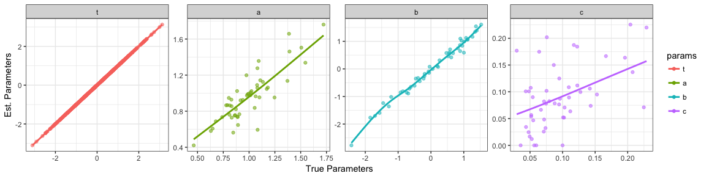
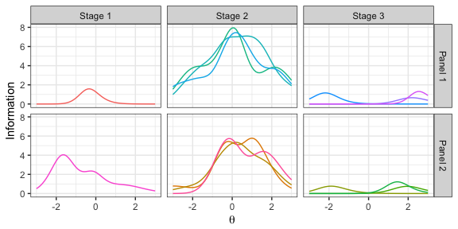

xxIRT: Practical Item Response Theory and Computer-Based Testing in R
================
Xiao Luo
18 October 2017

### Table of Contents

-   [Installation](#installation)
-   [Introduction](#introduction)
-   [Package Modules](#package-modules)
    -   [IRT Models](#irt-models)
    -   [IRT Utils](#irt-utils)
    -   [Parameter Estimation](#parameter-estimation)
    -   [Automated Test Assembly](#automated-test-assembly)
    -   [Computerized Adaptive Testing](#computerized-adaptive-testing)
    -   [Multistage Testing](#multistage-testing)
-   [Graphical User Interfaces](#graphical-user-interfaces)
-   [Ending](#ending)

### Installation

To install a stable version from [CRAN](https://cran.r-project.org/package=xxIRT), call `install.packages("xxIRT")` in R console. To install the most recent version from [GitHub](https://github.com/xluo11/xxIRT), call `devtools::install_github("xluo11/xxIRT")` in R console (if *devtools* package has not been installed yet, install it first). To remove the installed package, call `remove.packages("xxIRT")` in R console.

### Introduction

*xxIRT* is a R package designed to implement latest advancements in psychometric research, especially pertaining to computer-based testing, in hopes of facilitating the psychometric research and operations in practice. The package is organized into six modules:

1.  IRT models
2.  IRT Utils
3.  Parameter Estimation
4.  Automated Test Assembly
5.  Computerized Adaptive Testing
6.  Multistage Testing

The application programming interface (API) is for the intermediate R users who are familiar with R, whereas the graphic user interface (GUI) is for novice users who don't feel like writing code in R.

#### Package Modules

##### IRT Models

The 3-parameter-logistic (3PL) model was introduced by Birnbaum[1], which uses three item parameter (a, b, and c) and one people parameter (*θ*) to describe the probabilistic relationship of the item-people interaction. When fixing the a-parameter to 0.58 (since D=1.7) and c-parameters to 0, this model becomes **mathematically** equivalent to the Rasch model[2].

This module creates a S3 R object representing the 3PL model. It contains parameter and response data, as well as functions to compute the probability, information and likelihood. Use `model_3pl(people, items, responses)` or `model_3pl(theta, a, b, c, responses)` to create a *3PL* object. The *people* argument needs to be a data frame with a column named *theta*, the *items* argument a data frame with columns named *a*, *b*, and *c*, and the *responses* argument a matrix or data frame with dimensionality equal to the numbers of people and items. Alternatively, use *theta*, *a*, *b*, and *c* arguments to pass in numeric vectors of parameters directly. Upon its creation, the object comes with functions to compute the probability (`P(x)`), information (`I(x)`), and likelihood (`L(x, log)`) using the 3PL model. It also provides a helper function for generating data (`gendata(n.people, n.items, people, items, ...)`). Pass in the number of people (`n.people`) and items (`n.items`) to generate parameters, or pass in the people (`people`) or item (`items`) parameters to fix parameters in data generation. By default, the *θ* parameter are drawn from a normal distribution (`theta.mean=0`, `theta.sd=1`), *a*-parameter from a lognormal distribution (`a.mean=0`, `a.sd=0.2`), *b*-parameters from a normal distribution (`b.mean=0`, `b.sd=1`), and *c*-parameters from a beta distribution (`c.alpha=5`, `c.beta=46`).

###### Examples

``` r
### create a 3pl model using given parameters
theta <- c(-1, 0, 1)
a <- c(.588, 1)
b <- c(-1, 1)
c <- c(0, .2)
u <- matrix(c(1, 0, 1, 0, 1, 0), nrow=3)
people <- data.frame(theta=theta)
items <- data.frame(a=a, b=b, c=c)

# create 3pl model using different arguments
model_3pl(people=people, items=items, responses=u) 
model_3pl(people=people, items=items) 
model_3pl(theta=theta, a=a, b=b, c=c) 
model_3pl(people=people, a=a, b=b, c=c) 
model_3pl(theta=theta, items=items) 

# compute Probability, Information, Likelihood by calling itself
x <- model_3pl(people=people, items=items, responses=u)
x$P(x)
x$I(x)
x$L(x)

# compute Probability, Information, Likelihood by calling the class object
model_3pl()$P(x)
model_3pl()$I(x)
model_3pl()$L(x)

### create a 3PL model using generated data
x <- model_3pl()$gendata(5, 3)
x$P(x)
x$I(x)
x$L(x)
```

##### IRT Utils

Item response theory (IRT) is a family of measurement models describing the relationship between observed responses and unobserved item/people parameters. It has been widely used to design and analyze large-scale high-stakes psychological and educational assessments. It is the foundation of some advanced applications such as computerized adaptive testing and multistage testing. See Hambleton and Swaminathan's [3] and Lord's [4] books for more details pertaining to IRT.

This module provides a collection of functions for commonly-used computations and graphing in IRT. For example,

-   `irt_stats(obj, stats, summary, fun)`: compute probability, information, or likelihood, and summarize it over *people* or *item* using customized functions optionally.
-   `irt_select(obj, people_index, items_index)`: subset data
-   `irt_sample(obj, n.people, n.items)`: sample data
-   `irt_rescale_3pl(obj, parameter, mean, sd)`: rescale parameters to the new scale of the *θ* or *b* parameters.
-   `plot(obj, stats, total)`: visualize the specified statistics

###### Examples

``` r
# create a 3pl model using generated data
x <- model_3pl()$gendata(3, 5)

# compute probability, summed over items
irt_stats(x, "prob", summary="people", fun=sum)
```

    ## [1] 1.449984 2.013357 3.636388

``` r
# compute information, people(rows) by items (columns)
irt_stats(x, "info")
```

    ##         item.1    item.2     item.3     item.4    item.5
    ## [1,] 0.1411890 0.9394728 0.01671984 0.08132169 0.8044025
    ## [2,] 0.3146471 0.8314567 0.06444512 0.14119859 0.9114373
    ## [3,] 0.5762411 0.1143605 0.62876212 0.34499566 0.1874615

``` r
# compute likelihood, multiplied over items
irt_stats(x, "lik", summary="people", fun=prod)
```

    ## [1] 0.005933198 0.016875945 0.066118611

``` r
# retain items [1, 3, 5] and people [2, 4]
irt_select(x, c(1, 3), c(2, 4))
```

    ## a 3pl model: 2 people, 2 items, with responses.
    ## snapshot of people:
    ##        theta
    ## 1 -0.7866266
    ## 2  0.8924285
    ## snapshot of items:
    ##          a         b          c
    ## 2 1.255849 -0.759449 0.09327669
    ## 4 0.731939  1.099783 0.04315741
    ## snapshot of responses:
    ##      item.2 item.4
    ## [1,]      1      1
    ## [2,]      1      1

``` r
# sample 5 people and 3 items
irt_sample(x, 5, 3)
```

    ## a 3pl model: 5 people, 3 items, with responses.
    ## snapshot of people:
    ##        theta
    ## 1 -0.7866266
    ## 2  0.8924285
    ## 3 -0.3578231
    ## 4 -0.3578231
    ## 5 -0.7866266
    ## snapshot of items:
    ##          a          b          c
    ## 2 1.255849 -0.7594490 0.09327669
    ## 1 1.028049  0.4547894 0.09216901
    ## 5 1.226427 -0.5218293 0.08463328
    ## snapshot of responses:
    ##      item.2 item.1 item.5
    ## [1,]      1      0      0
    ## [2,]      1      0      1
    ## [3,]      1      1      1
    ## [4,]      1      1      1
    ## [5,]      1      0      0

``` r
# rescale parameters
x <- irt_rescale(x, "theta", 0, 1)
c(mean=mean(x$people$theta), sd=sd(x$people$theta))
```

    ##         mean           sd 
    ## 1.850372e-17 1.000000e+00

``` r
x <- irt_rescale(x, "b", 0, 1)
c(mean=mean(x$items$b), sd=sd(x$items$b))
```

    ##          mean            sd 
    ## -3.332837e-17  1.000000e+00

``` r
# draw item characteristic curves
plot(x, stats='prob', total=FALSE)
```


``` r
# draw test information functions
plot(x, stats='info', total=TRUE)
```


``` r
# draw response log-likelihood
plot(x, stats='loglik', total=TRUE)
```


##### Parameter Estimation

This module provides an interface for estimating people and item parameters in the 3PL model with dichotomous responses. Two estimators are available: the maximum likelihood estimator `estimate_mle(u, ...)` and the Bayesian estimator `estimate_bayesian(u, ...)`. To fix values, put the values at the corresponding positions in the `a` (discrimination), `b` (difficulty), `c` (pseudo-guessing), and `t` (ability) arguments, and put `NA` to estimate parameters otherwise. The lower bound of *a* and *c* parameters are 0.0 and the upper bound are controlled by `bound_a` (default=2.0) and `bound_c` (default=0.25). The lower and upper bound of *b* and *t* parameters are controlled by `bound_b` and `bound_t`, default = 3.5. Both estimators iteratively update the parameters until the maximum iterations (`iter=20` by default) or parameter converges (`conv=0.005` by default). When `debug=TRUE`, return additional data for debugging. The `scale` argument controls on which parameter the scale is set (`theta` vs. `b`), and the `scale_mean` and `scale_sd` specify the mean and standard deviation of the scale (0.0 and 1.0 by default).

In addition, the maximum likelihood estimator has the following arguments:

-   `method`: `jmle` to use joint maximum likelihood estimation and `mmle` to use maximum likelihood estimation
-   `mmle_mu`, `mmle_sig`: the mean and standard deviation of the marginal distribution of *t* parameters when `method='mmle'`

The Bayesian estimator has the following arguments:

-   `method`: the theta estimation method, `map`(maximum a posteriori) or `eap`(expected a posteriori)
-   `t_mu`, `t_sig`: the priors of *t* parameters (normal distribution)
-   `a_mu`, `a_sig`: the priors of *a* parameters (log-normal distribution)
-   `b_mu`, `b_sig`: the priors of *b* parameters (normal distribution)
-   `c_alpha`, `c_beta`: the priors of *c* parameters (beta distribution)
-   `reported_sd`: `TRUE` to report the posterior SD of *t* parameters

###### Examples

Example 1: Joint maximum likelihood estimation of all parameters:

``` r
data <- model_3pl()$gendata(2000, 50)
# joint maximum likelihood estimation
x <- estimate_mle(data$responses, method='jmle', scale="theta")
```

    ##   params    n      corr       rmse
    ## 1  theta 2000 0.9550775 0.29886613
    ## 2      a   50 0.7252836 0.20947366
    ## 3      b   50 0.9859689 0.19542105
    ## 4      c   50 0.4949252 0.08030257


Example 2: Marginal maximum likelihood estimation of all parameters:

``` r
# marginal maximum likelihood estimation
x <- estimate_mle(data$responses, method='mmle', scale="theta")
```

    ##   params    n      corr       rmse
    ## 1  theta 2000 0.9587235 0.28651451
    ## 2      a   50 0.7835471 0.18427574
    ## 3      b   50 0.9927029 0.18923304
    ## 4      c   50 0.5181874 0.05648146


Example 3: Bayesian estimation of all parameters (EAP for *θ* parameters):

``` r
# bayesian estimation: eap
x <- estimate_bayesian(data$responses, method='eap', scale="theta")
```

    ##   params    n      corr       rmse
    ## 1  theta 2000 0.9626451 0.27260506
    ## 2      a   50 0.8062786 0.12852839
    ## 3      b   50 0.9964042 0.12260018
    ## 4      c   50 0.7938714 0.03874528


Example 4: Bayesian estimation of all parameters (MAP for *θ* parameters):

``` r
# bayesian estimation: map
x <- estimate_bayesian(data$responses, method='map', scale="theta")
```

    ##   params    n      corr       rmse
    ## 1  theta 2000 0.9622556 0.27401812
    ## 2      a   50 0.8062786 0.12852839
    ## 3      b   50 0.9964042 0.12260018
    ## 4      c   50 0.7938714 0.03874528


Example 5: The effect of sample sizes and test lengths on JMLE:

``` r
rs <- NULL
for(ns in seq(500, 2000, by=500)){
  for(ni in seq(30, 90, by=30)){
    data <- model_3pl()$gendata(ns, ni)
    x <- estimate_mle(data$responses, method='jmle', scale="theta")
    params <- data.frame(true=c(data$people$theta, data$items$a, data$items$b, data$items$c), est=c(x$t, x$a, x$b, x$c), params=c(rep("theta", ns), rep(c("a", "b", "c"), each=ni)), n_sample=ns, n_items=ni)
    rs <- rbind(rs, params)
  }
}
```


Example 6: Fix parameters

``` r
data <- model_3pl()$gendata(1000, 50)
x <- estimate_mle(data$response, t=data$people$theta)
```



Example 7: Estimation with missing data

``` r
data <- model_3pl()$gendata(1000, 50)
na_index <- runif(prod(dim(data$responses))) < .1
data$responses[na_index] <- NA
x <- estimate_mle(data$responses, method='jmle', scale="theta")
```


##### Automated Test Assembly

Automated test assembly (ATA) uses advanced optimization algorithms to assemble test forms to satisfy stringent objectives and constraints. Objectives in ATA can be relative (e.g., maximize or minimize difficulty) or absolute (e.g., approach a given test information function). While an ATA problem can be solved by heuristic algorithms [5][6], this module implements the mixed integer linear programming (MILP) algorithms [7]. Compared with heuristic algorithms which are usually fast but cannot guarantee the global optimality, the MILP can arguably solve large and sophisticated problems more efficiently. This module uses the well-known open-source MILP solver: [lp\_solve](http://lpsolve.sourceforge.net/5.5/).

Call `ata(pool, nform, len, max_use, debug)` to construct an *ata* object. Use `ata_obj_relative(ata, coef, mode, negative, flatten, forms, collapse)` and `ata_obj_absolute(ata, coef, target, forms, collapse)` functions to add relative and absolute objective functions to the problem respectively. The relative objective function is to maximize (`mode='max'`) or minimize (`mode='min'`) a given property, whereas the absolute objective functions is to minimize the discrepancy between the objective function and `target`. The `coef` argument can be a pool-size numeric vector, a variable name, or a numeric vector of theta values (when length is not equal to the number of items in the pool). When the optimum is expected to be negative, set `negative=TRUE`, and this is imperative to obtain the correct results. If not `NULL`, the `forms` argument specifies on which forms objectives are set. When `collapse=TRUE`, forms are collapsed into one combined form; otherwise, the same objective is set for each form.

Use `ata_constraint(ata, coef, min, max, level, forms, collapse)` to add constraints. The `coef` argument can be a variable name, a constant, or a pool-size numeric vector. When `min=NA` or `max=NA`, the lower or the upper bound of the constraint is not set. When `min==max`, the constraint is set to equal to the value. When `coef` is a categorical variable, use `level` to specify which level is constrained. The `forms` and `collapses` work in the same way as in setting objectives.

Use `ata_item_enemy(ata, items)` to add enemy items which should not be selected into the same form. Use `ata_item_fixedvalue(ata, items, min, max, forms, collapse)` to force the selection or not selection of items. Use `ata_item_use(ata, min, max, items)` to set the minimum and maximum number of selection for items.

Finally, use `ata_solve(ata, as.list, timeout, mip_gap, verbose, ...)` to solve the problem. When `as.list=TRUE`, results are returned in a list, instead of a data frame. The `timeout`, `min_gap`, `verbose` arguments are three important MILP parameters. Additional parameters are taken by `...`. See the documentation of \*lpSolveAPI\*\* for more detail. When the problem is successfully solved, the following data are added to the original object:

-   `status`: the status of the solution
-   `optimum`: the optimal value of the objective function
-   `result`: a binary matrix of assembly result
-   `items`: a list or data frame of assembled items

Use `plot(ata)` to visualize the TIFs of assembled test forms.

###### Examples

Prep: Generate data

``` r
n <- 100
items <- model_3pl()$gendata(1, n)$items %>%
  mutate(id=1:n, content=sample(1:3, n, replace=T), time=round(rlnorm(n, 4.1, .2)))
```

Example 1: Assemble 6 parallel forms with 10 items each (use 60% of the pool) to maximize/minimize the *b*-parameters.

``` r
### maximize difficulty
x <- ata(items, 6, len=10, max_use=1)
x <- ata_obj_relative(x, "b", "max")
x <- ata_solve(x, as.list=F)
group_by(x$items, form) %>%
  summarise(n=n(), mean=mean(b), sd=sd(b)) %>%
  round(., 2)
```

    ## # A tibble: 6 x 4
    ##    form     n  mean    sd
    ##   <dbl> <dbl> <dbl> <dbl>
    ## 1     1    10  0.87  0.85
    ## 2     2    10  0.87  0.73
    ## 3     3    10  0.86  0.59
    ## 4     4    10  0.85  0.60
    ## 5     5    10  0.86  0.65
    ## 6     6    10  0.87  0.35

``` r
### minimize difficulty
x <- ata(items, 6, len=10, max_use=1)
x <- ata_obj_relative(x, "b", "min", negative=T)
x <- ata_solve(x, as.list=F)
group_by(x$items, form) %>%
  summarise(n=n(), mean=mean(b), sd=sd(b)) %>%
  round(., 2)
```

    ## # A tibble: 6 x 4
    ##    form     n  mean    sd
    ##   <dbl> <dbl> <dbl> <dbl>
    ## 1     1    10 -0.48  1.07
    ## 2     2    10 -0.46  0.88
    ## 3     3    10 -0.46  0.66
    ## 4     4    10 -0.45  0.80
    ## 5     5    10 -0.44  0.53
    ## 6     6    10 -0.46  0.61

Example 2: Assemble 4 parallel forms with 10 items each to have the mean and sd of *b* parameters equal to 0 and 1.

``` r
x <- ata(items, 4, len=10, max_use=1)
x <- ata_obj_absolute(x, items$b, target=0*10)
x <- ata_obj_absolute(x, items$b^2, target=1*10)
x <- ata_solve(x, as.list=F)
group_by(x$items, form) %>%
  summarise(n=n(), mean=mean(b), sd=sd(b)) %>%
  round(., 2)
```

    ## # A tibble: 4 x 4
    ##    form     n  mean    sd
    ##   <dbl> <dbl> <dbl> <dbl>
    ## 1     1    10  0.01  1.04
    ## 2     2    10  0.01  1.04
    ## 3     3    10  0.00  1.05
    ## 4     4    10  0.00  1.05

Example 3: Assemble 2 parallel forms with 10 items each to maximize information over *θ*=\[-1, 1\]. Each form has 3 items from content \#1, 3 items from content \#2, 4 items from content \#3, and average response time of 55-65 seconds.

``` r
x <- ata(items, 2, len=10, max_use=1) %>%
  ata_obj_relative(c(-1, 0, 1), "max") %>%
  ata_constraint("content", min=3, max=3, level=1) %>%
  ata_constraint("content", min=3, max=3, level=2) %>%
  ata_constraint("content", min=4, max=4, level=3) %>%
  ata_constraint("time", min=55*10, max=65*10) %>%
  ata_solve(as.list=F)
group_by(x$items, form) %>%
  summarise(n=n(), mean_time=mean(time), conten1=sum(content==1), content2=sum(content==2), content3=sum(content==3))
```

    ## # A tibble: 2 x 6
    ##    form     n mean_time conten1 content2 content3
    ##   <int> <int>     <dbl>   <int>    <int>    <int>
    ## 1     1    10      58.2       3        3        4
    ## 2     2    10      60.4       3        3        4

``` r
plot(x)
```


Example 4: Assemble 2 parallel forms from an item pool of item sets. Each form should maximize information over *θ*=\[-1, 1\], and should have 10 items in 3 content areas as (3, 3, 4). To solve this problem, the item pool should be restructured to collapse items in the set into one entry.

``` r
# generate item pool
pool <- model_3pl()$gendata(1, 100)$items %>%
  mutate(content=sample(1:3, 100, replace=TRUE), set_id=sample(1:30, 100, replace=T)) %>%
  arrange(set_id)
# collapse item sets: a, b, c parameters are not used, but still required by ATA
info <- irt_stats(model_3pl(theta=c(-1, 0, 1), items=pool), "info") %>% t() %>% as.data.frame()
colnames(info) <- paste("info", 1:3, sep="")
items <- cbind(pool, info) %>% group_by(set_id) %>%
  summarise(n=n(), info1=sum(info1), info2=sum(info2), info3=sum(info3),
            content1=sum(content==1), content2=sum(content==2), content3=sum(content==3),
            a=mean(a), b=mean(b), c=mean(c))
# solve ata problem: don't use the 'len' argument to set length constraints!
x <- ata(items, 2, len=NULL, max_use=1) %>%
  ata_obj_relative(coef="info1", mode="max") %>%
  ata_obj_relative(coef="info2", mode="max") %>%
  ata_obj_relative(coef="info3", mode="max") %>%
  ata_constraint(coef="n", min=10, max=10) %>%
  ata_constraint(coef="content1", min=3, max=3) %>%
  ata_constraint(coef="content2", min=3, max=3) %>%
  ata_constraint(coef="content3", min=4, max=4) %>%
  ata_solve(as.list=FALSE)
# find orignial items using set_id
x <- select(x$items, form, set_id) %>% merge(x=pool, y=., by="set_id")
arrange(x, form, set_id)
```

    ##    set_id         a           b          c content form
    ## 1       2 1.1924919 -1.88224468 0.07982162       3    1
    ## 2       2 0.9032577 -0.94921453 0.04575850       3    1
    ## 3      13 1.1639798 -0.40807206 0.08827816       3    1
    ## 4      13 1.0379956  0.55456420 0.11404886       2    1
    ## 5      13 1.0012051 -0.23225501 0.14380430       1    1
    ## 6      25 1.0982872  1.30633238 0.07729940       2    1
    ## 7      25 0.9727295 -0.10365715 0.18783206       2    1
    ## 8      30 0.8360997 -0.69147264 0.05317370       1    1
    ## 9      30 1.3046757  0.27616159 0.06969433       1    1
    ## 10     30 0.8416255 -0.68342769 0.17971713       3    1
    ## 11      4 0.8480180 -0.44441071 0.04071742       3    2
    ## 12      4 1.3842386  1.36737005 0.11894269       2    2
    ## 13     17 0.9690874 -0.75579441 0.09498128       3    2
    ## 14     17 1.1657151  0.80743016 0.13786804       3    2
    ## 15     17 1.0582329 -0.07151977 0.10602959       1    2
    ## 16     24 1.4344255 -0.24671246 0.05532379       3    2
    ## 17     24 1.4949505  2.02214264 0.10135517       2    2
    ## 18     24 0.9475700 -0.43906378 0.09671041       1    2
    ## 19     24 0.9456405 -2.07357458 0.13353600       1    2
    ## 20     24 0.9601787 -0.82474023 0.07936581       2    2

``` r
group_by(x, form) %>% summarise(n=n(), content1=sum(content==1), content2=sum(content==2), content3=sum(content==3))
```

    ## # A tibble: 2 x 5
    ##    form     n content1 content2 content3
    ##   <int> <int>    <int>    <int>    <int>
    ## 1     1    10        3        3        4
    ## 2     2    10        3        3        4

##### Computerized Adaptive Testing

Computerized adaptive testing (CAT) takes advantage of the tremendous computing powers of modern computers to customize the test forms to match the test takers' demonstrated abilities during the administration. Studies have shown that CAT could massively improve the testing efficiency and enhance the test security. This module provides a framework for conducting CAT simulation studies with the out-of-box or user-defined selection, estimation, or stopping rules. To change a rule, just pass in the corresponding function in the `cat_sim(true, pool, ...)` function -- e.g., `cat_sim(..., select_rule=new_select_func, estimate_rule=new_estimate_func, stop_rule=new_stop_func)`. When writing a new rule, make sure the function signature is as follows: `function(len, theta, stats, admin, pool, opts)`, where

-   `len` is the current test length
-   `theta` is the current *θ* estimate
-   `stats` is a matrix with 3 columns: `u` for responses, `t` for *θ* estimates, and `se` for standard errors
-   `admin` is a data frame of administered items
-   `pool` is a data frame of the remaining items in the pool
-   `opts` is a list of option/control parameters, converted from the `...` argument in the `cat_sim` function.

The following rules are provided as the out-of-box rules:

-   `cat_select_default` selects the item with the maximum information or the item set with the maximum averaged information. When working with item sets, group items in the same set with the same identifier and pass the identifier variable name to the `select_id` argument. Use the `randomesque` argument to implement the randomesque item exposure control procedure[8][9].

-   `cat_select_ccat` selects items or item sets to approach the content-balancing targets[10]. Use `ccat_var` to define the content variable, and `ccat_perc` to define the targets in percentage (decimal numbers). Make sure the elements names of the `ccat_perc` align with the values in `ccat_var`. Use `ccat_init_rand` to add randomness in the selection of the initial content areas. The `select_id` and `randomesque` options are also applicable for this rule.

-   `cat_select_shadow` implements the shadow-test CAT item selection algorithm[11]. Use `shadow_constraints` to define the constraints, which should have four columns: `var` (the constrained variable), `level` (the constrained level in that variable, `NA` for continuous variable), `min` (the lower bound) and `max` (the upper bound). The `select_id` and `randomesque` options are also applicable for this rule.

-   `cat_estimate_default` is a maximum likelihood estimator (MLE) of the *θ* parameter.

-   `cat_estimate_mle_step` is another maximum likelihood estimator of the *θ* parameter, but only increment or decrement the *θ* by a `mle_step` for all 1s or 0s responses.

-   `cat_estimate_eap` is a expected a posteriori (EAP) estimator of the *θ* parameter. Use `eap_mean` and `eap_sd` to define the priors.

-   `cat_estimate_hybrid` is a hybrid estimator, which uses EAP for all 1s and 0s responses and MLE otherwise.

-   `cat_stop_default` is a trifold stopping rule. It uses the minimum standard error stopping rule when `stop_se` is defined in the options, and the minimum information stopping rule when `stop_mi` is defined in the options, and the 95% confidence interval classification stopping rule when `stop_cut` is defined in the options.

The simulation results are wrapped in a *cat* object, which includes `pool` (the remaining pool), `admin` (the administered items), `true` (the true *θ*) and `theta` (the final *θ* estimate)

###### Examples

``` r
## generate item pool
pool <- model_3pl()$gendata(1, 100)$items %>% round(., 3)
pool$set_id <- sample(1:30, 100, replace=TRUE)
pool$content <- sample(1:3, 100, replace=TRUE)
pool$time <- round(rlnorm(100, mean=4.1, sd=.2))

## use all default rules and options
x <- cat_sim(1.0, pool, min=10, max=20) 
## use randomesque to control exposure in selection
x <- cat_sim(1.0, pool, min=10, max=20, randomesque=5)
## use user-defined identifier to select item sets
x <- cat_sim(1.0, pool, min=10, max=20, selct_id="set")
## use the mle_step estimation rule
x <- cat_sim(1.0, pool, min=10, max=20, estimate_rule=cat_estimate_mle_step, mle_step=.5)
## use the hybrid estimation rule
x <- cat_sim(1.0, pool, min=10, max=20, estimate_rule=cat_estimate_hybrid, eap_mean=0, eap_sd=1)
## use the standard error stopping rule
x <- cat_sim(1.0, pool, min=10, max=20, stop_rule=cat_stop_default, stop_se=.25)
## use the 95% confidence interval classification stopping rule
x <- cat_sim(1.0, pool, min=10, max=20, stop_rule=cat_stop_default, stop_cut=0)
## use the constrained CAT item selection
x <- cat_sim(1.0, pool, min=10, max=20, select_rule=cat_select_ccat, ccat_var='content', ccat_perc=c('1'=.2, '2'=.3, '3'=.5))
## use the constrained CAT item selection with initial randomness
x <- cat_sim(1.0, pool, min=10, max=20, select_rule=cat_select_ccat, ccat_var='content', ccat_perc=c('1'=.2, '2'=.3, '3'=.5), ccat_init_rand=5)
## use the shadow-test CAT
cons <- data.frame(var='content', level=1:3, min=3, max=5)
cons <- rbind(cons, data.frame(var='time', level=NA, min=55*10, max=65*10))
x <- cat_sim(1.0, pool, min=10, max=10, shadow_constraints=cons, select_id="set_id")
## extract CAT history
x$admin
```

    ##    u        t         se     a      b     c set_id content time
    ## 71 1 3.338989 15.7272016 1.126 -0.159 0.105     11       3   61
    ## 33 1 1.973895  0.7631727 1.285  1.284 0.092      5       3   64
    ## 58 1 1.973895  0.7631727 1.158  1.168 0.130      5       3   53
    ## 64 0 1.973895  0.7631727 1.263  2.350 0.186      5       2   62
    ## 99 1 1.973895  0.7631727 1.211 -1.234 0.111      5       2   63
    ## 3  1 1.314364  0.5361329 0.923  0.299 0.114      9       1   62
    ## 53 0 1.314364  0.5361329 0.936 -0.104 0.047      9       3   67
    ## 54 0 1.314364  0.5361329 1.225  1.915 0.091      9       1   51
    ## 88 1 1.314364  0.5361329 1.130  0.333 0.060      9       3   72
    ## 12 1 1.339385  0.5261917 0.922 -0.356 0.077     19       2   87

``` r
## print and plot results
print(x)
```

    ## true=1, est.=1.34, se=0.53, p=0.7, used 10 items (7 correct).
    ## Belows is a history of the CAT:
    ##    u        t         se     a      b     c set_id content time
    ## 71 1 3.338989 15.7272016 1.126 -0.159 0.105     11       3   61
    ## 33 1 1.973895  0.7631727 1.285  1.284 0.092      5       3   64
    ## 58 1 1.973895  0.7631727 1.158  1.168 0.130      5       3   53
    ## 64 0 1.973895  0.7631727 1.263  2.350 0.186      5       2   62
    ## 99 1 1.973895  0.7631727 1.211 -1.234 0.111      5       2   63
    ## 3  1 1.314364  0.5361329 0.923  0.299 0.114      9       1   62
    ## 53 0 1.314364  0.5361329 0.936 -0.104 0.047      9       3   67
    ## 54 0 1.314364  0.5361329 1.225  1.915 0.091      9       1   51
    ## 88 1 1.314364  0.5361329 1.130  0.333 0.060      9       3   72
    ## 12 1 1.339385  0.5261917 0.922 -0.356 0.077     19       2   87

``` r
plot(x)
```


##### Multistage Testing

Multistage testing (MST) navigates test takers through multiple testing stages and each stage contains a set of pre-constructed *modules*. The test is adapted between stages to administer modules most suitable to the test takers' abilities. A group of modules connected via the routing rule constitutes a MST *panel*, and the combination of modules (one module per stage) that leads a test taker to the end of the test is called *route*. The layout design of a MST is normally abbreviated as "1-2", "1-3-3", etc., where the length represents the number of stages and each number represents the number of modules in that stage. With reduced adaptivity, MST usually results in slightly inferior efficiency than CAT. However, it allows test developers to add complex constraints and review assembled tests before test publishing, and this could be a tremendous enhancement of test quality as compared to CAT.

This module provides an interface for designing, assembling and simulating MSTs. To design a MST, use the following functions:

-   `mst(pool, design, npanel, method, len, max_use)` initiates a *mst* object. `pool` must have columns named *a*, *b*, and *c* to represent item parameters. `design` indicates the MST layout using a hyphen-delimited string (e.g., "1-3-3"). `npanel` is the number of parallel panels to assemble. `method` is the design/assembly method: `topdown` or `bottomup`. `len` is the test/module length. `max_use` is the maximum use of an item, which is typically 1.
-   `mst_route(mst, route, op)` adds or removes routes from the MST.
-   `mst_obj(mst, theta, indices, target, ...)` adds the TIF objectives. When `target` is set, it means to approach the target. Otherwise, maximum TIF at given *θ*s.
-   `mst_constraint(mst, coef, min, max, level, indices)` adds constraints. When `min` or `max` is `NA`, it means the lower or upper bound is open. When `coef` is a categorical variable, set `level` to indicate which level is constrained. When `coef` is a continuous variable, leave `level` to `NA`.
-   `mst_stage_length(mst, stages, min, max)` regulates the size of stages. This constraint is useful for enforcing a desired item partition across stages. Otherwise, the ATA oftentimes puts more items at the last stages for the optimal results.
-   `mst_rdp(mst, theta, indices, tol)` anchors the intersection of adjacent modules. This is useful for optimizing routing results with fixed RDPs.
-   `mst_module_mininfo(mst, theta, mininfo, indices)` sets the minimum information at RDPs.
-   `mst_assemble(mst)` assembles the MST using MILP. If successful, it adds a data frame named `items` to the orignal *mst* object.
-   `mst_get_items` retrieves items from an assembled MST
-   `plot(mst, byroute)` visualizes the assembly results. When `byroute=TRUE`, the route information functions are plotted; otherwise, the module information functions.

After the MST is assembled, call `mst_sim(mst, true, rdp, ...)` to perform a simulation. When `rdp=NULL`, the test takers are routed to modules with maximum information; otherwise, use fixed RDPs for routing. `rdp` expects a list with length equal to `n_stages - 1`, and each element is a vector with length equal to `n_modules - 1`. In `...`, users can define initial `theta` estimate or which `panel` to use.

###### Examples

Prep: Generate item pool

``` r
## generate item pool
set.seed(10001)
pool <- model_3pl()$gendata(1, 500)$items
pool$content <- sample(1:3, nrow(pool), replace=TRUE)
pool$time <- round(exp(rnorm(nrow(pool), log(60), .2)))
```

Example 1: Assemble 2 panels of 1-2-2 MST using the top-down approach. Maximize information at -1 and 1 for easy and hard routes. Each route should have 20 items in total and 10 items in content area 1. Stage 1 should have at least 5 items.

``` r
x <- mst(pool, "1-2-2", 2, 'topdown', len=20, max_use=1)
x <- mst_obj(x, theta=-1, indices=1:2)
x <- mst_obj(x, theta=1, indices=3:4)
x <- mst_constraint(x, "content", 10, 10, level=1)
x <- mst_stage_length(x, 1, min=5)
x <- mst_assemble(x, timeout=10)
plot(x, byroute=TRUE)
```


``` r
for(i in 1:4)
  freq(mst_get_items(x, panel=1, route=i)$content, 1)$freq %>% 
  cat("items in content 1 in route", i, "\n")
```

    ## 10 items in content 1 in route 1 
    ## 10 items in content 1 in route 2 
    ## 10 items in content 1 in route 3 
    ## 10 items in content 1 in route 4

Example 2: Assemble 2 panels of 1-2-3 MST using the bottom-up approach. Remove routes with radical *θ* changes. Maximize information at -1.0, 0.0, 1.0 for easy, medium and hard modules. Each module should have 10 items in total and 4 items in content area 1.

``` r
x <- mst(pool, "1-2-3", 2, 'bottomup', len=10, max_use=1) %>%
  mst_route(c(1, 2, 6), "-") %>%
  mst_route(c(1, 3, 4), "-") %>%
  mst_obj(theta= 0, indices=c(1, 5)) %>%
  mst_obj(theta=-1, indices=c(2, 4)) %>%
  mst_obj(theta= 1, indices=c(3, 6)) %>%
  mst_constraint("content", 4, 4, level=1)
x <- mst_assemble(x, timeout=10)
plot(x, byroute=FALSE) + guides(color=F)
```


``` r
group_by(x$items, panel, index) %>% 
  summarise(n=sum(content==1)) %>%
  acast(panel ~ index, value.var="n")
```

    ##   1 2 3 4 5 6
    ## 1 4 4 4 4 4 4
    ## 2 4 4 4 4 4 4

Example 3: Assemble 2 panels of 1-3-3 MST using the top-down approach. Remove routes with radical *θ* changes. Maximize information over \[-2, -0.4\] for easy routes, \[-0.4, 0.4\] for medium routes, and \[0.4, 2\] for hard routes. Each route should have 20 items in total and 8 in content area 1. All E and M modules intersect around -0.4 and M and H modules intersect around 0.4. Information should be at least 5.0 at -0.4 and 0.4 at Stage 1. This may not be the best MST design (probably over-complicated), but a good example to showcase the functionality of this packages with regard to coping with complex MST design.

``` r
x <- mst(pool, "1-3-3", 2, 'topdown', len=20, max_use=1)
x <- mst_route(x, c(1, 2, 7), "-")
x <- mst_route(x, c(1, 4, 5), "-")
x <- mst_obj(x, theta=c(-2, -1, -0.4), indices=c(1, 3))
x <- mst_obj(x, theta=c(-0.4, 0, 0.4), indices=c(2, 4, 6))
x <- mst_obj(x, theta=c(0.4, 1, 2), indices=c(5, 7))
x <- mst_constraint(x, "content", 8, 8, level=1)
x <- mst_rdp(x, -0.4, indices=c(2, 3), tol=0.2)
x <- mst_rdp(x,  0.4, indices=c(3, 4), tol=0.2)
x <- mst_rdp(x, -0.4, indices=c(5, 6), tol=0.2)
x <- mst_rdp(x,  0.4, indices=c(6, 7), tol=0.2)
x <- mst_module_mininfo(x, -0.4, 5.0, c(2, 3))
x <- mst_module_mininfo(x,  0.4, 5.0, c(3, 4))
x <- mst_assemble(x, timeout=20)
plot(x) + guides(color=FALSE)
```



Conduct a simulation on the assembled MST using fixed RDP for routing. In the plot, circles represent the item difficulty with sizes proportional to the discrimination. Crosses represent three *θ* estimates with dashed line indicating the 95% confidence interval.

``` r
rdp <- list(stage1=c(-0.4, 0.4), stage2=c(-0.4, 0.4))
x_sim <- mst_sim(x, 1.0, rdp)
x_sim
```

    ## mst simulation: true=1, est.=1.58:
    ##   route    t   se    lb   ub  n pos
    ## 1     1 1.16 1.02 -0.83 3.15  7   7
    ## 2     4 1.92 0.52  0.91 2.93 12  19
    ## 3     7 1.58 0.42  0.75 2.41  1  20
    ## Call x$admin to see administered items ('x' is the mst.sim object name).

``` r
plot(x_sim)
```


Conduct another simulation on the same MST using the maximum information routing rule.

``` r
x_sim <- mst_sim(x, 1.0)
x_sim
```

    ## mst simulation: true=1, est.=0.99:
    ##   route    t   se    lb   ub  n pos
    ## 1     1 1.27 1.03 -0.75 3.28  7   7
    ## 2     3 0.77 0.39  0.02 1.53 12  19
    ## 3     7 0.99 0.36  0.28 1.69  1  20
    ## Call x$admin to see administered items ('x' is the mst.sim object name).

``` r
plot(x_sim)
```


### Graphic User Interfaces

In progress ...

### Ending

Please your comments, questions and feature request to the [author](mailto:xluo1986@gmail.com). To report bugs, go to the [issues](https://github.com/xluo11/xxIRT/issues) page.

### References

[1] Birnbaum, A. (1968). Some latent trait models. In F.M. Lord & M.R. Novick, (Eds.), Statistical theories of mental test scores. Reading, MA: Addison-Wesley.

[2] Rasch, G. (1966). An item analysis which takes individual differences into account. British journal of mathematical and statistical psychology, 19(1), 49-57.

[3] Hambleton, R. K., & Swaminathan, H. (1985). Item response theory: Principles and applications. New York, NY: Springer.

[4] Lord, F. M. (1980). Applications of item response theory to practical testing problems. New York NY: Routledge.

[5] Stocking, M. L., & Swanson, L. (1998). Optimal design of item banks for computerized adaptive tests. Applied Psychological Measurement, 22, 271-279.

[6] Luecht, R. M. (1998). Computer-assisted test assembly using optimization heuristics. Applied Psychological Measurement, 22, 224-236.

[7] van der Linden, W. J., & Reese, L. M. (1998). A model for optimal constrained adaptive testing. Applied Psychological Measurement, 22, 259-270.

[8] Weiss, D. J., & Kingsbury, G. (1984). Application of computerized adaptive testing to educational problems. Journal of Educational Measurement, 21, 361-375.

[9] Kingsbury, C. G., & Zara, A. R. (1991). A comparison of procedures for content-sensitive item selection in computerized adaptive tests. Applied Measurement in Education, 4, 241-261.

[10] Kingsbury, C. G., & Zara, A. R. (1991). A comparison of procedures for content-sensitive item selection in computerized adaptive tests. Applied Measurement in Education, 4, 241-261.

[11] van der Linden, W. J. (2000). Constrained adaptive testing with shadow tests. In Computerized adaptive testing: Theory and practice (pp. 27-52). Springer Netherlands.
