xxIRT: Item Response Theory and Computer-Based Testing in R
================
Xiao Luo
05 July 2018

### Table of Contents

-   [Installation](#installation)
-   [Introduction](#introduction)
-   [Package Modules](#package-modules)
    -   [IRT Models](#irt-models)
    -   [Parameter Estimation](#parameter-estimation)
    -   [Automated Test Assembly](#automated-test-assembly)
    -   [Computerized Adaptive Testing](#computerized-adaptive-testing)
    -   [Multistage Testing](#multistage-testing)
-   [Ending](#ending)

### Installation

To install a stable version from [CRAN](https://cran.r-project.org/package=xxIRT), call `install.packages("xxIRT")` in R console. To install the most recent version from [GitHub](https://github.com/xluo11/xxIRT), call `devtools::install_github("xluo11/xxIRT")` in R console (if *devtools* package has not been installed yet, install it first). To remove the installed package, call `remove.packages("xxIRT")` in R console.

### Introduction

*xxIRT* is a R package designed to provide a suite of practical psychometric analysis and research tools and implement latest advancements in psychometrics (especially pertaining to computer-based testing). The package is organized into five modules:

1.  IRT Models
2.  Parameter Estimation
3.  Automated Test Assembly
4.  Computerized Adaptive Testing
5.  Multistage Testing

#### Package Modules

##### IRT Models

###### 3PL Model

The 3-parameter-logistic (3PL) model was introduced by Birnbaum[1]. This model uses three item parameters (a, b, and c) and one people parameter (*θ*) to describe the probabilistic relationship between an item and a person. The three item parameters are often referred to as the discrimination, difficulty and pseudo-guessing of an item. By default, the scaling constant D=1.702. When c=0, the model is reduced to the 2PL model. When a=1 and c=0, the model is reduced to the 1PL model. When a=1, c=0, and D=1, the model is **mathematically** equivalent to the Rasch model[2].

The following functions are available for the 3PL model:

-   `model_3pl_prob(t, a, b, c, D)`: Compute the probabilities of correct responses for given parameters. Return results in a people-by-item matrix. `D=1.702` by default.
-   `model_3pl_info(t, a, b, c, D)`: Compute the information for given parameters and return results in a matrix
-   `model_3pl_lik(u, t, a, b, c, D, log)`: Compute the response likelihoods for given response data and parameters. Use `log=TRUE` to return log-likelihood.
-   `model_3pl_rescale(t, a, b, c, param, mean, sd)`: Transform parameters to a new scale and return a list of rescaled parameters.
-   `model_3pl_gendata(num_people, num_item, ...)`: Generate response data and parameters using the 3PL model. Pass in `t`, `a`, `b`, and `c` to fix parameters. Otherwise, draw these parameters from the normal, log-normal, normal and beta distributions respectively. Use `t_dist`, `a_dist`, `b_dist`, and `c_dist` to set the sampling distribution. Use `missing` argument to add missing response data.
-   `model_3pl_plot(a, b, c, D, type, total, ...)`: Plot the item characteristic curves (ICCs; `type='prob'`) or the item information function curves (IIFCs; `type='info'`). When `total=TRUE`, results are summed over items into test characteristic curve (TCC) or the test information function (TIF) curve.
-   `model_3pl_plot_loglik(u, a, b, c, D, ...)`: Plot each person's log-likelihood functions. Use `show_mle=TRUE` to print a rough maximum likelihood estimate for each response vector.

###### Examples

``` r
# generate 1PL data with 10% missing
x <- model_3pl_gendata(10, 5, a=1, c=0, missing=.1)
# generate 3PL data and sample theta from N(.8, .5) and c-parameter from beta(1, 4)
x <- model_3pl_gendata(10, 5, t_dist=c(.8, .5), c_dist=c(1, 6))
# compute the probability using the Rasch model
p <- model_3pl_prob(x$t, 1, x$b, 0, D=1)
# compute the probability using the 3PL model
p <- model_3pl_prob(x$t, x$a, x$b, x$c)
# compute the information using the 3pl model
i <- model_3pl_info(x$t, x$a, x$b, x$c)
# compute the log-likelihood
l <- model_3pl_lik(x$u, x$t, x$a, x$b, x$c, log=TRUE)
## rescale parameters to a new scale where theta ~ N(0, 1)
xx <- model_3pl_rescale(x$t, x$a, x$b, x$c, param="t", mean=0, sd=1)
```

###### Graphs

``` r
# ICC
model_3pl_plot(x$a, x$b, x$c, type="prob")
```

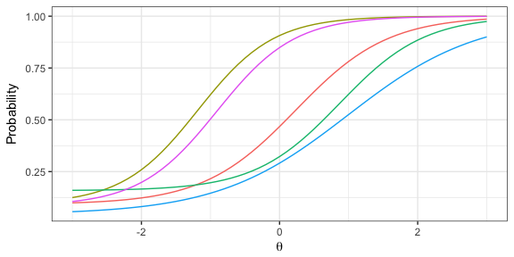

``` r
# TIF
model_3pl_plot(x$a, x$b, x$c, type="info", total=TRUE)
```

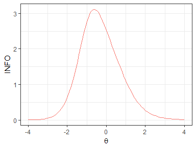

``` r
# log-likelihood
model_3pl_plot_loglik(x$u, x$a, x$b, x$c)
```

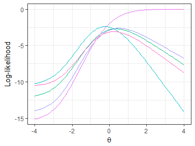

###### Generalized Partial Credit Model

The generalized partial credit model (GPCM) was introduced by Muraki[3][4]. GPCM extends IRT to model polytomous responses, where items have more than two score categories. There are two parameterization of this model: (1) an item-by-category matrix of *b*-parameter as the item-category parameters, or (2) a vector of *b*-parameters as the item difficulty parameters and an item-by-category matrix of *d*-parameters as the item category parameters (the final item-category parameters are computed as: *b* − *d*). Because guessing is usually difficult for polytomous items, *c*-parameter is absent in GPCM. Note because the difficulty of the initial category of an item (*b*<sub>*j*1</sub> or *d*<sub>*j*1</sub>) does not change the probabilities of score categories of that item, it is usually arbitrarily set to 0.

The following functions are available for GPCM:

-   `model_gpcm_prob(t, a, b, d, D, add_initial)`: Compute the probabilities of score categories for given parameters. When `b` is a matrix and `d` is NULL, *b* is used as the item-category parameter. When `b` is a vector and `d` is a matrix, *b* is used as the item difficulty parameter and *d* the item category parameter. Use `add_initial` to add the initial category to *b* or *d*. The scaling constant `D=1.702` by default. The result is a 3-dimensional array: people by item by category.
-   `model_gpcm_info(t, a, b, d, D, add_initial)`: Compute the information of score categories and return a 3D array as results.
-   `model_gpcm_lik(u, t, a, b, d, D, add_initial, log)`: Compute the response likelihood and return a matrix as results. Use `log=TRUE` to return log-likelihood.
-   `model_gpcm_gendata(num_people, num_item, num_category, ...)`: Generate response data and parameters using the GPCM. Pass in `t`, `a`, and `b`. Otherwise, draw these parameters from the normal, log-normal, and normal distributions respectively. Use `t_dist`, `a_dist`, and `b_dist` to set the sampling distribution. Use `missing` argument to add missing response data. Use `set_initial` to set the value of the initial category. If `sort_b=TRUE`, category difficulties are sorted for each item.
-   `model_gpcm_plot(a, b, d, D, add_initial, type, by_item, total, xaxis)`: Plot the item category characteristic curves (ICCCs; `type='prob'`) or item category information function curves (ICIFCs; `type='info'`). Use `by_item=TRUE` to combine category-level statistics into item-level statistics. Use `total=TRUE` to sum over items.
-   `model_gpcm_plot_loglik(u, a, b, d, D=1.702, add_initial, xaxis, show_mle)`: Plot the log-likelihood for each response vector. Use `show_mle` to print a rough maximum likelihood estimate for each response vector.

###### Examples

``` r
# generate data: 10 peopel, 5 item, 3 categories in each item
x <- model_gpcm_gendata(10, 5, 3, set_initial=0)
# compute probability
p <- model_gpcm_prob(x$t, x$a, x$b, NULL)
# compute informtaoin
i <- model_gpcm_info(x$t, x$a, x$b, NULL)
# compute likelihood
l <- model_gpcm_lik(x$u, x$t, x$a, x$b, NULL)
```

###### Graphs

``` r
# Figure 1 in Muraki, 1992 (APM)
model_gpcm_plot(a=c(1,1,.7), b=matrix(c(-2,0,2,-.5,0,2,-.5,0,2), nrow=3, byrow=TRUE), d=NULL, D=1.0, add_initial=0, xaxis=seq(-4, 4, .1), type='prob')
```

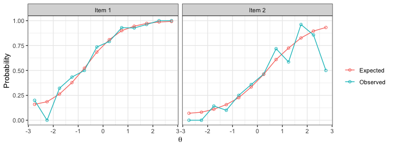

``` r
# Figure 2 in Muraki, 1992 (APM)
model_gpcm_plot(a=.7, b=matrix(c(.5,0,NA,0,0,0), nrow=2, byrow=TRUE), d=NULL, D=1.0, add_initial=0, xaxis=seq(-4, 4, .1))
```

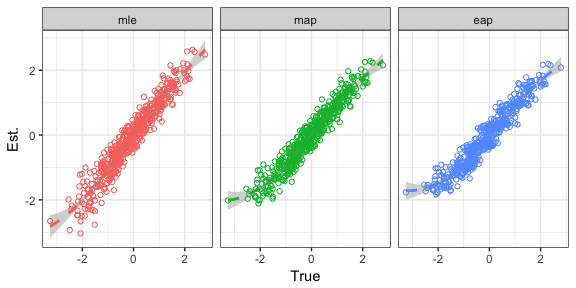

``` r
# Figure 3 in Muraki, 1992 (APM)
model_gpcm_plot(a=c(.778,.946), b=matrix(c(1.759,-1.643,3.970,-2.764), nrow=2, byrow=TRUE), d=NULL, D=1.0, add_initial=0)
```

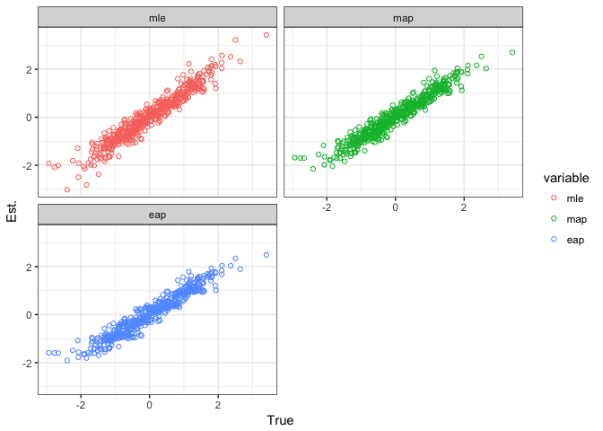

``` r
# Figure 1 in Muraki, 1993 (APM)
model_gpcm_plot(a=1, b=matrix(c(0,-2,4,0,-2,2,0,-2,0,0,-2,-2,0,-2,-4), nrow=5, byrow=TRUE), d=NULL, D=1.0)
```

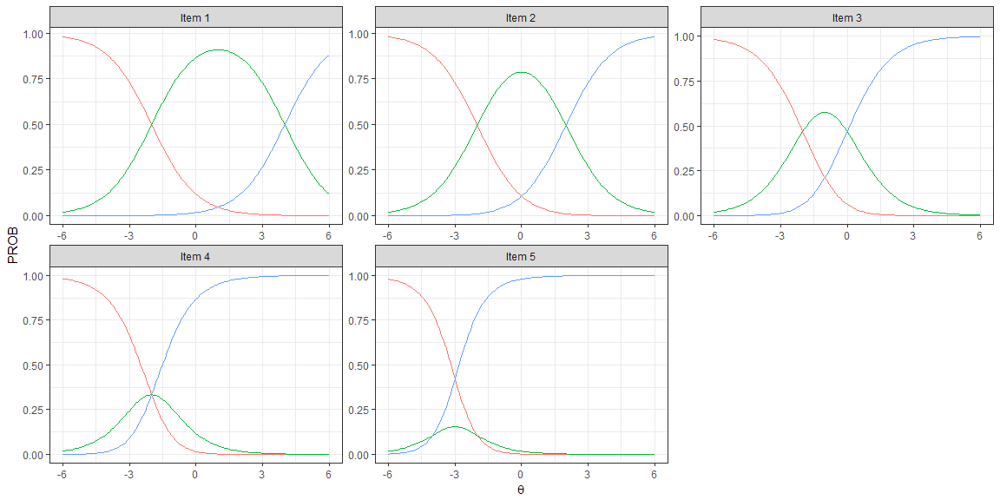

``` r
# Figure 2 in Muraki, 1993 (APM)
model_gpcm_plot(a=1, b=matrix(c(0,-2,4,0,-2,2,0,-2,0,0,-2,-2,0,-2,-4), nrow=5, byrow=TRUE), d=NULL, D=1.0, type='info', by_item=TRUE)
```

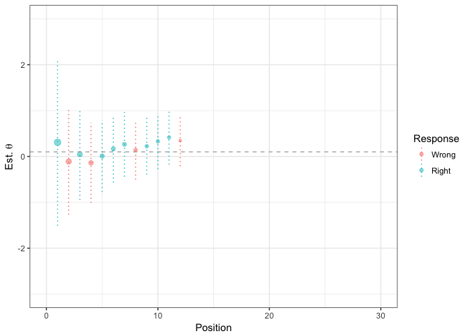

##### Parameter Estimation

Parameters are often unknown and need to be estimated using statistical procedures, and parameter estimation is a central activity in IRT. The following functions are available for the estimation of 3PL model:

-   `model_3pl_jmle(u, t=NA, a=NA, b=NA, c=NA, D=1.702, num_iter=100, num_nr=15, h_max=1.0, conv=.1, decay=.95, scale=NULL, bounds=list(), priors=list(), debug=TRUE)`: A joint maximum likelihood estimator of *θ* and item parameters, and a MAP estimator when `priors` is set. Pass in `t`, `a`, `b`, `c` to fix parameters. Use `num_iter` and `num_nr` to control the maximum cycles of E-M iteration and Newton-Raphson iteration. Use `conv` to control the convergence criterion. The estimation terminates when the log-likelihood decrement is less than *conv*. Use `scale` to set the scale for *θ*. Use `bounds` and `priors` to control the bounds and priors of parameters. Use `debug=TRUE` to turn on the debugging mode.
-   `model_3pl_mmle(u, a=NA, b=NA, c=NA, D=1.702, num_iter=100, num_nr=15, num_quad=c('11', '20'), h_max=1.0, conv=.1, decay=.98, scale=NULL, bounds=list(), priors=list(), debug=FALSE)`: A marginal maximum likelihood estimator of *θ* and item parameters. Item parameters are estimated first using the marginal distribution of *θ*, and *θ*s are estimated afterwards.
-   `model_3pl_eap_scoring(u, a, b, c, D)`: An EAP estimator of *θ*s.

The following functions are available for the estimation of GPCM:

-   `model_gpcm_jmle(u, t, a, b, d, D, set_initial, num_iter, num_nr, h_max, conv, decay, scale, bounds=list(), priors=list(), debug)`: A joint maximum likelihood estimator.

###### Examples

Generate data: 3000 people, 60 items

``` r
data_tru <- model_3pl_gendata(3000, 60)
```

Joint maximum likelihood estimation

``` r
data_est <- model_3pl_jmle(u=data_tru$u, scale=c(0, 1), priors=NULL)
evaluate_3pl_estimation(data_tru, data_est)
```

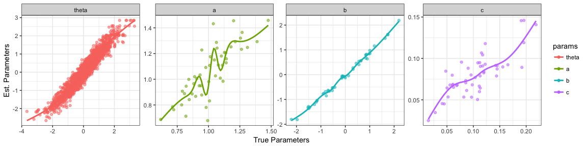

    ## Parameter t: corr=0.97, rmse=0.26
    ## Parameter a: corr=0.93, rmse=0.09
    ## Parameter b: corr=1, rmse=0.08
    ## Parameter c: corr=0.34, rmse=0.06

MAP with joint maximum likelihood estimation

``` r
data_est <- model_3pl_jmle(u=data_tru$u, scale=c(0, 1))
evaluate_3pl_estimation(data_tru, data_est)
```

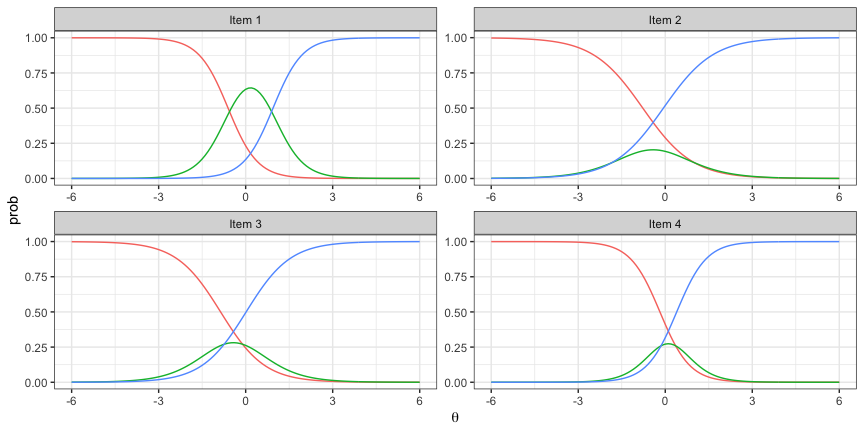

    ## Parameter t: corr=0.97, rmse=0.24
    ## Parameter a: corr=0.94, rmse=0.09
    ## Parameter b: corr=1, rmse=0.07
    ## Parameter c: corr=0.61, rmse=0.03

Marginal maximum likelihood estimation

``` r
data_est <- model_3pl_mmle(u=data_tru$u, num_quad="11", scale=NULL, priors=NULL)
evaluate_3pl_estimation(data_tru, data_est)
```

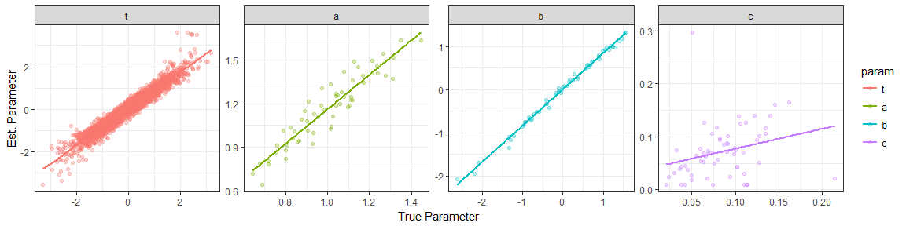

    ## Parameter t: corr=0.97, rmse=0.27
    ## Parameter a: corr=0.93, rmse=0.19
    ## Parameter b: corr=1, rmse=0.17
    ## Parameter c: corr=0.28, rmse=0.06

Estimate item parameters only

``` r
data_est <- model_3pl_jmle(u=data_tru$u, t=data_tru$t, priors=NULL)
evaluate_3pl_estimation(data_tru, data_est)
```

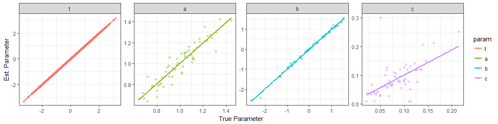

    ## Parameter t: corr=1, rmse=0
    ## Parameter a: corr=0.93, rmse=0.07
    ## Parameter b: corr=1, rmse=0.07
    ## Parameter c: corr=0.59, rmse=0.05

Estimate *θ* only

``` r
theta_est <- with(data_tru, model_3pl_jmle(u=u, a=a, b=b, c=c, priors=NULL))$t
cat('corr=', round(cor(theta_est, data_tru$t), 2), ', rmse=', round(rmse(theta_est, data_tru$t), 2), '\n', sep='')
```

    ## corr=0.97, rmse=0.27

EAP estimates of *θ*

``` r
theta_est <- with(data_tru, model_3pl_eap_scoring(u=u, a=a, b=b, c=c, D=1.702))
cat('corr=', round(cor(theta_est, data_tru$t), 2), ', rmse=', round(rmse(theta_est, data_tru$t), 2), '\n', sep='')
```

    ## corr=0.97, rmse=0.25

The effect of sample sizes and test lengths on estimation 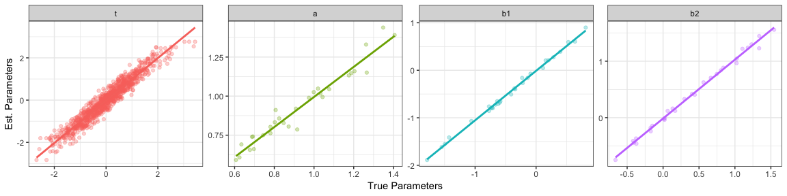

The effects of fixed items on estimation (3000 people and 50 items) 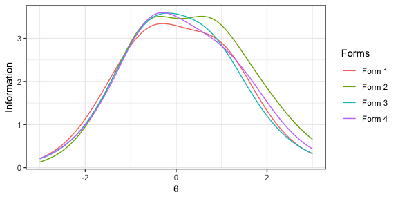

The effect of missing data on estimation (3000 people and 50 items) 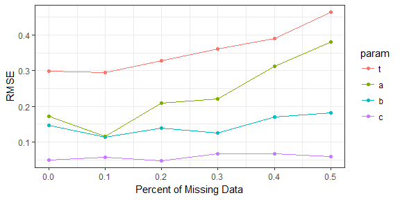

##### Automated Test Assembly

Automated test assembly (ATA) applies advanced optimization algorithms to assemble test forms that optimize the objective functions while satisfying a set of constraints. Objectives in ATA can be relative (e.g., maximize or minimize difficulty) or absolute (e.g., approach a TIF target). While there are many ATA methods in psychometric literature [5][6][7], the mixed integer linear programming (MILP) algorithm is chosen as the implementation method in this package for its versality and flexibility. This module uses the open source solver [lp\_solve](http://lpsolve.sourceforge.net/5.5/) and the package [lpSolveAPI](https://CRAN.R-project.org/package=lpSolveAPI).

The following ATA functions are available: + `ata <- function(pool, num_form, len, max_use, group, ...)`: Create an ATA job. Use `len` and `max_use` to conveniently set test length constraint and the maximum item usage constraint. Use `group` (a string to refer to a variable in the item pool or a numeric vector of group coding) to group item belonging to the same sets. + `ata_obj_relative(x, coef, mode, negative, flatten, forms, collapse)`: Add a relative objective function to the ATA job. Use `mode` to indicate whether to maximize (`mode="max"`) or minimize (`mode="min"`) the objective functions. `coef` is the coefficients in the objective functions, which can be a variable of the item pool or a pool-long numeric vector. When being a numeric vector unequal to the number of items in the pool, it is interpreted as *θ* points at which the information is optimized. Use `negative=TRUE` to indicate that the value of the objective function is expected to be negative. Use `forms` to indicate onto which forms objective functions are set (*NULL* for all forms). Use `collapse=TRUE` to collapse objective functions on different forms into one objective function. Tune the `flatten` argument if a flat TIF is desired. + `ata_obj_absolute <- function(x, coef, target, forms, collapse)`: Add an absolute objective function to the ATA job. Use `target` to set the target values. + `ata_constraint(x, coef, min, max, level, forms, collapse)`: Add a constraint to the ATA job. `coef` can be either a variable of the item pool, a pool-long numeric vector, or a single value (broadcasted to all items). When `coef` refers to a categorical variable, use `level` to indicate for which level the constraint is set. When `coef` refers to a quantitative variable, leave `level=NULL`. + `ata_item_use(x, min, max, items)`: Set the minimum and maximum usage constraints on items. `items` should be a vector of item indices in the pool. + `ata_item_enemy(x, items)`: Set the enemy relationship constraints on items. + `ata_item_fixedvalue(x, items, min, max, forms, collapse)`: Fix the results of decision variables on items + `ata_solve(x, as.list, timeout, ...)`: Solve the ATA job. Use `as.list=TRUE` to return results as list; otherwise, data frame. Use `timeout` to set the time limits of the job in seconds. Pass additional control parameters in `...`. See the documentation of *lp\_solve* and *lpSolveAPI* for more details. Once solved, the ATA job is added with four objects: `status` (status code of the solution), `optimum` (final optimal value of the objective function), `result` (a binary matrix of assembly results), and `item` (a list of data frame of assembled test forms). + `plot.ata(x, ...)`: Plot the TIFs of assembled test forms.

###### Examples

Generate a pool of 300 items

``` r
pool <- with(model_3pl_gendata(1, 300), data.frame(a=a, b=b, c=c))
pool$id <- 1:nrow(pool)
pool$content <- sample(1:3, nrow(pool), replace=TRUE)
pool$time <- round(rlnorm(nrow(pool), 4.2, .3))
pool$group <- sort(sample(1:round(nrow(pool)/3), nrow(pool), replace=TRUE))
```

Ex. 1: 6 forms, 10 items, maximize b parameter

``` r
x <- ata(pool, 6, len=10, max_use=1)
x <- ata_obj_relative(x, "b", "max")
x <- ata_solve(x)
plot(x)
```

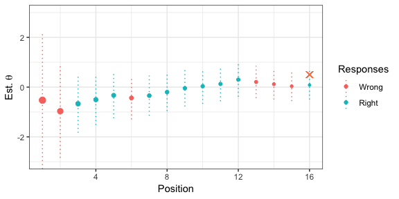

``` r
sapply(x$items, function(x) c(n=nrow(x), b_mean=mean(x$b), b_sd=sd(x$b))) %>% t()
```

    ##       n   b_mean      b_sd
    ## [1,] 10 1.420730 0.6934977
    ## [2,] 10 1.432549 0.4756749
    ## [3,] 10 1.409530 0.3642590
    ## [4,] 10 1.427461 0.4112808
    ## [5,] 10 1.407538 0.4923109
    ## [6,] 10 1.398415 0.2282698

Ex. 2: 3 forms, 10 items, minimize b parameter

``` r
x <- ata(pool, 3, len=10, max_use=1)
x <- ata_obj_relative(x, "b", "min", negative=TRUE)
x <- ata_solve(x, as.list=FALSE, timeout=5)
plot(x)
```

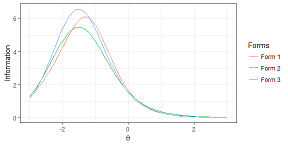

``` r
group_by(x$items, form) %>% summarise(n=n(), b_mean=mean(b), b_sd=sd(b))
```

    ## # A tibble: 3 x 4
    ##    form     n b_mean  b_sd
    ##   <int> <int>  <dbl> <dbl>
    ## 1     1    10  -1.62 0.445
    ## 2     2    10  -1.62 0.349
    ## 3     3    10  -1.61 0.291

Ex. 3: 2 forms, 10 items, mean(b) = 0, sd(b) = 1.0, content = (3, 3, 4)

``` r
x <- ata(pool, 2, len=10, max_use=1)
x <- ata_obj_absolute(x, pool$b, 0 * 10)
x <- ata_obj_absolute(x, (pool$b - 0)^2, 1 * 10)
x <- ata_constraint(x, "content", min=3, max=3, level=1)
x <- ata_constraint(x, "content", min=3, max=3, level=2)
x <- ata_constraint(x, "content", min=4, max=4, level=3)
x <- ata_solve(x, timeout=5)
plot(x)
```

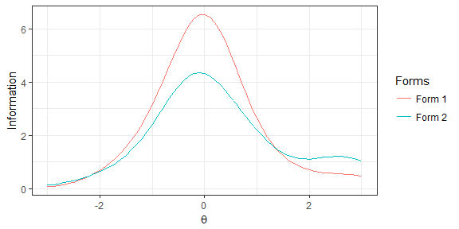

``` r
sapply(x$items, function(x) c(n=nrow(x), b_mean=mean(x$b), b_sd=sd(x$b))) %>% t()
```

    ##       n      b_mean     b_sd
    ## [1,] 10 0.002175360 1.053551
    ## [2,] 10 0.007400645 1.050613

Ex. 4: Same with ex. 3, but group-based

``` r
x <- ata(pool, 2, len=10, max_use=1, group="group")
x <- ata_obj_absolute(x, pool$b, 0 * 10)
x <- ata_obj_absolute(x, (pool$b - 0)^2, 1 * 10)
x <- ata_constraint(x, "content", min=3, max=3, level=1)
x <- ata_constraint(x, "content", min=3, max=3, level=2)
x <- ata_constraint(x, "content", min=4, max=4, level=3)
x <- ata_solve(x, as.list=FALSE, timeout=10)
plot(x)
```

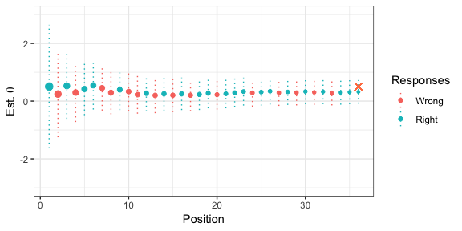

``` r
group_by(x$items, form) %>% summarise(n=n(), b_mean=mean(b), b_sd=sd(b), n_items=length(unique(id)), n_groups=length(unique(group)))
```

    ## # A tibble: 2 x 6
    ##    form     n    b_mean  b_sd n_items n_groups
    ##   <int> <int>     <dbl> <dbl>   <int>    <int>
    ## 1     1    10 -0.00898   1.03      10        6
    ## 2     2    10 -0.000522  1.05      10        6

Ex. 5: 2 forms, 10 items, flat TIF over \[-1, 1\]

``` r
x <- ata(pool, 2, len=10, max_use=1)
x <- ata_obj_relative(x, seq(-1, 1, by=.5), "max", flatten=0.1)
x <- ata_solve(x)
plot(x)
```

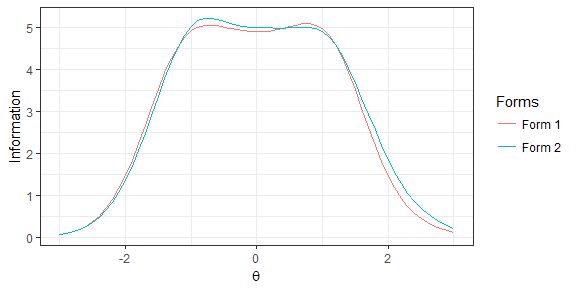

Ex. 6: 2 forms, 10 items, info target over \[-1, 1\] to be 5.0

``` r
x <- ata(pool, 2, len=10, max_use=1)
x <- ata_obj_absolute(x, seq(-1, 1, by=.5), 5.0)
x <- ata_solve(x, timeout=10)
plot(x)
```

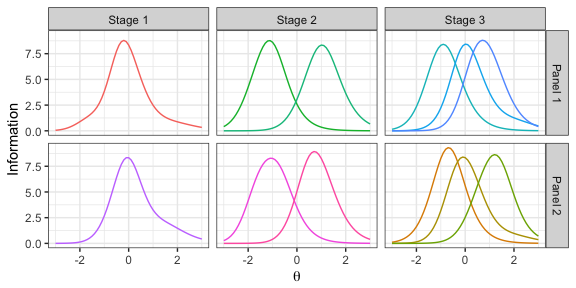

##### Computerized Adaptive Testing

Computerized adaptive testing (CAT) is a testing model that utilizes the computing powers of modern computers to customize the test form on-the-fly to match a test taker's demonstrated abilities. The on-the-fly test adaptation improves testing efficiency and prevents answer-copying behaviors to a great extent. This module provides a framework for conducting CAT simulation studies. Three essential components of a CAT system are: the item selection rule, the ability estimation rule, and the test stopping rule. The framework allows for the mix-and-match of different rules and using customized rules in the CAT simulation. When writing a new rule, the function signature must be `function(len, theta, stats, admin, pool, opts)` where `len` is the current test length, `theta` is the current *θ* estimate, `stats` is a matrix of four columns (*u*, *t*, *se*, *info*), `admin` is a data frame of administered items, `pool` is a data frame of remaining items in the pool, `opts` is a list of option/control parameters (see built-in rules for examples).

The following functions are available in this module: + `cat_sim(true, pool, ...)`: Start a CAT simulation. Pass options into `...`, where `min` (the minimum test length) and `max` (the maximum test length) are required. Use `theta` to set the initial value of *θ* estimate. + `cat_estimate_mle`: The maximum likelihood estimation rule. Use `map_len` (10 by default) to apply MAP to the first K items and use `map_prior` (`c(0, 1)` by default) to set the prior for MAP. MAP is used to prevent extreme result of MLE. + `cat_estimate_eap`: The EAP estimation rule. Use `eap_mean` and `eap_sd` options to control the prior. + `cat_estimate_hybrid`: A hybrid estimation rule of MLE (for mixed responses) and EAP (for all 1s or 0s response) + `cat_select_maxinfo`: The maximum information selection rule[8]. Use `group` (variable name) to group items belonging to the set. Use `info_random` to add the random-esque item exposure control. + `cat_select_ccat`: The constrained CAT selection rule[9]. This rule selects items under the content-balancing constraint. Use `ccat_var` to indicate the content variable in the pool and use `ccat_perc` to set the desired content distribution (a vector in which the element name is the content code and the value is the percentage). Use `ccat_random` to add randomness to initial item selections. Use `info_random` to add the randomesque item exposure control. + `cat_select_shadow`: The shadow-test selection rule[10]. Use `shadow_id` to group item sets. Use `constraints` to set constraints. Constraints should be in a data frame with four columns: var (variable name), level (variable level, `NA` for quantitative variable), min (lower bound), and max (upper bound). + `cat_stop_default`: A three-way stopping rule. When `stop_se` is set in options, the standard error stopping rule is invoked. When `stop_mi` is set in options, the minimum information stopping rule is invoked. When `stop_cut` is set in options, the confidence interval stopping rule is invoked. The width of the confidence interval is controlled by the `ci_width` option. + `cat_stop_projection`: The projection-based stopping rule[11]. Use `projection_method` to choose the projection method (`info` or `diff`). Use `stop_cut` to set the cut score. Use `constraints` to set the constraints. Constraints should be in a data frame with four columns: var (variable name), level (variable level, `NA` for quantitative variable), min (lower bound), max (upper bound). + `plot.cat(x, ...)`: Plot the results of a CAT simulation.

###### Examples

Generate a 100-item pool

``` r
num_items <- 100
pool <- with(model_3pl_gendata(1, num_items), data.frame(a=a, b=b, c=c))
pool$group <- sort(sample(1:30, num_items, replace=TRUE))
pool$content <- sample(1:3, num_items, replace=TRUE)
pool$time <- round(rlnorm(num_items, mean=4.1, sd=.2))
```

MLE, EAP, and hybrid estimation rule

``` r
cat_sim(.5, pool, min=10, max=20, estimate_rule=cat_estimate_mle) %>% plot()
```

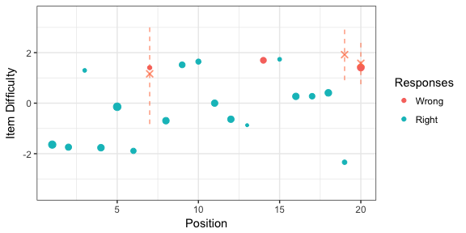

``` r
cat_sim(.5, pool, min=10, max=20, estimate_rule=cat_estimate_eap) %>% plot()
```

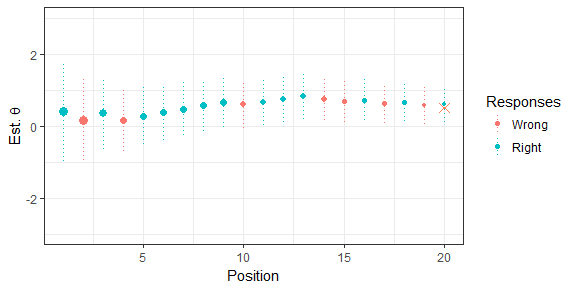

``` r
cat_sim(.5, pool, min=10, max=20, estimate_rule=cat_estimate_hybrid) %>% plot()
```

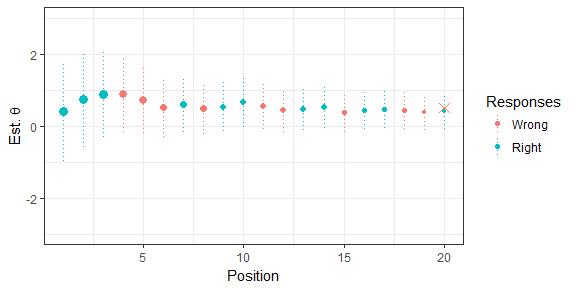

SE, MI, and CI stopping rule

``` r
cat_sim(.5, pool, min=10, max=20, stop_se=.3) %>% plot()
```


``` r
cat_sim(.5, pool, min=10, max=20, stop_mi=.6) %>% plot()
```

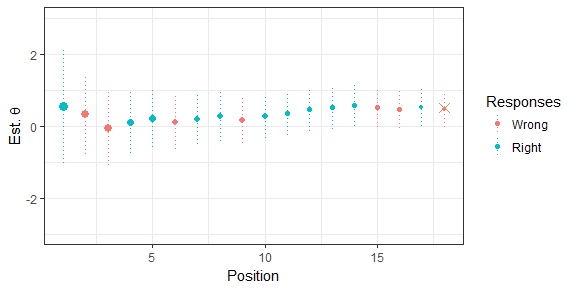

``` r
cat_sim(.5, pool, min=10, max=20, stop_cut=0) %>% plot() 
```

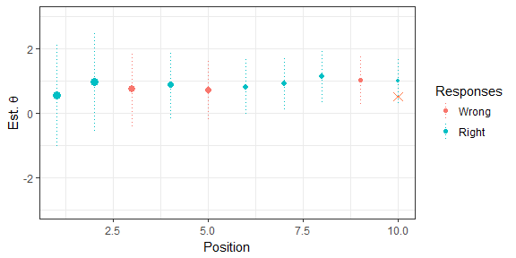

``` r
cat_sim(.5, pool, min=10, max=20, stop_cut=0, ci_width=2.58) %>% plot()
```

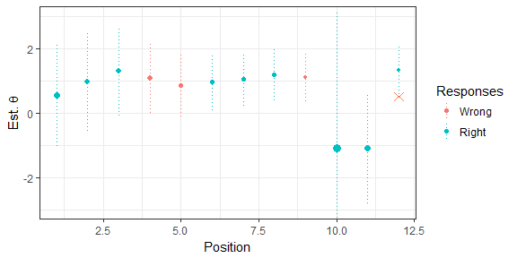

Maximum information selection with item sets

``` r
cat_sim(.5, pool, min=10, max=10, group="group")$admin %>% round(., 2)
```

    ##    u    t   se info    a     b    c group content time
    ## 9  1 0.63 0.64 2.48 1.22  0.39 0.12     4       1   46
    ## 10 0 0.63 0.64 2.48 0.72  0.99 0.07     4       3   59
    ## 11 1 0.63 0.64 2.48 2.00  0.13 0.11     4       2   46
    ## 12 1 0.63 0.64 2.48 1.36 -1.43 0.03     4       3   54
    ## 3  1 0.79 0.48 4.39 1.35  0.71 0.05     2       3   50
    ## 4  1 0.79 0.48 4.39 1.16 -0.60 0.05     2       3   57
    ## 5  0 0.79 0.48 4.39 1.03  0.73 0.07     2       2   36
    ## 6  1 0.79 0.48 4.39 0.79  0.19 0.15     2       1   70
    ## 80 0 0.71 0.43 5.51 1.07  0.23 0.10    25       1   57
    ## 81 1 0.71 0.43 5.51 1.04 -0.53 0.06    25       1   65

Maximum information with item exposure control

``` r
cat_sim(.5, pool, min=10, max=10, info_random=5)$admin %>% round(., 2)
```

    ##    u    t   se info    a     b    c group content time
    ## 13 1 0.42 1.09 0.85 1.47 -0.14 0.12     5       2   41
    ## 11 1 0.66 0.75 1.77 2.00  0.13 0.11     4       2   46
    ## 3  1 1.00 0.73 1.87 1.35  0.71 0.05     2       3   50
    ## 43 0 0.68 0.52 3.74 1.10  0.55 0.03    15       1   54
    ## 90 0 0.51 0.44 5.05 1.09  0.64 0.10    28       2   81
    ## 74 0 0.30 0.40 6.34 1.19  0.01 0.08    23       2   94
    ## 75 1 0.42 0.38 7.04 1.21  0.36 0.04    23       3   51
    ## 28 1 0.48 0.36 7.55 1.27 -0.01 0.17    10       1   66
    ## 48 1 0.53 0.35 8.01 1.25 -0.09 0.08    16       3   63
    ## 62 1 0.66 0.36 7.83 1.09  0.19 0.09    19       1   48

Constrained-CAT selection rule with and without initial randomness

``` r
cat_sim(.5, pool, min=10, max=20, select_rule=cat_select_ccat, ccat_var="content", ccat_perc=c("1"=.2, "2"=.3, "3"=.5))$admin$content %>% freq()
```

    ##   value freq perc cum.freq cum.perc
    ## 1     1    4  0.2        4      0.2
    ## 2     2    6  0.3       10      0.5
    ## 3     3   10  0.5       20      1.0

Shadow-test selection rule

``` r
cons <- data.frame(var='content', level=1:3, min=c(3,3,4), max=c(3,3,4))
cons <- rbind(cons, data.frame(var='time', level=NA, min=55*10, max=65*10))
cat_sim(.5, pool, min=10, max=10, select_rule=cat_select_shadow, constraints=cons)$admin %>% round(., 2)
```

    ##    u    t   se info    a     b    c group content time shadow_id
    ## 11 1 0.56 0.81 1.53 2.00  0.13 0.11     4       2   46        11
    ## 3  1 0.95 0.77 1.69 1.35  0.71 0.05     2       3   50         3
    ## 21 0 0.73 0.59 2.89 1.35  1.16 0.13     8       2   50        21
    ## 83 0 0.48 0.49 4.13 1.26  0.50 0.13    25       2   65        83
    ## 75 0 0.31 0.44 5.14 1.21  0.36 0.04    23       3   51        75
    ## 48 1 0.39 0.41 5.97 1.25 -0.09 0.08    16       3   63        48
    ## 9  0 0.26 0.38 6.77 1.22  0.39 0.12     4       1   46         9
    ## 34 0 0.10 0.37 7.15 1.23 -0.08 0.10    13       3   73        34
    ## 28 1 0.17 0.35 8.27 1.27 -0.01 0.17    10       1   66        28
    ## 62 0 0.09 0.34 8.66 1.09  0.19 0.09    19       1   48        62

Projection-based stopping rule

``` r
cons <- data.frame(var='content', level=1:3, min=5, max=15)
cons <- rbind(cons, data.frame(var='time', level=NA, min=60*20, max=60*40))
cat_sim(.5, pool, min=20, max=40, select_rule=cat_select_shadow, stop_rule=cat_stop_projection, projection_method="diff", stop_cut=0, constraints=cons) %>% plot()
```

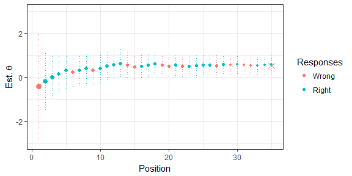

##### Multistage Testing

Multistage testing (MST) is a computer-based adaptive testing model that gives practitioners more controls over the test, compared to CAT. MST navigates test takers through multiple stages and each stage contains a set of pre-constructed *modules*. The test is adapted between stages in order to administer modules most suited to the test taker's ability. A group of modules connected via the routing rule constitutes a MST *panel*, and the combination of modules (one module per stage) that leads a test taker to the end of the test is called a *route*. The design, or configuration, of a MST is normally abbreviated as "1-2", "1-3-3", etc., where the length represents the number of stages and each number represents the number of modules in that stage. With reduced adaptivity, MST usually has a slightly low efficiency than CAT. However, it allows test developers to add complex constraints and review assembled tests before publishing and administration, which enhances test quality and security.

The following functions are available in this module:

-   `mst(pool, design, num_panel, method, len, max_use, group, ...)`: Create a MST assembly job. Use `design` to specify the design/configuration of the MST (e.g., "1-3", "1-2-2", "1-2-3"). Use `num_panel` to simultaneously assembly multiple panels. `method` can be either *topdown*[12] or *bottomup*[13]. Use `len` and `max_use` to conveniently set the test length and maximum item usage. Use `group` to group item sets.
-   `mst_route(x, route, op)`: Add or remove a route from the MST
-   `mst_obj(x, theta, indices, target, flatten)`: Add objective functions to the assembly job. Use `theta` to specify at which *θ* points the information is optimized. When `target` is `NULL`, the information is maximized at *θ* points; otherwise, the information approaches the given targets. Use `flatten` argument to obtain a flatter TIF by curbing the information difference between *θ* points. `indices` sets on which modules or routes the objective functions are added.
-   `mst_constraint(x, coef, min, max, level, indices)`: Add constraints to the assembly job. `coef` should be a variable name of pool-long numeric vector. Set `level=NULL` for a quantitative variable and a specific level for a categorical variable.
-   `mst_stage_length(x, stages, min, max)`: Add the length constraints on modules in given stages.
-   `mst_rdp(x, theta, indices, tol)`: Set the routing decision points between two adjacent modules.
-   `mst_module_mininfo(x, theta, mininfo, indices)`: Set the minimum information at given *θ* points for some modules.
-   `mst_assemble(x, ...)`: Assemble MST panels.
-   `mst_get_items(x, panel, stage, module, route, route_index)`: Extract assembled modules.
-   `plot.mst(x, ...)`: Plot TIFs of assembled routes (when `byroute=TRUE`) or modules (when `byroute=FALSE`).
-   `mst_sim(x, true, rdp, ...)`: Simulate a MST administration. When `rdp=NULL`, test takers are routed to the module with the maximum information; otherwise test takers are routed according to given routing decision points.

###### Examples

Generate a pool of 300 items

``` r
num_item <- 300
pool <- with(model_3pl_gendata(1, num_item), data.frame(a=a, b=b, c=c))
pool$id <- 1:num_item
pool$content <- sample(1:3, num_item, replace=TRUE)
pool$time <- round(rlnorm(num_item, 4, .3))
pool$group <- sort(sample(1:round(num_item/3), num_item, replace=TRUE))
```

Ex. 1: Assemble 2 panels of 1-2-2 MST using the top-down approach 20 items in total and 10 items in content area 1 in each route maximize info. at -1 and 1 for easy and hard routes

``` r
x <- mst(pool, "1-2-2", 2, 'topdown', len=20, max_use=1)
x <- mst_obj(x, theta=-1, indices=1:2)
x <- mst_obj(x, theta=1, indices=3:4)
x <- mst_constraint(x, "content", 10, 10, level=1)
x <- mst_assemble(x, timeout=10)
plot(x, byroute=TRUE)
```

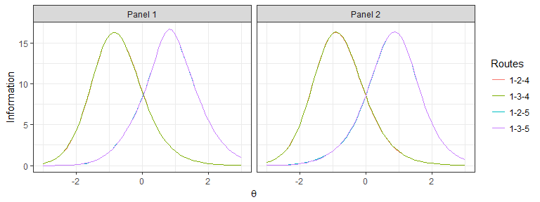

Ex. 2: Assemble 2 panels of 1-2-3 MST using the bottom-up approach Remove two routes with large theta change: 1-2-6, 1-3-4 10 items in total and 4 items in content area 2 in each module Maximize info. at -1, 0 and 1 for easy, medium, and hard modules

``` r
x <- mst(pool, "1-2-3", 2, 'bottomup', len=10, max_use=1)
x <- mst_route(x, c(1, 2, 6), "-")
x <- mst_route(x, c(1, 3, 4), "-")
x <- mst_obj(x, theta= 0, indices=c(1, 5))
x <- mst_obj(x, theta=-1, indices=c(2, 4))
x <- mst_obj(x, theta= 1, indices=c(3, 6))
x <- mst_constraint(x, "content", 4, 4, level=2)
x <- mst_assemble(x, timeout=10) 
plot(x, byroute=FALSE)
```

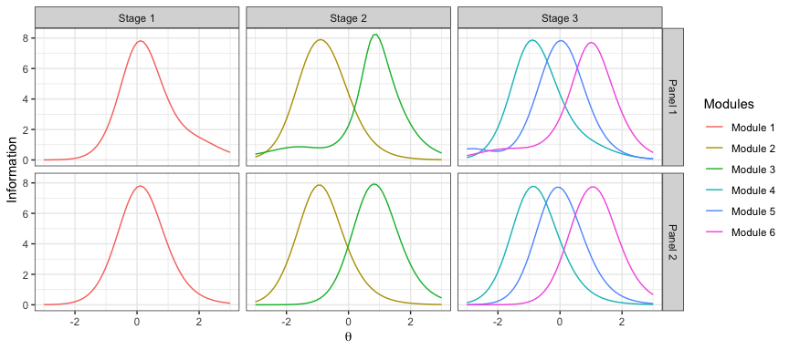

Ex.3: Same specs with Ex.2 (without content constraints), but group-based

``` r
x <- mst(pool, "1-2-3", 2, 'bottomup', len=12, max_use=1, group="group")
x <- mst_route(x, c(1, 2, 6), "-")
x <- mst_route(x, c(1, 3, 4), "-")
x <- mst_obj(x, theta= 0, indices=c(1, 5))
x <- mst_obj(x, theta=-1, indices=c(2, 4))
x <- mst_obj(x, theta= 1, indices=c(3, 6))
x <- mst_assemble(x, timeout=10)
plot(x, byroute=FALSE)
```

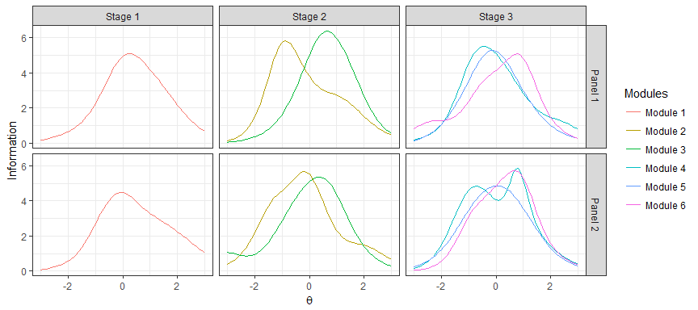

``` r
for(p in 1:x$num_panel)
   for(m in 1:x$num_module){
     items <- mst_get_items(x, panel=p, module=m)
     cat('panel=', p, ', module=', m, ': ', length(unique(items$id)), ' items from ', 
         length(unique(items$group)), ' groups\n', sep='')
   }
```

    ## panel=1, module=1: 12 items from 3 groups
    ## panel=1, module=2: 12 items from 6 groups
    ## panel=1, module=3: 12 items from 4 groups
    ## panel=1, module=4: 12 items from 6 groups
    ## panel=1, module=5: 12 items from 4 groups
    ## panel=1, module=6: 12 items from 5 groups
    ## panel=2, module=1: 12 items from 4 groups
    ## panel=2, module=2: 12 items from 6 groups
    ## panel=2, module=3: 12 items from 3 groups
    ## panel=2, module=4: 12 items from 4 groups
    ## panel=2, module=5: 12 items from 4 groups
    ## panel=2, module=6: 12 items from 4 groups

Ex.4: Assemble 2 panels of 1-2-3 using the top-down design 20 total items and 10 items in content area 3, 6+ items in stage 1 & 2

``` r
x <- mst(pool, "1-2-3", 2, "topdown", len=20, max_use=1)
x <- mst_route(x, c(1, 2, 6), "-")
x <- mst_route(x, c(1, 3, 4), "-")
x <- mst_obj(x, theta=-1, indices=1)
x <- mst_obj(x, theta=0, indices=2:3)
x <- mst_obj(x, theta=1, indices=4)
x <- mst_constraint(x, "content", 8, 12, level=3)
x <- mst_stage_length(x, 1:2, min=6)
x <- mst_assemble(x, timeout=15)
plot(x, byroute=FALSE)
```

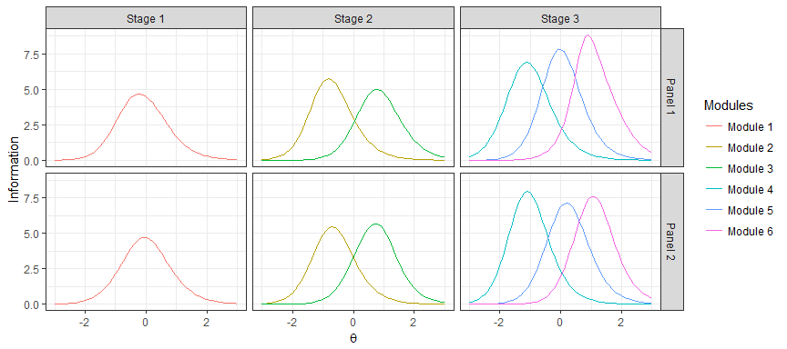

``` r
for(p in 1:x$num_panel)
  for(s in 1:x$num_stage){
    items <- mst_get_items(x, panel=p, stage=s)
    cat('panel=', p, ', stage=', s, ': ', length(unique(items$id)), ' items\n', sep='')
    }
```

    ## panel=1, stage=1: 6 items
    ## panel=1, stage=2: 12 items
    ## panel=1, stage=3: 24 items
    ## panel=2, stage=1: 6 items
    ## panel=2, stage=2: 12 items
    ## panel=2, stage=3: 24 items

Ex. 5: Administer the MST using fixed RDP for routing

``` r
x_sim <- mst_sim(x, .5, list(stage1=0, stage2=c(-.4, .4)))
plot(x_sim, ylim=c(-4, 4))
```


Ex. 6: Administer the MST using the maximum information for routing

``` r
x_sim <- mst_sim(x, .5)
plot(x_sim, ylim=c(-4, 4))
```

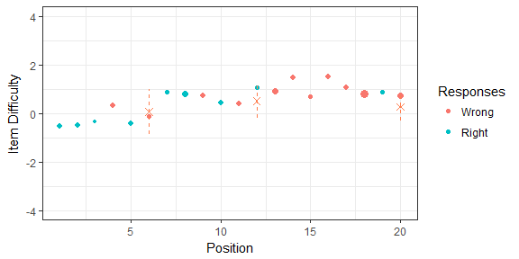

### Ending

Please send comments, questions and feature requests to the [author](mailto:xluo1986@gmail.com). To report bugs, go to the [issues](https://github.com/xluo11/xxIRT/issues) page.

### References

[1] Birnbaum, A. (1968). Some latent trait models. In F.M. Lord & M.R. Novick, (Eds.), Statistical theories of mental test scores. Reading, MA: Addison-Wesley.

[2] Rasch, G. (1966). An item analysis which takes individual differences into account. British journal of mathematical and statistical psychology, 19(1), 49-57.

[3] Muraki, E. (1992). A Generalized Partial Credit Model: Application of an EM Algorithm. Applied Psychological Measurement, 16(2), 159-176.

[4] Muraki, E. (1993). Information Functions of the Generalized Partial Credit Model. Applied Psychological Measurement, 17(4), 351-363.

[5] Stocking, M. L., & Swanson, L. (1998). Optimal design of item banks for computerized adaptive tests. Applied Psychological Measurement, 22, 271-279.

[6] Luecht, R. M. (1998). Computer-assisted test assembly using optimization heuristics. Applied Psychological Measurement, 22, 224-236.

[7] van der Linden, W. J., & Reese, L. M. (1998). A model for optimal constrained adaptive testing. Applied Psychological Measurement, 22, 259-270.

[8] Weiss, D. J., & Kingsbury, G. (1984). Application of computerized adaptive testing to educational problems. Journal of Educational Measurement, 21, 361-375.

[9] Kingsbury, C. G., & Zara, A. R. (1991). A comparison of procedures for content-sensitive item selection in computerized adaptive tests. Applied Measurement in Education, 4, 241-261.

[10] van der Linden, W. J. (2000). Constrained adaptive testing with shadow tests. In Computerized adaptive testing: Theory and practice (pp. 27-52). Springer Netherlands.

[11] Luo, X., Doyoung, K., & Dickison, P. (2018). Projection-based stopping rules for computerized adaptive testing in licensure testing. Applied Psychological Measurement, 42, 275-290

[12] Luo, X., & Kim, D. (2018). A Top‐Down Approach to Designing the Computerized Adaptive Multistage Test. Journal of Educational Measurement, 55(2), 243-263.

[13] Luecht, R. M., & Nungester, R. J. (1998). Some practical examples of computer‐adaptive sequential testing. Journal of Educational Measurement, 35(3), 229-249.
